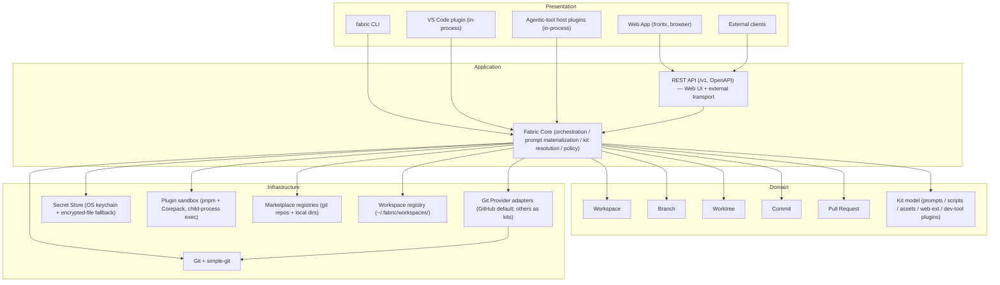
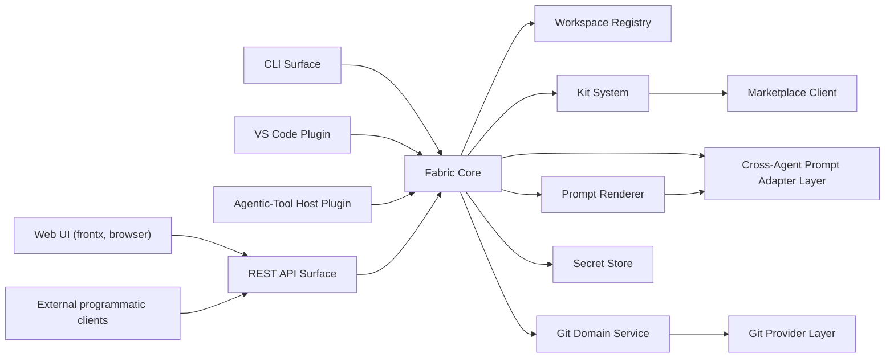
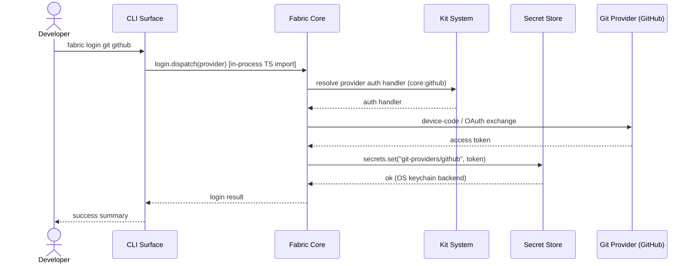
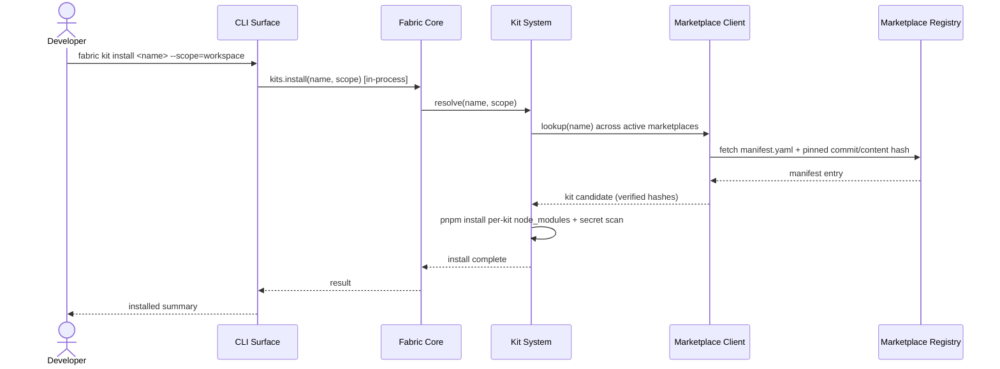
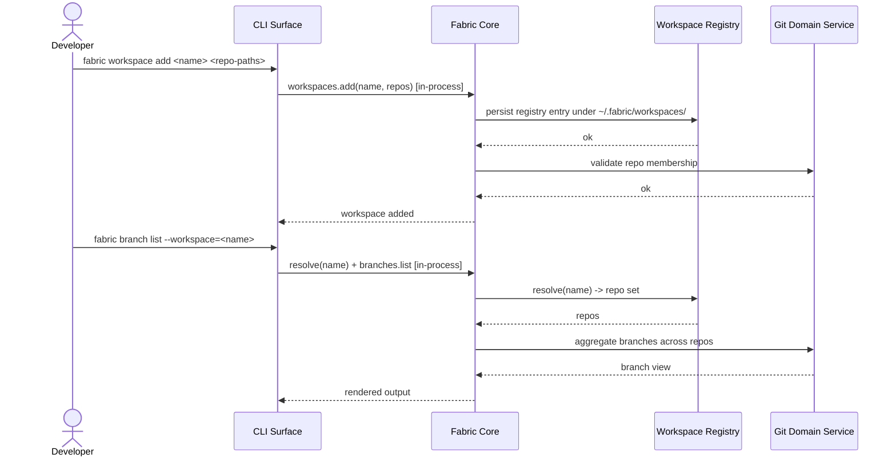
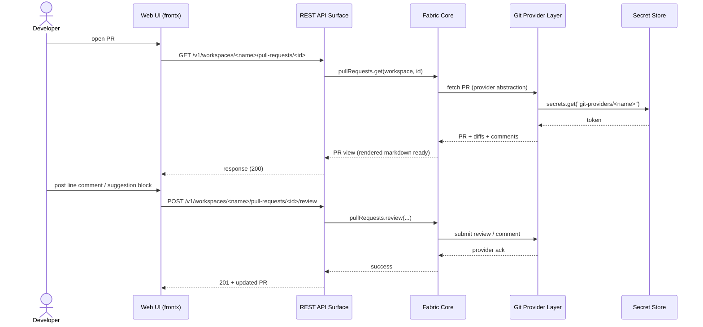
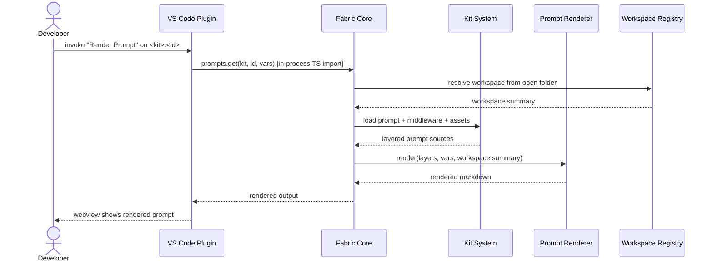

# Technical Design — Cyber Fabric

<!-- toc -->

- [1. Architecture Overview](#1-architecture-overview)
  - [1.1 Architectural Vision](#11-architectural-vision)
  - [1.2 Architecture Drivers](#12-architecture-drivers)
  - [1.3 Architecture Layers](#13-architecture-layers)
- [2. Principles & Constraints](#2-principles--constraints)
  - [2.1 Design Principles](#21-design-principles)
  - [2.2 Constraints](#22-constraints)
- [3. Technical Architecture](#3-technical-architecture)
  - [3.1 Domain Model](#31-domain-model)
  - [3.2 Component Model](#32-component-model)
  - [3.3 API Contracts](#33-api-contracts)
  - [3.4 Internal Dependencies](#34-internal-dependencies)
  - [3.5 External Dependencies](#35-external-dependencies)
  - [3.6 Interactions & Sequences](#36-interactions--sequences)
  - [3.7 Database schemas & tables](#37-database-schemas--tables)
  - [3.8 Deployment Topology](#38-deployment-topology)
- [4. Additional context](#4-additional-context)
  - [4.1 ADR-coverage map](#41-adr-coverage-map)
  - [4.2 Glossary](#42-glossary)
  - [4.3 Cross-cutting notes](#43-cross-cutting-notes)
  - [4.4 Out-of-scope quality domains (explicit non-applicability)](#44-out-of-scope-quality-domains-explicit-non-applicability)
- [5. Traceability](#5-traceability)
  - [5.1 FR / NFR → Component coverage matrix](#51-fr--nfr--component-coverage-matrix)
  - [5.2 ID uniqueness verification](#52-id-uniqueness-verification)

<!-- /toc -->

- [ ] `p1` - **ID**: `cpt-cyber-fabric-design-fabric`

## 1. Architecture Overview

### 1.1 Architectural Vision

Cyber Fabric is an agent-first, local-first delivery platform that unifies five authoring personas — Developer, Architect, Product Manager, Prompt Engineer, UX Designer — around the same artifacts they already keep in git (specs, ADRs, PRDs, prompts, scripts, mockups, code, PRs). The architecture realizes one canonical content model and one extension mechanism (Kits) so that any operation reachable from one surface is reachable from every surface. v1 ships the CLI and agentic-tool host plugins; v2 lights up the Web App, VS Code plugin, and REST API on the same orchestration layer. The dominant architectural style is a **shared semantic core fronted by host-native adapters**: every surface is a thin host-native client that resolves into the same Fabric Core (per ADR-0001 unified operational model, ADR-0002 central Fabric Core, and ADR-0003 host-native plugins and adapters). Surface parity is achieved structurally through Fabric Core, not through any single shared transport.

The platform is **distributed host-natively, installed minimally, and runs without a daemon or hosted backend**. There is no long-running Fabric service, no separate database, and no built-in telemetry; persistent state lives in the user's repos, the OS keychain, and a small global registry under `~/.fabric/` (ADR-0005 minimal installation footprint, ADR-0011 workspace registry, ADR-0027 OS-keychain secret storage). Distribution targets the user's preferred package manager — npm/pnpm, Homebrew, VS Code Marketplace, agentic-tool marketplaces, container images — and every channel produces an equivalent install: same version, same bundled `core` kit, same surfaces (ADR-0032 multi-channel distribution, ADR-0030 core-bundled `core` kit). TypeScript is the primary implementation language across core, adapters, surfaces, and orchestration to keep one set of typed contracts (ADR-0004), which is also what enables host-native surfaces that share the Fabric Core process to embed it directly via TypeScript import. The REST API (ADR-0020) is the canonical transport for the **Web UI** (because the browser cannot import Node modules per ADR-0018) and for **external programmatic clients**; the CLI, the VS Code plugin (ADR-0021 — thin native extension embedding Fabric Core in-process via direct TS import), and agentic-tool host plugins embed Fabric Core in-process and do not require a Fabric REST server running for local desktop use. Future remote / cloud Fabric for the VS Code extension is out of scope and may use REST API as a separate adapter mode in a follow-on decision.

Extensibility is **kit-driven and uniform**: kits are the only extension mechanism, packaged in three scopes — global, workspace, and core-bundled — and every extension type (prompts, scripts, assets, web extensions, dev-tool plugins) ships through the same packaging, dependency, and marketplace machinery (ADR-0006, ADR-0008, ADR-0019, ADR-0029). Kits compose via declared dependencies and per-kit auto-update flags (ADR-0009), persist state through a backend-agnostic localStorage-shaped SDK (ADR-0015), expose static files through identifier-addressed assets (ADR-0016), and run scripts in per-kit isolated `node_modules` with process-sandboxed execution (ADR-0017, ADR-0028). Workspaces are the first-class addressable target for every kit-aware operation (ADR-0011), composing with first-class branches, worktrees, commits, and pull requests over a provider-agnostic git interface (ADR-0013, ADR-0014, ADR-0022, ADR-0023, ADR-0024) and feeding workspace-aware prompt rendering with deterministic init-fallback when context is missing (ADR-0025, ADR-0026). The Fabric Core is therefore the single semantic locus where kits, workspaces, prompts, and provider operations are resolved — adapters and surfaces remain thin views over it, whether they reach Core in-process or over the REST API.

### 1.2 Architecture Drivers

Requirements that significantly influence architecture decisions, mapped from the PRD digest. Each driver row cites the responsible ADR(s) from the digest's per-ADR section.

**ADRs**: `cpt-cyber-fabric-adr-unified-operational-model`, `cpt-cyber-fabric-adr-central-fabric-core`, `cpt-cyber-fabric-adr-host-native-plugins-and-adapters`, `cpt-cyber-fabric-adr-typescript-primary-language`, `cpt-cyber-fabric-adr-minimal-installation-footprint`, `cpt-cyber-fabric-adr-kits-as-universal-extension-mechanism`, `cpt-cyber-fabric-adr-workspace-as-first-class-concept`, `cpt-cyber-fabric-adr-rest-api-as-fabric-surface`, `cpt-cyber-fabric-adr-fabric-web-ui-on-frontx`, `cpt-cyber-fabric-adr-vscode-plugin-fabric-host-adapter`, `cpt-cyber-fabric-adr-secret-storage-and-fabric-login`, `cpt-cyber-fabric-adr-per-kit-dependency-isolation-and-script-sandbox`, `cpt-cyber-fabric-adr-multi-channel-distribution`, `cpt-cyber-fabric-adr-kit-marketplace-architecture`, `cpt-cyber-fabric-adr-core-bundled-kit-core`, `cpt-cyber-fabric-adr-dev-tool-plugins-as-kit-resources`, `cpt-cyber-fabric-adr-kit-configuration-storage`, `cpt-cyber-fabric-adr-kit-assets`, `cpt-cyber-fabric-adr-scripts-as-kit-resources`, `cpt-cyber-fabric-adr-cross-agent-prompt-discovery-and-middleware-composition`.

#### Functional Drivers

| Requirement | Design Response | ADRs |
|-------------|-----------------|------|
| `cpt-cyber-fabric-fr-workspace-named-multi-repo` | Named, IDE-independent workspace aggregating N repos as a first-class addressable target across all surfaces. | `cpt-cyber-fabric-adr-workspace-as-first-class-concept` |
| `cpt-cyber-fabric-fr-workspace-lifecycle` | Workspace `init / add / remove / list / info` operations defined in Fabric Core; reachable identically from CLI (in-process), VS Code plugin (in-process), agentic-tool host plugins (in-process), Web UI (via REST API), and external clients (via REST API). | `cpt-cyber-fabric-adr-workspace-as-first-class-concept`, `cpt-cyber-fabric-adr-rest-api-as-fabric-surface` |
| `cpt-cyber-fabric-fr-workspace-vscode-interop` | Bidirectional `.code-workspace` import/export with init-time discovery and choose-or-merge for multi-config repos. | `cpt-cyber-fabric-adr-vscode-workspace-interop` |
| `cpt-cyber-fabric-fr-workspace-context-resolution` | Per-surface auto-detection (CLI=CWD, REST=URL path, Web UI=selector, VS Code=open folder) with explicit `--workspace` override; no global sticky state. | `cpt-cyber-fabric-adr-multi-workspace-operation-and-context-resolution` |
| `cpt-cyber-fabric-fr-workspace-aware-prompt-rendering` | Auto-injected `{{workspace}}` Handlebars variable plus prepended summary block; recoverable init-workspace fallback prompt when no workspace detected. | `cpt-cyber-fabric-adr-workspace-aware-prompt-rendering`, `cpt-cyber-fabric-adr-prompt-templating-and-instruction-extraction` |
| `cpt-cyber-fabric-fr-kits-only-extension-mechanism` | Kits are the sole extension surface; same packaging machinery for prompts, scripts, assets, web extensions, dev-tool plugins. | `cpt-cyber-fabric-adr-kits-as-universal-extension-mechanism`, `cpt-cyber-fabric-adr-kit-packaged-pluggable-skills` |
| `cpt-cyber-fabric-fr-kits-three-scopes` | Three kit scopes — global (per user), workspace (in-repo), core-bundled — sharing the same tooling and resolution rules. | `cpt-cyber-fabric-adr-kits-as-universal-extension-mechanism`, `cpt-cyber-fabric-adr-core-bundled-kit-core` |
| `cpt-cyber-fabric-fr-kits-dependencies-and-auto-update` | Kits declare deps as `==X.Y.Z` strict pin or `>=X.Y.Z` minimum with orthogonal `latest:[major|minor|patch]` flags. | `cpt-cyber-fabric-adr-kit-dependencies-and-auto-update` |
| `cpt-cyber-fabric-fr-marketplace-cross-surface` | Browse/install/remove/list reachable from CLI, VS Code plugin, agentic-tool host plugins (in-process via Fabric Core), and Web UI / external clients (via REST API) using the same marketplace abstraction. | `cpt-cyber-fabric-adr-kit-marketplace-architecture`, `cpt-cyber-fabric-adr-rest-api-as-fabric-surface` |
| `cpt-cyber-fabric-fr-multiple-marketplaces` | Multi-marketplace simultaneously (official + per-org + per-project + local-path) backed by git repos or local dirs. | `cpt-cyber-fabric-adr-kit-marketplace-architecture` |
| `cpt-cyber-fabric-fr-kit-publication-pr-gated` | PR-gated versioned manifest entries pinned to commit + content hash; CI validates, client verifies on install. | `cpt-cyber-fabric-adr-kit-marketplace-architecture` |
| `cpt-cyber-fabric-fr-per-kit-dependency-isolation` | pnpm via Corepack with per-kit `node_modules`, content-addressed global store, child-process script execution with env whitelist. | `cpt-cyber-fabric-adr-per-kit-dependency-isolation-and-script-sandbox` |
| `cpt-cyber-fabric-fr-prompts-typed-markdown` | Markdown + YAML frontmatter; closed nine-type taxonomy declared per prompt and validated at packaging time. | `cpt-cyber-fabric-adr-prompt-type-taxonomy`, `cpt-cyber-fabric-adr-tool-generated-layered-prompts` |
| `cpt-cyber-fabric-fr-prompts-layered-overrides` | Handlebars block helpers (`{{#instruction}}`, `{{#replace}}`, `{{#append after="id"}}`, `{{#remove}}`) with stable instruction ids and project > user > kit override layering. | `cpt-cyber-fabric-adr-tool-generated-layered-prompts`, `cpt-cyber-fabric-adr-prompt-templating-and-instruction-extraction` |
| `cpt-cyber-fabric-fr-prompts-variable-resolution` | Global → local → CLI `--var` precedence resolved by the materializer; per-invocation overrides win. | `cpt-cyber-fabric-adr-prompt-templating-and-instruction-extraction` |
| `cpt-cyber-fabric-fr-skills-cross-tool-registration` | One central registration tool materializes agent-specific skill registrations from the kit manifest. | `cpt-cyber-fabric-adr-kit-packaged-pluggable-skills`, `cpt-cyber-fabric-adr-prompt-type-taxonomy` |
| `cpt-cyber-fabric-fr-prompts-middleware-composition` | Middleware-typed prompts compose cross-cutting injections by id / type / glob without modifying target prompts; the same selector mechanism reaches discovered external prompts (per ADR-0033). | `cpt-cyber-fabric-adr-prompt-type-taxonomy`, `cpt-cyber-fabric-adr-workspace-aware-prompt-rendering`, `cpt-cyber-fabric-adr-cross-agent-prompt-discovery-and-middleware-composition` |
| `cpt-cyber-fabric-fr-prompts-delegate-external-agents` | `delegate` prompt type wraps invocation of an explicit external agent (Claude / Codex / Devin / Copilot CLI). | `cpt-cyber-fabric-adr-prompt-type-taxonomy` |
| `cpt-cyber-fabric-fr-surface-cli` | `fabric ...` CLI exposes every capability and embeds Fabric Core in-process; primary v1 surface. | `cpt-cyber-fabric-adr-unified-operational-model`, `cpt-cyber-fabric-adr-host-native-plugins-and-adapters` |
| `cpt-cyber-fabric-fr-surface-web-app` | First-party Web UI on frontx with microfrontend kit web extensions, served by the REST API (browser cannot import Node modules). | `cpt-cyber-fabric-adr-fabric-web-ui-on-frontx`, `cpt-cyber-fabric-adr-rest-api-as-fabric-surface` |
| `cpt-cyber-fabric-fr-surface-vscode-plugin` | Thin native VS Code extension shipped inside `core` kit; embeds Fabric Core in-process via direct TS import (no REST API dependency for local desktop). | `cpt-cyber-fabric-adr-vscode-plugin-fabric-host-adapter`, `cpt-cyber-fabric-adr-core-bundled-kit-core` |
| `cpt-cyber-fabric-fr-surface-rest-api` | Local-by-default REST API at `/v1/...` with auto-generated OpenAPI; canonical transport for Web UI (browser context) and external programmatic clients. | `cpt-cyber-fabric-adr-rest-api-as-fabric-surface` |
| `cpt-cyber-fabric-fr-surface-web-extensions` | Single web-extension contract runs unmodified in Web App and VS Code plugin webviews. | `cpt-cyber-fabric-adr-fabric-web-ui-on-frontx`, `cpt-cyber-fabric-adr-vscode-plugin-fabric-host-adapter` |
| `cpt-cyber-fabric-fr-surface-parity` | Every operation defined once in Fabric Core and reached from every surface (in-process for CLI / VS Code / agentic-tool plugins; via REST API for Web UI / external clients); release-time equivalence checklist enforced. | `cpt-cyber-fabric-adr-unified-operational-model`, `cpt-cyber-fabric-adr-central-fabric-core`, `cpt-cyber-fabric-adr-host-native-plugins-and-adapters` |
| `cpt-cyber-fabric-fr-git-branches-first-class` | Structured branch model with workspace aggregation and `--orphan/--gone/--stale` filters; merge/rebase/push delegated to git. | `cpt-cyber-fabric-adr-branches-as-first-class-concept` |
| `cpt-cyber-fabric-fr-git-worktrees-first-class` | Worktree model with `owner ∈ {fabric, external}` ownership metadata and tiered cleanup policy via `simple-git`. | `cpt-cyber-fabric-adr-worktrees-as-first-class-with-hybrid-ownership` |
| `cpt-cyber-fabric-fr-git-commits-first-class` | Structured commit model with cross-repo workspace aggregation; `commit list/info/log` CLI. | `cpt-cyber-fabric-adr-git-commits-as-first-class-concept` |
| `cpt-cyber-fabric-fr-git-workspace-aggregation` | Workspace-default aggregation across repos with on-demand per-repo filtering for branches, worktrees, and commits. | `cpt-cyber-fabric-adr-branches-as-first-class-concept`, `cpt-cyber-fabric-adr-git-commits-as-first-class-concept` |
| `cpt-cyber-fabric-fr-pr-first-class` | Structured PR model over provider abstraction with cross-surface reachability. | `cpt-cyber-fabric-adr-pull-requests-as-first-class-concept`, `cpt-cyber-fabric-adr-git-provider-abstraction-with-github-default` |
| `cpt-cyber-fabric-fr-pr-cross-surface-operations` | `pr list/info/create/review/comment` reachable from CLI, VS Code plugin, agentic-tool plugins (in-process) and Web UI / external clients (via REST API). | `cpt-cyber-fabric-adr-pull-requests-as-first-class-concept` |
| `cpt-cyber-fabric-fr-pr-markdown-aware-review` | Rendered preview, line comments on rendered output, suggestion blocks; richest in Web App, VS Code uses built-in renderer. | `cpt-cyber-fabric-adr-pull-requests-as-first-class-concept`, `cpt-cyber-fabric-adr-fabric-web-ui-on-frontx` |
| `cpt-cyber-fabric-fr-pr-provider-agnostic` | Provider-agnostic interface in core; GitHub bundled in `core` kit; GitLab / Bitbucket / Gerrit / Gitea / Forgejo as kits. | `cpt-cyber-fabric-adr-git-provider-abstraction-with-github-default`, `cpt-cyber-fabric-adr-core-bundled-kit-core` |
| `cpt-cyber-fabric-fr-auth-fabric-login` | Unified `fabric login <provider>` dispatches to provider kit's auth handler with credentials stored under `git-providers/<name>` namespace. | `cpt-cyber-fabric-adr-secret-storage-and-fabric-login` |
| `cpt-cyber-fabric-fr-auth-secret-storage` | OS-keychain backends (macOS Keychain, Windows Credential Manager, Linux Secret Service) with explicit-opt-in AES-256-GCM encrypted-file fallback. | `cpt-cyber-fabric-adr-secret-storage-and-fabric-login` |
| `cpt-cyber-fabric-fr-auth-cross-surface` | Login + secret management exposed identically across surfaces — in-process for CLI / VS Code / agentic-tool plugins, via REST API for Web UI / external clients. | `cpt-cyber-fabric-adr-secret-storage-and-fabric-login`, `cpt-cyber-fabric-adr-rest-api-as-fabric-surface` |
| `cpt-cyber-fabric-fr-auth-secret-protection` | Remote REST API rejects secret reads unless TLS-terminated; localhost default no-auth. | `cpt-cyber-fabric-adr-secret-storage-and-fabric-login`, `cpt-cyber-fabric-adr-rest-api-as-fabric-surface` |
| `cpt-cyber-fabric-fr-distribution-multi-channel` | npm/pnpm + Homebrew + VS Code Marketplace at v1; Scoop, agent-tool marketplaces, container images, self-contained binary follow-on. | `cpt-cyber-fabric-adr-multi-channel-distribution` |
| `cpt-cyber-fabric-fr-distribution-channel-equivalence` | Every channel produces same version + same `core` kit + same surfaces; release-time equivalence checklist. | `cpt-cyber-fabric-adr-multi-channel-distribution`, `cpt-cyber-fabric-adr-core-bundled-kit-core` |
| `cpt-cyber-fabric-fr-distribution-channel-native-update` | Channel-native update mechanism (`brew upgrade`, `pnpm update -g`, VS Code auto-update); `--version` reports channel. | `cpt-cyber-fabric-adr-multi-channel-distribution` |
| `cpt-cyber-fabric-fr-distribution-core-kit` | Fresh install always ships the bundled `core` kit (init-workspace, summary, dev toolkit, GitHub provider). | `cpt-cyber-fabric-adr-core-bundled-kit-core` |
| `cpt-cyber-fabric-fr-mockup-visualization` | Web App renders mockups in a documented format set; iteration outputs persist as version-controlled artifacts. | `cpt-cyber-fabric-adr-fabric-web-ui-on-frontx` |
| `cpt-cyber-fabric-fr-mockup-chat-iteration` | Chat-driven iteration in Web App alongside the mockup; outputs land as PRs. | `cpt-cyber-fabric-adr-fabric-web-ui-on-frontx`, `cpt-cyber-fabric-adr-pull-requests-as-first-class-concept` |
| `cpt-cyber-fabric-fr-design-kits` | Design-focused kit category in marketplace; design-system kits use the same kit machinery. | `cpt-cyber-fabric-adr-kits-as-universal-extension-mechanism`, `cpt-cyber-fabric-adr-kit-marketplace-architecture` |

#### NFR Allocation

This table maps non-functional requirements from the PRD to specific design / architecture responses, demonstrating how quality attributes are realized.

| NFR ID | NFR Summary | Allocated To | Design Response | Verification Approach |
|--------|-------------|--------------|-----------------|----------------------|
| `cpt-cyber-fabric-nfr-security-secret-storage` | Zero plaintext secrets persisted by default; OS keychain. | Infrastructure layer — Secret Store (ADR-0027) | Dedicated `fabric.secrets` SDK distinct from ADR-0015 storage; per-platform OS keychain backends; AES-256-GCM encrypted-file fallback only on explicit opt-in for headless / CI. | Audit on every release that no plaintext-secret persistence path exists; integration tests on each OS keychain backend; encrypted-file fallback gated by explicit flag; remote REST rejects unencrypted secret reads. |
| `cpt-cyber-fabric-nfr-security-kit-secret-scan` | Every kit install runs `gitleaks` / `trufflehog`; non-clean aborts. | Application layer — Kit installer pipeline (ADR-0029) | Kit install pipeline invokes `gitleaks` and `trufflehog` against the resolved manifest + content; non-clean result aborts install before any registration. | Install-pipeline unit tests with seeded leaked-secret fixtures; CI gate on marketplace PR validation; release smoke test installing a representative kit. |
| `cpt-cyber-fabric-nfr-security-sbom` | SBOM (CycloneDX or SPDX) ships with every release artifact. | Distribution pipeline (ADR-0032) | Release pipeline emits CycloneDX / SPDX SBOM per channel artifact (npm tarball, brew bottle, VS Code VSIX, container image). | Release CI verifies SBOM presence + format per artifact; signature attached; release notes link the SBOM. |
| `cpt-cyber-fabric-nfr-license-apache-no-cla` | Apache-2.0, no CLA, BDFL governance. | Repository / governance metadata | Apache-2.0 LICENSE in every Fabric repo; absence of CLA bot enforced; governance documented in CONTRIBUTING / GOVERNANCE. | License lint in CI (`license-checker`); manual governance review at release; ADR amendment required to change. |
| `cpt-cyber-fabric-nfr-surface-parity` | Release-time equivalence checklist across CLI / Web App / VS Code / REST / agentic tools. | Application layer — Fabric Core (ADR-0001 / 0002) with thin per-surface adapters (ADR-0003) | Every operation lands first in Fabric Core; CLI, VS Code plugin, and agentic-tool host plugins reach Core in-process via direct TS import; Web UI and external clients reach Core through the REST API. Parity is structural through Fabric Core, not through a single shared transport. | Release-gate equivalence test matrix in CI; operation × surface checklist signed off per release; smoke tests per surface against the same Fabric Core build (in-process for CLI / VS Code / agentic-tool, REST for Web UI / external). |
| `cpt-cyber-fabric-nfr-cross-channel-equivalence` | Install equivalence across distribution channels. | Distribution pipeline (ADR-0032) | Same source / git tag publishes to every channel; bundled `core` kit pinned to Fabric version; surface set identical per channel. | Per-channel post-install probe (`fabric --version`, `fabric kit list`, `fabric surface list`) reports same triple across channels in release CI. |
| `cpt-cyber-fabric-nfr-reviewable-artifacts` | 100% of artifact types readable without Fabric. | Domain layer — content model (ADR-0007 / 0030) | All artifacts are plain markdown + YAML / JSON / TOML / committed source; no proprietary binary formats; templating engine is opt-in for rendering, not for reading. | Downstream-beneficiary read test: open every artifact type in plain editor / GitHub renderer / VS Code without Fabric installed; confirm legibility. |
| `cpt-cyber-fabric-nfr-minimal-footprint` | Only workspace registration + committed kit configuration in the diff-able footprint. | Infrastructure layer — Storage scopes (ADR-0005 / 0011 / 0015) | Repo-local files limited to `.fabric/workspaces/<name>.toml` + workspace-scoped kit config + in-repo kit storage explicitly chosen by user; everything else is global (`~/.fabric/`) or lazy-materialized. | Footprint-check CI test on a fresh `fabric workspace init`: assert diff contains only declared whitelist; size budget enforced. |
| `cpt-cyber-fabric-nfr-concurrency-git-native` | No Fabric-side cross-repo lock / queue / transactional commit. | Domain layer — Git domain (ADR-0013 / 0014 / 0022) | Branch / worktree / commit operations delegated to `simple-git` per repo; no Fabric-side coordinator; concurrent-edit conflicts surface as native git conflicts. | Concurrency test running parallel `fabric branch / worktree / commit` operations across two repos; assert no Fabric-side lock files; assert git's own conflict semantics. |

### 1.3 Architecture Layers

- [ ] `p3` - **ID**: `cpt-cyber-fabric-tech-fabric`

| Layer | Responsibility | Technology |
|-------|---------------|------------|
| Presentation | Host-native user surfaces — `fabric` CLI (v1 primary; embeds Fabric Core in-process), VS Code plugin (v2; thin native extension embedding Fabric Core in-process via direct TS import per ADR-0021, no REST dependency for local desktop), agentic-tool host plugins (Claude Code / Codex / Cursor / Windsurf / Copilot / Pi; embed Fabric Core in-process), Web App on frontx (v2; runs in browser, consumes REST API), and external programmatic clients (consume REST API). Each surface auto-detects workspace context and exposes parity-equivalent operations. | TypeScript / Node 16+; oclif-style CLI; VS Code Extension API (Tree Views, Command Palette, webviews); frontx microfrontend runtime; host-native plugin formats (`.vsix`, `claude-plugin/`, ...). |
| Application | Fabric Core orchestration — workspace context resolution, kit resolution + auto-update, prompt materialization (Handlebars + layered overrides + workspace auto-injection), script invocation, secret + provider dispatch, policy. The REST API at `/v1/...` is the canonical transport for the Web UI (browser context) and external clients; it is NOT required for in-process surfaces (CLI / VS Code plugin / agentic-tool host plugins). Surface parity is achieved structurally through Fabric Core, not through a single shared transport. | TypeScript; Handlebars (templating); Express/Fastify-class HTTP framework; OpenAPI auto-generation; URL-versioned `/v1` REST surface; localhost no-auth default. |
| Domain | First-class structured models — Workspace (named, IDE-independent, multi-repo), Branch, Worktree (with hybrid `owner` ownership), Commit, Pull Request (over provider abstraction with markdown-aware review), and the Kit content model (prompts with closed nine-type taxonomy, scripts, assets, web extensions, dev-tool plugins). | TypeScript types + Zod-class validators; YAML / TOML / JSON manifests; markdown + YAML frontmatter for prompts. |
| Infrastructure | Git execution and integration boundaries — `simple-git` for branches / worktrees / commits, git provider adapters (`@octokit/rest` + `@octokit/graphql` for GitHub bundled in `core` kit; others as kits), OS-keychain secret storage with encrypted-file fallback, per-kit dependency isolation (pnpm via Corepack with content-addressed global store) and process-sandboxed script execution, git-repo-backed marketplace registries with PR-gated versioned manifest entries pinned to commit + content hash, and the global workspace registry under `~/.fabric/`. | `simple-git`; `@octokit/rest`, `@octokit/graphql`; macOS Keychain / Windows Credential Manager / Linux Secret Service / libsecret; AES-256-GCM (`node:crypto`); pnpm + Corepack; child-process execution with constrained CWD / NODE_PATH / env-var whitelist; git repos / local dirs for marketplaces. |

## 2. Principles & Constraints

### 2.1 Design Principles

#### Agent-First Surface

- [ ] `p2` - **ID**: `cpt-cyber-fabric-principle-agent-first-surface`

Cyber Fabric exposes one shared operational model through host-native surfaces (Claude Code, Codex, OpenCode, Pi, VS Code, future hosts) rather than mandating a dedicated TUI. Host integrations look like views over a single coherent operational identity, so users meet Fabric in the tools they already work in while planner / orchestrator / prompt tooling / validation semantics stay shared across hosts.

**ADRs**: `cpt-cyber-fabric-adr-unified-operational-model`

#### Central Fabric Core

- [ ] `p2` - **ID**: `cpt-cyber-fabric-principle-central-fabric-core`

Planning, orchestration, prompt materialization, validation, policy, and artifact awareness live in one authoritative Fabric core packaged flexibly (library, daemon, service, or combination). Adapters stay thin, new behavior is added in the core, and execution decisions are inspectable in one place — the core can run embedded, locally, or server-backed without changing its semantic contract. Surface parity across CLI, Web UI, REST, VS Code, and agentic-tool hosts is achieved structurally through this single core, not through a forced shared transport.

**ADRs**: `cpt-cyber-fabric-adr-central-fabric-core`, `cpt-cyber-fabric-adr-unified-operational-model`

#### Host-Native Plugins

- [ ] `p2` - **ID**: `cpt-cyber-fabric-principle-host-native-plugins`

Fabric is delivered through host-native plugins, extensions, and adapters that translate host capabilities, permissions, and session context into the shared core via a standard adapter contract. Each host-native plugin reaches Fabric Core through the most direct mechanism for its host runtime: Node-based hosts (the VS Code extension per ADR-0021 and agentic-tool plugins per ADR-0003) embed Fabric Core in-process via direct TypeScript import, while browser-based hosts (the Web UI per ADR-0018) consume the REST API. This preserves native UX in each host, keeps the local-desktop install daemonless, and gives Fabric a repeatable path to add new hosts without re-implementing runtime semantics.

**ADRs**: `cpt-cyber-fabric-adr-host-native-plugins-and-adapters`, `cpt-cyber-fabric-adr-vscode-plugin-fabric-host-adapter`, `cpt-cyber-fabric-adr-dev-tool-plugins-as-kit-resources`, `cpt-cyber-fabric-adr-fabric-web-ui-on-frontx`

#### Minimal Installation Footprint

- [ ] `p2` - **ID**: `cpt-cyber-fabric-principle-minimal-installation-footprint`

Repos hold only essential reviewable config; heavy runtime, caches, and integrations are externalized, shared-loaded, or lazily materialized on demand. The local desktop experience is daemonless: in-process host adapters (VS Code, agentic-tool plugins) avoid requiring a Fabric REST server for everyday use, keeping repo diffs clean, simplifying upgrades, and letting the same project move cleanly across local, IDE, and centralized environments without bloating checkouts.

**ADRs**: `cpt-cyber-fabric-adr-minimal-installation-footprint`, `cpt-cyber-fabric-adr-vscode-plugin-fabric-host-adapter`

#### Kit-Packaged Pluggable Skills

- [ ] `p2` - **ID**: `cpt-cyber-fabric-principle-kit-packaged-pluggable-skills`

Skills, prompts, scripts, assets, web extensions, and dev tool plugins all ship as installable kit packages — kits are the only extension mechanism, in three scopes (global per-user, workspace/project, core-bundled). One central registration tool discovers installed kits, validates metadata and interfaces, and materializes agent-specific registrations from a single authoritative source so the same kit feeds multiple agents without duplicated authoring.

**ADRs**: `cpt-cyber-fabric-adr-kit-packaged-pluggable-skills`, `cpt-cyber-fabric-adr-kits-as-universal-extension-mechanism`, `cpt-cyber-fabric-adr-core-bundled-kit-core`

#### Workspace as First-Class

- [ ] `p2` - **ID**: `cpt-cyber-fabric-principle-workspace-as-first-class`

Fabric workspace is a named, IDE-independent set of repositories addressable by name from any surface and any CWD, with a global per-user registry as the canonical knowledge primitive. Every surface resolves workspace context from its natural signal (CLI walks up CWD, REST embeds name in URL path, Web UI selector, VS Code per-window) with explicit override and no global sticky state, so multi-repo flows and workspace-scoped kits get a stable target across surfaces.

**ADRs**: `cpt-cyber-fabric-adr-workspace-as-first-class-concept`, `cpt-cyber-fabric-adr-vscode-workspace-interop`, `cpt-cyber-fabric-adr-multi-workspace-operation-and-context-resolution`, `cpt-cyber-fabric-adr-workspace-aware-prompt-rendering`

#### Branches, Worktrees, Commits, and Pull Requests as First-Class Concepts

- [ ] `p2` - **ID**: `cpt-cyber-fabric-principle-git-primitives-first-class`

Branches, worktrees, commits, and pull requests are structured first-class models with workspace aggregation, exposed uniformly across CLI, Web UI, REST API, and VS Code plugin. Worktrees carry hybrid ownership (`fabric` vs `external`) for safe lifecycle handling; PRs compose with the git provider abstraction for markdown-aware review. History-rewriting and low-level git operations stay in `git` and `gh` so Fabric does not become a parallel porcelain.

**ADRs**: `cpt-cyber-fabric-adr-branches-as-first-class-concept`, `cpt-cyber-fabric-adr-worktrees-as-first-class-with-hybrid-ownership`, `cpt-cyber-fabric-adr-git-commits-as-first-class-concept`, `cpt-cyber-fabric-adr-pull-requests-as-first-class-concept`, `cpt-cyber-fabric-adr-git-provider-abstraction-with-github-default`

#### REST API as Canonical Remote / Browser Transport

- [ ] `p2` - **ID**: `cpt-cyber-fabric-principle-rest-api-canonical-transport`

The REST API is a third sibling-surface alongside CLI and Web UI and the canonical transport for browser-based and remote programmatic consumers — specifically the Fabric Web UI (which runs in a browser context with no in-process access to Fabric Core) and external programmatic clients. It is URL-versioned (`/v1/...`), OpenAPI-described, localhost no-auth by default, with workspace-scoped resources at `/v1/workspaces/<name>/<resource>`. In-process Node-based host adapters (the VS Code plugin per ADR-0021, agentic-tool plugins per ADR-0003) do not consume the REST API for local desktop use; surface parity is preserved by Fabric Core itself, not by forcing every host through one transport.

**ADRs**: `cpt-cyber-fabric-adr-rest-api-as-fabric-surface`, `cpt-cyber-fabric-adr-fabric-web-ui-on-frontx`

#### Multi-Channel Distribution Parity

- [ ] `p2` - **ID**: `cpt-cyber-fabric-principle-multi-channel-distribution-parity`

Fabric is distributed across multiple native channels (npm/pnpm, Homebrew, VS Code Marketplace at MVP; Scoop, agentic-tool marketplaces, container images, self-contained binary as follow-on) so users install through their platform's expected mechanism. Each channel produces an equivalent install — same Fabric version, same `core` kit, same surfaces — and updates flow through each channel's native update mechanism with cross-channel duplicate detection that warns but does not block.

**ADRs**: `cpt-cyber-fabric-adr-multi-channel-distribution`

#### Cross-Agent Prompt Surface

- [ ] `p2` - **ID**: `cpt-cyber-fabric-principle-cross-agent-prompt-surface`

Fabric exposes one deterministic discovery surface for prompts (skills, sub-agents, rules) across Fabric kits and the supported agentic-tool hosts (Claude Code, Codex, Cursor, Windsurf, Copilot). External prompts are surfaced through per-host read-only adapters that scan both global and local roots; the unified `fabric prompt list / get` accepts `--agent`, `--scope`, and `--type` filters and returns rendered content with the existing middleware mechanism (per `cpt-cyber-fabric-principle-kit-packaged-pluggable-skills` and the prompt taxonomy) applied at retrieval time. External on-disk source files are never mutated; Fabric-curated overrides live as Fabric kit prompts. Workspace context resolves per `cpt-cyber-fabric-principle-workspace-as-first-class`, so discovery, retrieval, and middleware composition all honor the active workspace.

**ADRs**: `cpt-cyber-fabric-adr-cross-agent-prompt-discovery-and-middleware-composition`, `cpt-cyber-fabric-adr-prompt-type-taxonomy`, `cpt-cyber-fabric-adr-workspace-aware-prompt-rendering`, `cpt-cyber-fabric-adr-host-native-plugins-and-adapters`

### 2.2 Constraints

#### TypeScript Primary Language

- [ ] `p2` - **ID**: `cpt-cyber-fabric-constraint-typescript-primary-language`

TypeScript is the primary implementation language for core, planner / orchestrator runtime, provider adapters, host integrations, web surfaces, prompt-materialization tooling, and the deterministic extension surface. Other languages appear only as bounded helpers, ensuring shared typed contracts across UI, CLI, and orchestration; this constrains Node and package-management complexity to be controlled to preserve the minimal-installation-footprint principle and enables Node-based hosts (VS Code, agentic-tool plugins) to embed Fabric Core in-process via direct TypeScript import.

**ADRs**: `cpt-cyber-fabric-adr-typescript-primary-language`, `cpt-cyber-fabric-adr-vscode-plugin-fabric-host-adapter`

#### Per-Kit Dependency Isolation and Script Sandbox

- [ ] `p2` - **ID**: `cpt-cyber-fabric-constraint-per-kit-dependency-isolation`

Kits use pnpm via Corepack with per-kit `node_modules` and a content-addressed global store that deduplicates across kits while strict node_modules layout prevents ambient leakage. `fabric script run` spawns a child Node process with CWD set to the kit directory, NODE_PATH scoped to the kit's `node_modules`, an env-var whitelist, and captured stdout/stderr. Stronger sandbox layers (filesystem, network, resource limits) are explicit follow-on; baseline isolation is mandatory.

**ADRs**: `cpt-cyber-fabric-adr-per-kit-dependency-isolation-and-script-sandbox`, `cpt-cyber-fabric-adr-scripts-as-kit-resources`

#### Secret Storage Rules

- [ ] `p2` - **ID**: `cpt-cyber-fabric-constraint-secret-storage`

Secrets must use the dedicated secret store distinct from ordinary kit configuration storage, backed per-platform by macOS Keychain, Windows Credential Manager, or Linux Secret Service / libsecret, with an AES-256-GCM encrypted-file fallback for headless and CI environments. Secrets are kit-namespaced; `fabric.secrets.list` returns names only; `fabric login git <provider>` dispatches to a provider kit's auth handler that stores credentials under the `git-providers/<name>` namespace; remote REST API rejects secret reads unless TLS-terminated.

**ADRs**: `cpt-cyber-fabric-adr-secret-storage-and-fabric-login`

#### Kit Configuration Storage Scopes

- [ ] `p2` - **ID**: `cpt-cyber-fabric-constraint-kit-configuration-storage`

Kit persistent state goes through a localStorage-shaped SDK (`get / set / delete / list`, JSON values, no schema enforcement) with three placement scopes: workspace-local (default), global (per user), and in-repo (committed). Storage is kit-namespaced by construction, the backend is hidden behind the SDK so it can evolve from JSON files to DB or remote without kit code changes, and operators inspect via `fabric storage list / get / set / delete`. Cross-kit access requires explicit grant. Secrets MUST NOT use this store (see secret-storage constraint).

**ADRs**: `cpt-cyber-fabric-adr-kit-configuration-storage`, `cpt-cyber-fabric-adr-kit-assets`

#### Handlebars Prompt Templating Engine

- [ ] `p2` - **ID**: `cpt-cyber-fabric-constraint-handlebars-prompt-templating`

All prompts are markdown plus YAML frontmatter; instructions are delimited by Handlebars `{{#instruction "<id>"}} ... {{/instruction}}` blocks; agent-facing prompts are produced only by the official tool (no plain-markdown read path). Override layering is project > outside-project user > kit-default with `{{#replace}}`, `{{#append after="id"}}`, and `{{#remove}}` helpers; variables resolve global → local → CLI (`--var key=value`) precedence; instruction ids are unique within a kit and enforced at packaging time. Prompt types follow a closed taxonomy of nine kinds (`template`, `rules`, `skill`, `agent`, `delegate`, `checklist`, `example`, `workflow`, `middleware`), mutex per prompt, declared in frontmatter.

**ADRs**: `cpt-cyber-fabric-adr-tool-generated-layered-prompts`, `cpt-cyber-fabric-adr-prompt-templating-and-instruction-extraction`, `cpt-cyber-fabric-adr-prompt-type-taxonomy`

#### Kit Marketplace Integrity

- [ ] `p2` - **ID**: `cpt-cyber-fabric-constraint-kit-marketplace-integrity`

Kit distribution is constrained to git-repo-backed (or local filesystem) marketplaces with a root `manifest.yaml`. Versioned entries are PR-gated and pin each version to commit hash plus content hash; CI validates hashes and the client verifies at install. Multi-marketplace operation is supported simultaneously, the system is provider-agnostic across GitHub / GitLab / Bitbucket / Gitea / Forgejo / self-hosted, and `fabric kit publish` automates manifest entry plus PR creation (including fork-and-PR for authors without write access). Local marketplaces use TOFU integrity since they lack git history.

**ADRs**: `cpt-cyber-fabric-adr-kit-marketplace-architecture`, `cpt-cyber-fabric-adr-kit-dependencies-and-auto-update`

## 3. Technical Architecture

### 3.1 Domain Model

**Technology**: TypeScript types + Zod-class validators; YAML / TOML / JSON manifests; markdown + YAML frontmatter for prompts; `simple-git` for branch / worktree / commit data.

**Location**: domain types live in the `@cyber-fabric/core` package, organized by bounded context. The schema column below names the planned module anchor for each entity; module file paths inside that anchor are FEATURE-scope.

**Core Entities**:

| Entity | Description | Schema |
|--------|-------------|--------|
| Workspace | Named, IDE-independent set of repositories; canonical addressable target for every kit-aware and git-aware operation across surfaces (ADR 0011). | `@cyber-fabric/core/workspace/types` |
| Repository | Member of a Workspace; per-repo unit over which `simple-git` performs branch / worktree / commit ops and at which provider selection resolves. | `@cyber-fabric/core/workspace/repository` |
| Branch | Structured branch model with workspace aggregation and `--orphan / --gone / --stale` filters; merge / rebase / push / fetch / cherry-pick stay in `git` (ADR 0013). | `@cyber-fabric/core/git/branch` |
| Worktree | First-class worktree with hybrid ownership (`owner` of `fabric` or `external`) plus creator / session / cleanup-policy metadata; aggressive cleanup of Fabric-owned, conservative for external (ADR 0014). | `@cyber-fabric/core/git/worktree` |
| Commit | Structured commit (sha, repo, message, author, date, parents, files-changed, is-merge) with cross-repo workspace aggregation (ADR 0022). | `@cyber-fabric/core/git/commit` |
| Pull Request | First-class PR over the provider abstraction with provider id, source / target branch, reviews, comments, file changes, last commit; supports markdown-aware review (ADR 0024). | `@cyber-fabric/core/git/pull-request` |
| Kit | Versioned package and the only Fabric extension mechanism; carries prompts, scripts, assets, web extensions, dev-tool plugins; in one of three scopes — global, workspace, core-bundled (ADR 0006, ADR 0008). | `@cyber-fabric/core/kits/types` |
| Prompt | Markdown + YAML frontmatter with Handlebars block-helper instructions; declared type drawn from a closed nine-type taxonomy (template / rules / skill / agent / delegate / checklist / example / workflow / middleware) (ADR 0007, ADR 0010, ADR 0031). | `@cyber-fabric/core/prompts/types` |
| Script | First-class kit-declared runnable resource (entry-point, language, description) executed under per-kit dependency isolation with kit-context SDK access (ADR 0017, ADR 0028). | `@cyber-fabric/core/scripts/types` |
| Asset | Manifest-declared kit static file addressable by stable id; resolves to a read-only on-disk path regardless of kit installation scope (ADR 0016). | `@cyber-fabric/core/kits/assets` |
| Secret | Kit-namespaced credential in a dedicated secret store distinct from ordinary kit storage; surfaces via `fabric.secrets` SDK and `fabric login <provider>` (ADR 0027). | `@cyber-fabric/core/secrets/types` |
| Marketplace | Git-repo-backed (or local-dir) registry whose root `manifest.yaml` lists PR-gated versioned kit entries pinned to commit + content hash; many can be active simultaneously (ADR 0029). | `@cyber-fabric/core/marketplace/types` |

**Invariants**:

- **Workspace**: `name` is unique within the local Workspace Registry (`~/.fabric/workspaces/`); root paths are absolute; at least one Repository per Workspace; switching the active Workspace replaces context atomically (no partial state) (ADR 0011, ADR 0025).
- **Repository**: identity is the absolute filesystem path to the repo root; membership in a Workspace is many-to-one and may not span Workspaces simultaneously.
- **Branch**: identity is the tuple `(repository, name)`; `state ∈ {active, gone, stale, orphan}` is derived from `git for-each-ref` output and never user-set; cross-repo aggregation preserves repo-qualified identity (ADR 0013).
- **Worktree**: every Worktree binds to exactly one `(repository, branch)`; `owner ∈ {fabric, external}` is set at creation and never mutates; `fabric`-owned Worktrees follow aggressive cleanup, `external`-owned Worktrees follow conservative cleanup (ADR 0014).
- **Commit**: identified by `(repository, sha)`; cross-repo workspace aggregation preserves repo-qualified identity; structured fields are derived from `git log`, never authored (ADR 0022).
- **Pull Request**: identity is the tuple `(provider, repo, number)`; references real Branch and Commit identities through the provider abstraction; provider-specific fields stay behind the abstraction (ADR 0023, ADR 0024).
- **Kit**: identity is the tuple `(scope, name)` where `scope ∈ {global, workspace, core-bundled}`; `version` is semver and immutable per release; scope precedence on conflict is `core-bundled < global < workspace` (ADR 0006, ADR 0008, ADR 0030).
- **Prompt**: declared `type` is drawn from the closed nine-type taxonomy `{template, rules, skill, agent, delegate, checklist, example, workflow, middleware}` and validated at kit packaging time; middleware Prompts compose by id / type / glob and never mutate target Prompts (ADR 0010, ADR 0026, ADR 0031).
- **Script**: every Script executes inside its owning Kit's per-kit dependency sandbox via child process; no Script may reach into another Kit's sandbox (ADR 0017, ADR 0028).
- **Asset**: addressable by stable id within the owning Kit; resolves to a read-only on-disk path independent of installation scope (ADR 0016).
- **Secret**: every Secret is namespaced under `(kit, key)` or `(git-providers, provider)`; secrets persist to the OS keychain, never to ordinary kit storage; `fabric.secrets` is the only API surface (ADR 0027).
- **Marketplace entry**: every entry pins both a `commit` SHA and a content `hash`; entries are PR-gated; multiple Marketplaces may be simultaneously active and resolved by precedence (ADR 0029).

**Relationships**:

- Workspace → Repository: aggregates one-to-many; every git-domain query resolves at workspace scope by default and per-repo on demand.
- Repository → Branch: owns one-to-many branches; branch identity is `(repo, name)` lifted into workspace-scoped views.
- Branch → Worktree: each Worktree binds to exactly one Branch in one Repository; composes via shared workspace context (ADR 0013, ADR 0014).
- Repository → Commit: owns one-to-many commits; commits aggregate across the Workspace for cross-repo views (ADR 0022).
- Pull Request → Branch / Commit: references source / target Branch and the head Commit through the provider-agnostic interface (ADR 0023, ADR 0024).
- Kit → Prompt / Script / Asset: a Kit packages zero-or-more of each, kit-namespaced and resolved through the kit manifest.
- Kit → Kit: declares typed dependencies (strict pin or minimum) with orthogonal `latest:[major|minor|patch]` flags (ADR 0009).
- Prompt → Prompt: middleware-typed Prompts compose cross-cutting injections by id / type / glob without forking targets (ADR 0031, ADR 0026).
- Workspace → Kit: workspace-scope Kits attach to a Workspace; global-scope Kits attach to a User; core-bundled Kits ship with Fabric (ADR 0008, ADR 0030).
- Marketplace → Kit: lists Kit versions pinned to commit + content hash via PR-gated entries; install resolves Kits from one or more active Marketplaces (ADR 0029).
- Secret → Kit: every Secret is kit-namespaced; provider auth lands under the `git-providers/<name>` namespace (ADR 0027).

### 3.2 Component Model

#### Fabric Core
- [ ] `p1` - **ID**: `cpt-cyber-fabric-component-fabric-core`

##### Why this component exists
Single authoritative semantic layer for planning, orchestration, prompt materialization, validation, and policy across host-native surfaces (originates from ADR 0002; reinforced by ADR 0001 unified operational model). Without it, surfaces would diverge into separate runtimes.

##### Responsibility scope
- Resolve workspace context, kits, and provider selection for every operation.
- Materialize prompts via the Prompt Renderer and dispatch scripts under per-kit isolation.
- Coordinate calls into the Git Domain Service, Secret Store, and Git Provider Layer.
- Expose one in-process TypeScript API embedded directly by the CLI, VS Code Plugin, and Agentic-Tool Host Plugins; the same API is also fronted by the REST API Surface for the Web UI and external programmatic clients.

##### Responsibility boundaries
- Does NOT host UI or render markdown previews.
- Does NOT bypass the Git Provider Layer for PR / review / comment ops.
- Does NOT persist long-running daemon state — no cross-repo lock or queue.

##### Related components (by ID)
- `cpt-cyber-fabric-component-cli-surface`, `cpt-cyber-fabric-component-vscode-plugin`, `cpt-cyber-fabric-component-agentic-tool-host-plugin` — embed Fabric Core in-process via direct TypeScript import (per ADR 0021 for VS Code; ADR 0001 / 0003 / 0006 for the others).
- `cpt-cyber-fabric-component-rest-api-surface` — fronts Fabric Core as REST transport for the Web UI and external programmatic clients only.
- `cpt-cyber-fabric-component-kit-system` — depends on for kit resolution and auto-update.
- `cpt-cyber-fabric-component-prompt-renderer` — depends on for materialization.
- `cpt-cyber-fabric-component-git-domain-service` — calls for branch / worktree / commit data.
- `cpt-cyber-fabric-component-secret-store` — calls for credential reads.
- `cpt-cyber-fabric-component-workspace-registry` — owns data for through.

#### CLI Surface
- [ ] `p1` - **ID**: `cpt-cyber-fabric-component-cli-surface`

##### Why this component exists
The `fabric ...` CLI is the v1 primary surface and exposes every Fabric capability without requiring an IDE or browser; it embeds Fabric Core in-process via direct TypeScript import so local invocation has no REST round-trip (originates from ADR 0001 and ADR 0003; reinforced by ADR 0005 minimal / daemonless install).

##### Responsibility scope
- Implement every `fabric` verb (workspace / kit / prompt / script / branch / worktree / commit / pr / login / secret / marketplace).
- Calls Fabric Core APIs in-process via TypeScript imports; does NOT call the REST API and does NOT require a Fabric REST server running for local desktop use.
- Auto-detect workspace by walking up from CWD for `.fabric/workspaces/<name>.toml` and accept `--workspace` overrides (ADR 0025).
- Apply `--var key=value` precedence on prompt invocations (ADR 0010).
- Render terminal-friendly tables, JSON, and exit codes; report channel via `--version`.

##### Responsibility boundaries
- Does NOT implement orchestration — every verb routes into Fabric Core.
- Does NOT render markdown previews; that lives in Web UI / VS Code Plugin.
- Does NOT consume the REST API and does NOT manage the REST API server lifecycle for its own operation; an optional `fabric web run` launcher starting the REST API server is a separate concern.

##### Related components (by ID)
- `cpt-cyber-fabric-component-fabric-core` — depends on Fabric Core (in-process import).
- `cpt-cyber-fabric-component-prompt-renderer` — calls via Fabric Core for `prompt get / list / info`.
- `cpt-cyber-fabric-component-secret-store` — calls via Fabric Core for `secret list / set / get`.

#### REST API Surface
- [ ] `p1` - **ID**: `cpt-cyber-fabric-component-rest-api-surface`

##### Why this component exists
Provides REST transport for surfaces that cannot embed Fabric Core in-process — the Web UI (browser context, cannot import Node modules per ADR 0018) and external programmatic clients — so they share one stable typed contract over a versioned HTTP surface (originates from ADR 0020; revised in ADR 0021 such that the VS Code plugin and other in-process surfaces no longer route through REST for local desktop use).

##### Responsibility scope
- Expose URL-versioned `/v1/...` resources with auto-generated OpenAPI at `/v1/openapi.json`.
- Bind localhost no-auth by default; gate remote bindings behind explicit configuration.
- Embed workspace name in URL path (`/v1/workspaces/<name>/<resource>`).
- Reject secret reads over non-TLS remote bindings (ADR 0027 + ADR 0020).
- Front Fabric Core for the Web UI and external programmatic clients only.

##### Responsibility boundaries
- Does NOT add semantics on top of Fabric Core — handlers are thin translators; does NOT host web assets (frontx serves the Web UI separately); does NOT implement provider-specific auth flows.
- Does NOT serve the VS Code Plugin, the CLI, or Agentic-Tool Host Plugins; those embed Fabric Core in-process and a Fabric REST server is NOT required for their local desktop use (per ADR 0021); surface parity is structural through Fabric Core (ADR 0001 / 0002), not a forced shared transport.

##### Related components (by ID)
- `cpt-cyber-fabric-component-fabric-core` — calls for every endpoint handler.
- `cpt-cyber-fabric-component-web-ui` — subscribes to as REST transport (browser context); external programmatic clients subscribe to as REST transport (out-of-tree consumers; not modeled as a Fabric component).

#### Web UI (frontx)
- [ ] `p2` - **ID**: `cpt-cyber-fabric-component-web-ui`

##### Why this component exists
First-party Web UI gives non-git-native personas parity with CLI users, hosts kit web extensions as microfrontends, and renders markdown-aware PR review with the richest fidelity (originates from ADR 0018; composes with ADR 0024).

##### Responsibility scope
- Boot via `fabric web run` against a local or remote REST API target.
- Discover and mount kit web extensions declared in kit manifests as frontx microfrontends.
- Render markdown previews, line comments on rendered output, and suggestion blocks for PR review.
- Surface workspace selector, kit browser, marketplace install flow, and chat-driven mockup iteration.

##### Responsibility boundaries
- Does NOT call Fabric Core in-process — every operation flows through the REST API.
- Does NOT own kit installation pipelines — only triggers them.
- Does NOT display secret values beyond names returned over TLS-terminated remotes.

##### Related components (by ID)
- `cpt-cyber-fabric-component-rest-api-surface` — calls as canonical transport.
- `cpt-cyber-fabric-component-kit-system` — shares model with for web-extension manifests.
- `cpt-cyber-fabric-component-prompt-renderer` — calls via REST for prompt rendering and chat workflows.

#### VS Code Plugin
- [ ] `p2` - **ID**: `cpt-cyber-fabric-component-vscode-plugin`

##### Why this component exists
Thin native VS Code extension that gives editor-resident users a native experience without leaving the editor; shipped inside the `core` kit as a kit dev-tool plugin and embeds Fabric Core in-process via direct TypeScript import — the VS Code extension host runs Node, the same runtime as Fabric Core, so direct import is the natural integration and avoids REST round-trip cost plus a forced daemon (originates from ADR 0021 — decision revised 2026-05-04 to in-process embedding; composes with ADR 0019, ADR 0030; preserves ADR 0005 daemonless / minimal-footprint).

##### Responsibility scope
- Provide Tree Views, Command Palette entries, and webviews over Fabric operations.
- Calls Fabric Core APIs in-process via TypeScript imports; does NOT call the REST API and does NOT require a Fabric REST server running for local desktop use.
- Derive per-window workspace context from the open folder or `.code-workspace` (ADR 0012, ADR 0025).
- Render PR markdown via VS Code's built-in renderer; host kit web extensions in webviews.
- Bridge `.code-workspace` import / export through Fabric Core.

##### Responsibility boundaries
- Does NOT consume the REST API as its primary transport — surface parity comes from Fabric Core (ADR 0001 / 0002), not a forced shared transport.
- Does NOT implement kit-shipped dev-tool plugin runtime — it is the host adapter.
- Does NOT bypass the VS Code marketplace publication flow.
- Does NOT cover remote / cloud Fabric integration in v1 — that is explicitly deferred to a follow-on decision and may use REST as a separate adapter mode.

##### Related components (by ID)
- `cpt-cyber-fabric-component-fabric-core` — depends on Fabric Core (in-process import).
- `cpt-cyber-fabric-component-kit-system` — shares model with for web extensions and dev-tool plugin manifests.
- `cpt-cyber-fabric-component-prompt-renderer` — calls via Fabric Core for prompt rendering and webview workflows.

#### Agentic-Tool Host Plugin
- [ ] `p1` - **ID**: `cpt-cyber-fabric-component-agentic-tool-host-plugin`

##### Why this component exists
Agentic-tool host plugins (Claude Code, Codex, Cursor, Windsurf, Copilot, Pi) bring Fabric capabilities into the agent runtime users already use, registering kit-shipped skills identically across hosts; like the CLI and VS Code Plugin, they embed Fabric Core in-process via direct TypeScript import (originates from ADR 0003 and ADR 0006; composes with ADR 0001 / 0002 surface parity through Core).

##### Responsibility scope
- Discover installed kits via Fabric Core and materialize host-native skill / sub-agent registrations.
- Calls Fabric Core APIs in-process via TypeScript imports; does NOT call the REST API and does NOT require a Fabric REST server running for local desktop use.
- Translate host capability + permission + session context into Fabric Core calls.
- Carry the `fab:<kit>:<name>` host-registered naming convention (ADR 0030).
- Provide agentic chat entry points for delegate prompts (ADR 0031).

##### Responsibility boundaries
- Does NOT own skill semantics — those live in the prompt + kit content model.
- Does NOT bypass workspace context resolution — host adapters request it from Fabric Core.
- Does NOT install kits autonomously — installation goes through CLI / REST flows.
- Does NOT consume the REST API as its primary transport for local desktop integration.

##### Related components (by ID)
- `cpt-cyber-fabric-component-fabric-core` — depends on Fabric Core (in-process import).
- `cpt-cyber-fabric-component-kit-system` — depends on for skill discovery.
- `cpt-cyber-fabric-component-prompt-renderer` — calls for prompt materialization.

#### Kit System
- [ ] `p1` - **ID**: `cpt-cyber-fabric-component-kit-system`

##### Why this component exists
Only extension mechanism in Fabric and central registration point for skills, scripts, assets, web extensions, and dev-tool plugins; owns dependency resolution, scope precedence, and per-kit dependency isolation (originates from ADR 0006, ADR 0008, ADR 0009, ADR 0028; composes with ADR 0015 and ADR 0016).

##### Responsibility scope
- Resolve kits across the three scopes and apply auto-update flags (`latest:[major|minor|patch]`).
- Maintain per-kit `node_modules` via pnpm + Corepack with content-addressed global store.
- Validate kit manifests, run secret-scan on install (gitleaks / trufflehog), and abort on non-clean results.
- Register kit resources (skills, scripts, assets, web extensions, dev-tool plugins) into Fabric Core.

##### Responsibility boundaries
- Does NOT execute scripts itself — spawns child Node processes with constrained CWD / NODE_PATH / env-var whitelist.
- Does NOT host the marketplace catalog — consumes one or more Marketplace Clients.
- Does NOT persist secrets — uses the Secret Store for credentials.

##### Related components (by ID)
- `cpt-cyber-fabric-component-fabric-core` — depends on for orchestration entry points.
- `cpt-cyber-fabric-component-marketplace-client` — calls for kit resolution from registries.
- `cpt-cyber-fabric-component-secret-store` — calls for kit-scoped credential access.
- `cpt-cyber-fabric-component-prompt-renderer` — shares model with for prompt resources.

#### Marketplace Client
- [ ] `p1` - **ID**: `cpt-cyber-fabric-component-marketplace-client`

##### Why this component exists
Integrates with one or more git-repo-backed (or local-dir) marketplaces and verifies supply-chain integrity at install time, so distribution does not require a custom registry service (originates from ADR 0029; composes with ADR 0008).

##### Responsibility scope
- Read root `manifest.yaml` from active marketplaces (user-global at `~/.fabric/marketplaces/<name>/`, workspace at `<repo>/.fabric/marketplaces/<name>/`).
- Verify commit hash + content hash on install for git-backed marketplaces; apply TOFU integrity for local-path marketplaces.
- Drive `fabric kit publish` automation including manifest entry edits and fork-and-PR for authors without write access.
- Allow multiple marketplaces simultaneously and provider-agnostic operation across GitHub / GitLab / Bitbucket / Gitea / Forgejo / self-hosted.

##### Responsibility boundaries
- Does NOT install kits itself — Kit System drives installation.
- Does NOT publish without PR — every published version goes through provider-side review.
- Does NOT expose secrets; provider auth flows through `fabric login` and the Secret Store.

##### Related components (by ID)
- `cpt-cyber-fabric-component-kit-system` — publishes to for resolved kit candidates.
- `cpt-cyber-fabric-component-git-provider-layer` — calls for fork-and-PR automation.
- `cpt-cyber-fabric-component-secret-store` — calls for provider auth tokens.

#### Prompt Renderer
- [ ] `p1` - **ID**: `cpt-cyber-fabric-component-prompt-renderer`

##### Why this component exists
Single materializer that turns layered markdown prompt files plus Handlebars block-helper instructions into agent-ready output, applying project > user > kit-default override layers and auto-injecting workspace context (originates from ADR 0007, ADR 0010, ADR 0026, ADR 0031).

##### Responsibility scope
- Resolve global → local → CLI variable precedence per render (with `--var` overrides winning).
- Apply replace / append-after / remove / prepend block helpers across layers.
- Auto-inject workspace context plus prepended summary block when a workspace is detected; honor per-prompt opt-out.
- Return the special core-bundled init-workspace prompt when no workspace is detected on workspace-required prompts.
- Compose middleware-typed prompts by id / type / glob across both Fabric kit-shipped prompts and prompts surfaced by the Cross-Agent Prompt Adapter Layer (per ADR 0033), without modifying targets.

##### Responsibility boundaries
- Does NOT execute scripts or sub-agents — produces prompt text only.
- Does NOT decide host registration — that belongs to the Agentic-Tool Host Plugin and Kit System.
- Does NOT mutate prompt source files; rendering is purely derivative; this applies equally to Fabric-kit sources and external on-disk prompt files surfaced by the Cross-Agent Prompt Adapter Layer.
- Does NOT discover external prompts itself — discovery is the Cross-Agent Prompt Adapter Layer's responsibility.

##### Related components (by ID)
- `cpt-cyber-fabric-component-fabric-core` — depends on for orchestration entry points.
- `cpt-cyber-fabric-component-kit-system` — shares model with for prompt sources and middleware.
- `cpt-cyber-fabric-component-workspace-registry` — calls for workspace summary content.
- `cpt-cyber-fabric-component-cross-agent-prompt-adapter-layer` — calls for discovered external prompts and their source content.

#### Cross-Agent Prompt Adapter Layer
- [ ] `p1` - **ID**: `cpt-cyber-fabric-component-cross-agent-prompt-adapter-layer`

##### Why this component exists
Provides the deterministic discovery surface for prompts (skills / sub-agents / rules) across Fabric kits and the supported agentic-tool hosts, so `fabric prompt list / get` returns one unified, filterable set and the Prompt Renderer can compose middleware over external prompts without mutating their source files (originates from ADR 0033; composes with ADR 0019, ADR 0030, ADR 0031, ADR 0026).

##### Responsibility scope
- Host one read-only `PromptDiscoveryAdapter` per supported agentic-tool host (v1: `claude-code`, `codex`, `cursor`, `windsurf`, `copilot`, `fabric`); each adapter scans both global (`~/.<tool>/...`) and local (`.<tool>/...`) roots.
- Map host-native frontmatter / file conventions onto the closed nine-type prompt taxonomy (per ADR 0031); produce stable `{tool}:{type}:{slug}[@{scope}]` IDs.
- Apply local-shadows-global precedence and carry source-path + scope metadata on each `PromptRecord`.
- Return prompt content on demand to the Prompt Renderer for middleware composition and Handlebars rendering at retrieval time.
- Resolve the active Workspace per ADR 0025 / ADR 0026 so discovery and retrieval honor workspace context.

##### Responsibility boundaries
- Read-only by default — never writes to or deletes from external tool directories; on-disk source files remain bytes-for-bytes unchanged.
- Does NOT render templating or apply middleware itself — it returns raw `PromptRecord` and source content; rendering belongs to the Prompt Renderer.
- Does NOT publish discovered prompts as host-native skills — host registration belongs to the Agentic-Tool Host Plugin and Kit System.
- Does NOT define new prompt types — every adapter maps onto the existing closed taxonomy from ADR 0031.

##### Related components (by ID)
- `cpt-cyber-fabric-component-prompt-renderer` — feeds discovered prompts to for rendering and middleware composition.
- `cpt-cyber-fabric-component-fabric-core` — exposes discovery operations through the Fabric Core API surface (in-process for CLI / VS Code Plugin / agentic-tool host plugins) and through the REST API Surface for Web UI / external clients.
- `cpt-cyber-fabric-component-kit-system` — shares model with for Fabric-kit prompts (the `fabric` adapter is itself a thin facade over the Kit System).
- `cpt-cyber-fabric-component-agentic-tool-host-plugin` — composes with for the `fab:<system>` in-chat bind: a Fabric-shipped `rules`-type prompt registered via the host plugin's skill mechanism that wraps subsequent invocations with `execute and follow fabric prompt get …`.
- `cpt-cyber-fabric-component-workspace-registry` — calls for active workspace context.

#### Git Domain Service
- [ ] `p1` - **ID**: `cpt-cyber-fabric-component-git-domain-service`

##### Why this component exists
Exposes branches, worktrees, and commits as first-class structured data with workspace aggregation, so every surface has a stable consumer contract for git state without reinventing porcelain (originates from ADR 0013, ADR 0014, ADR 0022; uses `simple-git`).

##### Responsibility scope
- Aggregate branches / worktrees / commits per Workspace with on-demand per-repo filtering.
- Apply branch filters (orphan / gone / stale) and worktree ownership metadata.
- Drive Fabric-owned worktree cleanup aggressively and external worktree cleanup conservatively.
- Provide the structured commit shape for Web UI rendering and REST API exposure.

##### Responsibility boundaries
- Does NOT implement merge / rebase / push / fetch / cherry-pick / signing — those stay in `git` and `gh`.
- Does NOT coordinate cross-repo locks — concurrency is git-native.
- Does NOT call git providers directly — provider operations belong to the Git Provider Layer.

##### Related components (by ID)
- `cpt-cyber-fabric-component-fabric-core` — owns data for through.
- `cpt-cyber-fabric-component-git-provider-layer` — shares model with for PR / commit composition.

#### Git Provider Layer
- [ ] `p1` - **ID**: `cpt-cyber-fabric-component-git-provider-layer`

##### Why this component exists
Implements the provider-agnostic interface for Pull Requests, reviews, comments, and releases so GitHub ships out-of-the-box and other providers (GitLab, Bitbucket, Gerrit, Gitea, Forgejo) plug in as kits without core changes (originates from ADR 0023, ADR 0024).

##### Responsibility scope
- Define the provider contract for PRs, reviews, comments, releases.
- Bundle the GitHub provider inside the `core` kit under `core:github.<name>` using `@octokit/rest` + `@octokit/graphql`.
- Resolve per-repo provider selection by remote URL pattern with explicit override.
- Surface markdown-aware review primitives (rendered preview, line comments on rendered output mapped to source lines, suggestion blocks).

##### Responsibility boundaries
- Does NOT implement issue management (out of scope per ADR 0023).
- Does NOT store provider tokens — that belongs to the Secret Store.
- Does NOT implement provider-specific webhooks or fine-grained permission UIs in v1.

##### Related components (by ID)
- `cpt-cyber-fabric-component-git-domain-service` — shares model with for branches and commits referenced by PRs.
- `cpt-cyber-fabric-component-secret-store` — calls for provider tokens.
- `cpt-cyber-fabric-component-fabric-core` — depends on for dispatch and policy.

#### Secret Store
- [ ] `p1` - **ID**: `cpt-cyber-fabric-component-secret-store`

##### Why this component exists
Dedicated kit-namespaced credential store distinct from ordinary kit storage, so secrets are encrypted at rest by default and provider auth flows live in provider kits, not core (originates from ADR 0027).

##### Responsibility scope
- Implement per-platform OS-keychain backends (macOS Keychain, Windows Credential Manager, Linux Secret Service / libsecret).
- Provide AES-256-GCM encrypted-file fallback gated by explicit opt-in for headless / CI.
- Expose `fabric.secrets.get / set / delete / list` SDK and `fabric secret list / get [--reveal] / set / delete` CLI; list returns names only.
- Dispatch `fabric login git <provider>` to the provider kit's auth handler under the `git-providers/<name>` namespace.

##### Responsibility boundaries
- Does NOT serve secret values over non-TLS remote REST bindings.
- Does NOT share namespaces across kits without an explicit grant.
- Does NOT run provider-specific auth flows itself — dispatches to provider kits.

##### Related components (by ID)
- `cpt-cyber-fabric-component-fabric-core` — owns data for through.
- `cpt-cyber-fabric-component-git-provider-layer` — publishes to for provider tokens.
- `cpt-cyber-fabric-component-kit-system` — owns data for kit-namespaced credentials.

#### Workspace Registry
- [ ] `p1` - **ID**: `cpt-cyber-fabric-component-workspace-registry`

##### Why this component exists
Holds the global per-user list of named, IDE-independent workspaces and the local per-repo convenience shortcut, so workspaces are addressable by name from any surface and any CWD (originates from ADR 0011; composes with ADR 0025 and ADR 0012).

##### Responsibility scope
- Persist the global workspace registry under `~/.fabric/workspaces/`.
- Resolve workspace name to repository set for every workspace-aware operation.
- Auto-register on first encounter of a local `.fabric/workspaces/<name>.toml` shortcut.
- Drive bidirectional `.code-workspace` import / export with init-time discovery and choose-or-merge for multi-config repos.

##### Responsibility boundaries
- Does NOT track sticky "active workspace" state — surfaces auto-detect per-call (ADR 0025).
- Does NOT host workspace-scoped kit configuration — that lives in the Kit System and ADR 0015 storage.
- Does NOT manage repository contents — repos remain managed by `git` and the Git Domain Service.

##### Related components (by ID)
- `cpt-cyber-fabric-component-fabric-core` — owns data for through.
- `cpt-cyber-fabric-component-git-domain-service` — shares model with for repository membership.
- `cpt-cyber-fabric-component-prompt-renderer` — publishes to for workspace summary content.

### 3.3 API Contracts

Fabric Core (`cpt-cyber-fabric-component-fabric-core`) is reached through two parallel surfaces — an in-process TypeScript API and a REST API. Per ADR 0021 (revised 2026-05-04) the REST API is NOT the canonical transport for every non-CLI surface; it is the canonical transport for the Web UI and external programmatic clients only.

#### 3.3.1 REST API (Fabric Core externalized)

- [ ] `p1` - **ID**: `cpt-cyber-fabric-interface-rest-api`

- **Owner**: `cpt-cyber-fabric-component-rest-api-surface` (fronts `cpt-cyber-fabric-component-fabric-core`).
- **Technology**: REST/OpenAPI (auto-generated at `/v1/openapi.json` per ADR 0020). Full request/response schemas are intentionally deferred to FEATURE-level specs per INT-DESIGN-NO-001.
- **Location**: `<fabric-core>/api/openapi/v1/openapi.json` (path placeholder — emitted at runtime).
- **Versioning**: URL-versioned `/v1/...`; resources scoped via `/v1/workspaces/<name>/<resource>` (ADR 0020, ADR 0025).
- **Default binding**: localhost no-auth; remote bindings require explicit auth configuration; secret reads rejected on non-TLS remote bindings (ADR 0027).
- **Consumed by**: Web UI (`cpt-cyber-fabric-component-web-ui`, browser context per ADR 0018) and external programmatic clients only.
- **NOT consumed by**: `cpt-cyber-fabric-component-cli-surface`, `cpt-cyber-fabric-component-vscode-plugin`, `cpt-cyber-fabric-component-agentic-tool-host-plugin` — these embed Fabric Core in-process via direct TypeScript import (ADR 0021 revised; ADR 0001 / ADR 0003).

**Endpoints Overview** (resource families — not individual endpoints; full surface deferred to FEATURE):

| Method | Path | Description | Stability |
|--------|------|-------------|-----------|
| `GET/POST/DELETE` | `/v1/workspaces` and `/v1/workspaces/<name>` | Workspace lifecycle: list, init, add/remove repos, info (ADR 0011, ADR 0025). | stable |
| `GET/POST/DELETE` | `/v1/workspaces/<name>/branches` | Branch lifecycle and workspace-aggregated branch queries with filters (ADR 0013). | stable |
| `GET/POST/DELETE` | `/v1/workspaces/<name>/worktrees` | Worktree lifecycle with hybrid ownership metadata and cleanup policies (ADR 0014). | stable |
| `GET/POST/DELETE` | `/v1/workspaces/<name>/kits` | Kit listing, install, uninstall, and update across global / workspace / core scopes (ADR 0006, ADR 0008, ADR 0009, ADR 0029). | stable |
| `GET` | `/v1/workspaces/<name>/prompts` and `/prompts/<id>` | Prompt list, info, and rendered get with `--var` precedence and workspace auto-injection (ADR 0010, ADR 0026, ADR 0031). Cross-agent discovery (ADR 0033) supports `?agent=<tool>`, `?scope=global|local|all`, `?type=<taxonomy-type>`; `id` accepts both Fabric `<kit>:<id>` and the unified `{tool}:{type}:{slug}[@{scope}]` form. `?render=none|middleware|full` controls retrieval rendering (default `middleware`); external on-disk source files are never mutated. | stable |
| `GET/POST` | `/v1/workspaces/<name>/scripts` and `/scripts/<kit>:<id>/run` | Script list, info, and run under per-kit dependency isolation (ADR 0017, ADR 0028). | unstable |
| `GET/POST/DELETE` | `/v1/workspaces/<name>/secrets` | Kit-namespaced secret list (names only) / get / set / delete; remote binding requires TLS (ADR 0027). | stable |
| `GET/POST/DELETE` | `/v1/workspaces/<name>/plugins` | Dev-tool plugin list / install / uninstall via host adapters (ADR 0019, ADR 0021, ADR 0003). | unstable |
| `GET` | `/v1/workspaces/<name>/commits` | Structured commit list / info / log with cross-repo aggregation (ADR 0022). | stable |
| `GET/POST` | `/v1/workspaces/<name>/pull-requests` | First-class PR list / info / create / review / comment over the provider abstraction (ADR 0023, ADR 0024). | stable |
| `GET/POST` | `/v1/marketplaces` | Marketplace registry list / add / remove and kit publish coordination (ADR 0029). | unstable |
| `POST` | `/v1/login/<provider>` | Dispatch provider-specific auth flow into provider kit; stores token under `git-providers/<name>` namespace (ADR 0027, ADR 0023). | stable |

#### 3.3.2 In-Process Fabric Core API (TypeScript)

- [ ] `p1` - **ID**: `cpt-cyber-fabric-interface-core-sdk`

- **Owner**: `cpt-cyber-fabric-component-fabric-core` (consumed via direct TypeScript import).
- **Technology**: TypeScript module API (no transport — direct in-process function calls). Full type signatures are deferred to FEATURE-level specs per INT-DESIGN-NO-001.
- **Location**: `@fabric/core` package (concrete export paths deferred to implementation).
- **Consumed by**: `cpt-cyber-fabric-component-cli-surface`, `cpt-cyber-fabric-component-vscode-plugin`, `cpt-cyber-fabric-component-agentic-tool-host-plugin`. These hosts run on Node and import Fabric Core directly — no REST round-trip and no Fabric REST server required for local desktop use (ADR 0001, ADR 0003, ADR 0021 revised).
- **NOT consumed by**: `cpt-cyber-fabric-component-web-ui` (browser context cannot import Node modules per ADR 0018) or external programmatic clients (use REST surface instead).
- **Surface families** (high-level only): workspace resolution, kit registry, prompt rendering, prompt cross-agent discovery (`fabric.prompts.list({agent, scope, type, workspace})` and `fabric.prompts.get(id, {render})` per ADR 0033), script dispatch, git domain queries, git provider operations, secret SDK (`fabric.secrets.*`), kit storage SDK (`fabric.storage.*`), kit assets SDK (`fabric.assets.*`).
- **Stability**: stable across all listed families; full enumeration of exported symbols and signatures is FEATURE-scope.

### 3.4 Internal Dependencies

Component-to-component contracts inside Fabric Core. Every edge below references component IDs defined in §3.2. All inter-component communication goes through versioned contracts, SDK clients, or the kit plugin interface — never through internal types.

| Dependency Module | Interface Used | Purpose |
|-------------------|----------------|---------|
| `cpt-cyber-fabric-component-rest-api-surface` → `cpt-cyber-fabric-component-fabric-core` | SDK client | Externalize Fabric Core as the `/v1` REST surface for the Web UI and external programmatic clients (ADR 0020). |
| `cpt-cyber-fabric-component-cli-surface` → `cpt-cyber-fabric-component-fabric-core` | SDK client (in-process TS import) | Route every `fabric` verb into shared semantics without a REST round-trip and without a daemon (ADR 0001, ADR 0003, ADR 0005). |
| `cpt-cyber-fabric-component-vscode-plugin` → `cpt-cyber-fabric-component-fabric-core` | SDK client (in-process TS import) | Provide native VS Code Tree Views / Command Palette / webviews backed by Fabric Core directly (ADR 0021 revised — in-process embedding). |
| `cpt-cyber-fabric-component-agentic-tool-host-plugin` → `cpt-cyber-fabric-component-fabric-core` | plugin (host adapter) + SDK client (in-process TS import) | Translate host capability + permission + session context into Fabric Core calls and register kit-shipped skills as `fab:<kit>:<name>` (ADR 0003, ADR 0030). |
| `cpt-cyber-fabric-component-kit-system` → `cpt-cyber-fabric-component-workspace-registry` | contract | Resolve workspace context for workspace-scoped kits and apply scope precedence (global / workspace / core) (ADR 0008, ADR 0011). |
| `cpt-cyber-fabric-component-prompt-renderer` → `cpt-cyber-fabric-component-kit-system` | contract (kit-asset / kit-prompt) | Resolve prompt sources, middleware prompts, and asset-addressed fragments across layered scopes (ADR 0007, ADR 0010, ADR 0016, ADR 0031). |
| `cpt-cyber-fabric-component-prompt-renderer` → `cpt-cyber-fabric-component-workspace-registry` | contract | Read the workspace summary block auto-injected into rendered prompts when a workspace is detected (ADR 0026). |
| `cpt-cyber-fabric-component-git-domain-service` → `cpt-cyber-fabric-component-git-provider-layer` | contract | Compose first-class commits / branches with PR / review / comment data routed through the provider-agnostic interface (ADR 0022, ADR 0023, ADR 0024). |
| `cpt-cyber-fabric-component-git-provider-layer` → `cpt-cyber-fabric-component-secret-store` | SDK client (`fabric.secrets`) | Read kit-namespaced provider tokens under `git-providers/<name>` for PR / review / release operations (ADR 0023, ADR 0027). |
| `cpt-cyber-fabric-component-secret-store` → `cpt-cyber-fabric-component-kit-system` | contract | Maintain kit-namespaced credential isolation and dispatch `fabric login <provider>` to the provider kit's auth handler (ADR 0027). |
| `cpt-cyber-fabric-component-kit-system` → `cpt-cyber-fabric-component-marketplace-client` | SDK client | Resolve kit candidates from one or more active marketplaces with commit + content-hash verification (ADR 0029). |
| `cpt-cyber-fabric-component-prompt-renderer` → `cpt-cyber-fabric-component-cross-agent-prompt-adapter-layer` | contract | Pull discovered external prompt records and source content for retrieval-time rendering and middleware composition; on-disk source is never mutated (ADR 0033, ADR 0031, ADR 0026). |
| `cpt-cyber-fabric-component-cross-agent-prompt-adapter-layer` → `cpt-cyber-fabric-component-workspace-registry` | contract | Resolve the active workspace per ADR 0025 / ADR 0026 so discovery and retrieval honor workspace context (ADR 0033). |
| `cpt-cyber-fabric-component-cross-agent-prompt-adapter-layer` → `cpt-cyber-fabric-component-kit-system` | contract | The `fabric` adapter is a thin facade over the Kit System for Fabric-kit prompts (ADR 0033, ADR 0030). |
| `cpt-cyber-fabric-component-agentic-tool-host-plugin` → `cpt-cyber-fabric-component-cross-agent-prompt-adapter-layer` | plugin (host adapter) | Provide the `fab:<system>` in-chat bind: register a Fabric-shipped `rules`-type prompt (e.g. `fab:core:system-route-via-fabric`) as a host-native skill that, when invoked, emits a system-prompt directive wrapping subsequent invocations with `execute and follow fabric prompt get …` (ADR 0033, ADR 0019, ADR 0030). |

**Dependency Rules** (per project conventions):
- No circular dependencies.
- Always use SDK modules for inter-module communication.
- No cross-category sideways deps except through contracts.
- Only integration / adapter modules talk to external systems.
- `SecurityContext` must be propagated across all in-process calls.

### 3.5 External Dependencies

External systems Fabric Core integrates with. Each subsection lists the integrating internal component, the interface kind, and the ADR(s) that motivate the dependency. No code-level integration details — those belong in implementation.

#### Git Provider (GitHub default, others as kits)

| Dependency Module | Interface Used | Purpose |
|-------------------|---------------|---------|
| `cpt-cyber-fabric-component-git-provider-layer` | provider-agnostic contract (HTTP/GraphQL via `@octokit/rest` + `@octokit/graphql` for GitHub; per-provider client for GitLab / Bitbucket / Gerrit / Gitea / Forgejo as kits) | Pull request, review, comment, and release operations over the provider-agnostic interface; per-repo selection by remote URL pattern with explicit override (ADR 0023, ADR 0024). |

#### OS Keychain / Secret Backend

| Dependency Module | Interface Used | Purpose |
|-------------------|---------------|---------|
| `cpt-cyber-fabric-component-secret-store` | OS-keychain backend bindings (macOS Keychain, Windows Credential Manager, Linux Secret Service / libsecret) with AES-256-GCM encrypted-file fallback | Encryption-at-rest for kit-namespaced credentials and provider auth tokens; headless / CI fallback gated by explicit opt-in (ADR 0027). |

#### Host Editor (VS Code)

| Dependency Module | Interface Used | Purpose |
|-------------------|---------------|---------|
| `cpt-cyber-fabric-component-vscode-plugin` | VS Code Extension Host API (Tree Views, Command Palette, webviews, markdown renderer); Fabric Core itself is bundled as a TypeScript dependency, NOT reached via an external API call | Native editor experience — Fabric Core embeds in-process via direct TS import inside the extension host (ADR 0021 revised); extension distributed via VS Code Marketplace per ADR 0032. |

#### Web Host (FrontX microfrontend runtime)

| Dependency Module | Interface Used | Purpose |
|-------------------|---------------|---------|
| `cpt-cyber-fabric-component-web-ui` | FrontX microfrontend runtime (browser-side) consuming the REST API as transport | Mount kit web extensions as microfrontends declared in kit manifests; render markdown-aware PR review and chat-driven flows (ADR 0018; uses §3.3.1 REST surface). |

#### Package Managers / Distribution Channels

| Dependency Module | Interface Used | Purpose |
|-------------------|---------------|---------|
| `cpt-cyber-fabric-component-kit-system` (per-kit dep isolation) and Fabric installer (out-of-tree) | pnpm + Corepack (Node 16+) for per-kit `node_modules` with content-addressed global store; npm/pnpm + Homebrew + VS Code Marketplace as distribution channels for Fabric itself; Scoop / agent-tool marketplaces / container images / self-contained binary as follow-on | Per-kit dependency isolation with strict `node_modules` layout + process-sandboxed script execution; multi-channel distribution producing equivalent installs across platforms (ADR 0028, ADR 0032). |

#### Kit Registry / Marketplace

| Dependency Module | Interface Used | Purpose |
|-------------------|---------------|---------|
| `cpt-cyber-fabric-component-marketplace-client` | git-repo-backed (or local-dir) marketplaces with root `manifest.yaml`; PR-gated versioned entries pinned to commit + content hash; provider-agnostic across GitHub / GitLab / Bitbucket / Gitea / Forgejo / self-hosted | Kit distribution with supply-chain integrity verification at install; multi-marketplace simultaneous activation; `fabric kit publish` automates fork-and-PR for authors without write access (ADR 0029). |

**Dependency Rules** (per project conventions):
- No circular dependencies.
- Always use SDK modules for inter-module communication.
- No cross-category sideways deps except through contracts.
- Only integration / adapter modules talk to external systems.
- `SecurityContext` must be propagated across all in-process calls.

### 3.6 Interactions & Sequences

Five priority sequences cover the highest-value cross-component flows surfaced in the PRD and ADRs. Per ADR 0021 (revised 2026-05-04), CLI / VS Code Plugin / agentic-tool host plugins embed Fabric Core in-process via direct TypeScript import; the Web UI and external programmatic clients reach Fabric Core via the REST API surface (ADR 0018, ADR 0020). Each sequence below states which transport is in play.

#### fabric login (Git Provider Auth)

**ID**: `cpt-cyber-fabric-seq-fabric-login`

**Use cases**: `cpt-cyber-fabric-usecase-auth-with-provider`

**Actors**: `cpt-cyber-fabric-actor-developer`, `cpt-cyber-fabric-actor-git-provider`, `cpt-cyber-fabric-actor-os-keychain`

**Description**: Developer authenticates against a git provider via the unified `fabric login <subject>` verb. The CLI embeds Fabric Core in-process (ADR 0021 revised); Core dispatches to the provider kit's auth handler (ADR 0027) and persists the resulting token in the OS keychain backend under the `git-providers/<name>` namespace. No REST round-trip and no Fabric daemon are required.

#### kit install (from Marketplace)

**ID**: `cpt-cyber-fabric-seq-kit-install`

**Use cases**: `cpt-cyber-fabric-usecase-dev-install-from-marketplace`

**Actors**: `cpt-cyber-fabric-actor-developer`, `cpt-cyber-fabric-actor-marketplace`

**Description**: Developer installs a kit from one of the active marketplaces. The CLI invokes Fabric Core in-process; the Kit System resolves the kit through the Marketplace Client which verifies commit + content hashes from the git-repo-backed registry (ADR 0029), then materializes a per-kit `node_modules` via pnpm + Corepack and runs the gitleaks / trufflehog scan (ADR 0028, NFR security-kit-secret-scan).

#### workspace add + switch (Multi-Workspace Context)

**ID**: `cpt-cyber-fabric-seq-workspace-add-switch`

**Use cases**: `cpt-cyber-fabric-usecase-dev-multi-repo-workspace`, `cpt-cyber-fabric-usecase-dev-switch-workspace-context`

**Actors**: `cpt-cyber-fabric-actor-developer`

**Description**: Developer creates a named workspace and then switches context to it for a workspace-aggregated git query. The CLI embeds Fabric Core in-process; Core writes to the global registry under `~/.fabric/workspaces/` (ADR 0011), and on the second invocation resolves the explicit `--workspace` override (ADR 0025) to drive cross-repo branch aggregation through the Git Domain Service (ADR 0013).

#### pr review (Markdown-Aware Review in Web UI)

**ID**: `cpt-cyber-fabric-seq-pr-review-web`

**Use cases**: `cpt-cyber-fabric-usecase-manage-pull-request`

**Actors**: `cpt-cyber-fabric-actor-developer`, `cpt-cyber-fabric-actor-git-provider`

**Description**: Developer reviews a PR in the Web UI with markdown-aware affordances (rendered preview, line comments on rendered output, suggestion blocks per ADR 0024). The Web UI is a browser client of the REST API surface (ADR 0018, ADR 0020); the REST handler is a thin translator into Fabric Core, which routes provider operations through the Git Provider Layer and reads the provider token from the Secret Store.

#### prompt render in VS Code (Webview)

**ID**: `cpt-cyber-fabric-seq-prompt-render-vscode`

**Use cases**: `cpt-cyber-fabric-usecase-dev-share-parameterized-prompt`

**Actors**: `cpt-cyber-fabric-actor-developer`

**Description**: Developer renders a parameterized prompt from inside VS Code. The plugin embeds Fabric Core in-process via direct TypeScript import (ADR 0021 revised); Core resolves per-window workspace context (ADR 0012, ADR 0025), the Kit System provides layered prompt sources and middleware (ADR 0007, ADR 0010, ADR 0031), and the Prompt Renderer auto-injects the workspace summary (ADR 0026) before returning rendered markdown for the webview.

### 3.7 Database schemas & tables

**Not applicable because**: Fabric Core does not own a central database; state is stored in Git, filesystem, and OS keychain (per ADR 0027). External secret/state backends are documented in §3.5.

Cyber Fabric is a developer-experience tool layered on Git plus filesystem plus OS keychain — there is no server-owned schema. Per-developer state is local: the global workspace registry under `~/.fabric/workspaces/` (ADR 0011), per-kit `node_modules` directories (ADR 0028), and kit storage scopes (workspace / global / in-repo) under the SDK shape from ADR 0015. ADR 0027 governs secret storage exclusively through OS-keychain backends (macOS Keychain, Windows Credential Manager, Linux Secret Service / libsecret) with an opt-in AES-256-GCM encrypted-file fallback for headless / CI use. External state backends — the kit marketplace registry (ADR 0029) and git providers (ADR 0023) — are documented in §3.5 External Dependencies and remain out of Fabric Core's ownership boundary.

### 3.8 Deployment Topology

Cyber Fabric deploys as a developer-machine-local toolchain with no daemon, no central server, and no hosted backend. Each install produces an equivalent Fabric Core surface across distribution channels (ADR 0032), keeps the project-local footprint minimal (ADR 0005), isolates kit dependencies per kit (ADR 0028), and pulls kits from one or more git-repo-backed marketplaces on demand (ADR 0029). Surface parity is structural through Fabric Core (ADR 0001 / ADR 0002), not through a forced shared transport — CLI / VS Code Plugin / agentic-tool host plugins embed Fabric Core in-process; the Web UI plus external programmatic clients use the REST API surface.

#### Distribution channels

- [ ] `p1` - **ID**: `cpt-cyber-fabric-topology-distribution-channels`

Fabric ships across multiple channels (ADR 0032). MVP channels are npm / pnpm (`pnpm add -g @fabric/cli`, primary source of truth), Homebrew (`brew install fabric`), and VS Code Marketplace (extension installer bootstraps Fabric Core; the extension itself is the `core` kit's dev-tool plugin per ADR 0021 / ADR 0030). Follow-on channels are Scoop, agent-tool marketplaces (Claude Code / Codex), container images, and a self-contained binary. Every channel produces an equivalent install — same version, same `core` kit, same surfaces — and uses channel-native updates (`brew upgrade`, `pnpm update -g`, VS Code auto-update); cross-channel duplicate detection warns but does not block.

#### Local runtime footprint

- [ ] `p1` - **ID**: `cpt-cyber-fabric-topology-local-footprint`

Per ADR 0005, Fabric installs with a minimal project-local footprint: the only diff-able artifacts in a repo are workspace registration shortcuts (`.fabric/workspaces/<name>.toml`) and committed kit configuration (in-repo storage scope per ADR 0015). Heavier state is externalized: the global per-user workspace registry sits under `~/.fabric/workspaces/`, kit caches and per-kit `node_modules` sit under user-scoped install dirs, and secrets sit in the OS keychain (ADR 0027) — not in repo files. There is no always-on daemon and no separate database (NX-2, NX-3 in PRD); Fabric Core runs in-process inside whichever surface invokes it (CLI process, VS Code extension host process, agentic-tool host process), and the optional `fabric web run` REST server is started only when the Web UI or an external programmatic client needs it.

#### Kit isolation and sandboxing

- [ ] `p1` - **ID**: `cpt-cyber-fabric-topology-kit-isolation`

Per ADR 0028, kits are isolated at the dependency and process levels. The Kit System uses pnpm via Corepack to maintain a per-kit `node_modules` directory deduplicated through pnpm's content-addressed global store; the strict `node_modules` layout prevents ambient leakage across kits. `fabric script run` spawns a child Node process with CWD pinned to the kit directory, NODE_PATH pointing at the kit's `node_modules`, and an env-var allow-list — so a misbehaving kit script cannot crash Fabric, read another kit's environment, or import another kit's modules. Stronger sandboxing (filesystem / network / resource limits) is explicit follow-on work.

#### Marketplace integration

- [ ] `p1` - **ID**: `cpt-cyber-fabric-topology-marketplace`

Per ADR 0029, kits flow from git-repo-backed (or local-dir) marketplaces into the local install layout under user-global `~/.fabric/marketplaces/<name>/` or workspace-local `<repo>/.fabric/marketplaces/<name>/`. Each marketplace is a git repo whose root `manifest.yaml` lists PR-gated versioned entries pinned to commit hash plus content hash; the Marketplace Client verifies hashes at install for git-backed marketplaces and applies TOFU integrity for local-path marketplaces. Multiple marketplaces are active simultaneously; distribution stays provider-agnostic across GitHub / GitLab / Bitbucket / Gitea / Forgejo / self-hosted, and `fabric kit publish` automates manifest entry edits and fork-and-PR for authors without write access — no custom registry service exists or is operated by Fabric.

## 4. Additional context

### 4.1 ADR-coverage map

Section labels: §1 = Architecture Overview (phase-02), §2 = Principles & Constraints (phase-03), §3 = Domain / Components / APIs / Sequences / Topology (phase-04, phase-05, phase-06). Every ADR is accepted; ADR-0021 was revised on 2026-05-04 from "REST-API client" to "in-process Fabric Core embedding via direct TypeScript import" — §1, §2, §3 all reflect the revised decision. Every ADR is cited in at least one section; there are no uncited ADRs and therefore no coverage gaps.

| ADR | Slug | §1 | §2 | §3 | Notes |
|-----|------|----|----|----|-------|
| 0001 | unified-operational-model | x | x | x | Surface-parity backbone. |
| 0002 | central-fabric-core | x | x | x | Single semantic locus. |
| 0003 | host-native-plugins-and-adapters | x | x | x | Adapter pattern. |
| 0004 | typescript-primary-language | x | x | — | Cited as constraint in §2; surfaces in §1; not re-cited in §3 (technology row already enumerates TS). |
| 0005 | minimal-installation-footprint | x | x | x | Daemonless local-first. |
| 0006 | kit-packaged-pluggable-skills | x | x | x | Kit-only extensions. |
| 0007 | tool-generated-layered-prompts | x | x | x | Handlebars instructions. |
| 0008 | kits-as-universal-extension-mechanism | x | x | x | Three kit scopes. |
| 0009 | kit-dependencies-and-auto-update | x | x | x | Dep semver + latest flags. |
| 0010 | prompt-templating-and-instruction-extraction | x | x | x | Variable precedence. |
| 0011 | workspace-as-first-class-concept | x | x | x | Workspace registry. |
| 0012 | vscode-workspace-interop | x | x | x | `.code-workspace` bridge. |
| 0013 | branches-as-first-class-concept | x | x | x | Branch model. |
| 0014 | worktrees-as-first-class-with-hybrid-ownership | x | x | x | Worktree ownership. |
| 0015 | kit-configuration-storage | — | x | x | Storage SDK; §1 references §2's constraint. |
| 0016 | kit-assets | — | x | x | Asset addressing; §1 implicit via kit content model. |
| 0017 | scripts-as-kit-resources | — | x | x | Scripts CLI; §1 implicit. |
| 0018 | fabric-web-ui-on-frontx | x | x | x | Web UI / browser transport. |
| 0019 | dev-tool-plugins-as-kit-resources | — | x | x | Plugin lifecycle; §1 implicit. |
| 0020 | rest-api-as-fabric-surface | x | x | x | REST `/v1`. |
| 0021 | vscode-plugin-fabric-host-adapter | x | x | x | Revised 2026-05-04 — in-process embedding. |
| 0022 | git-commits-as-first-class-concept | x | x | x | Commit model. |
| 0023 | git-provider-abstraction-with-github-default | x | x | x | Provider abstraction. |
| 0024 | pull-requests-as-first-class-concept | x | x | x | PR + markdown review. |
| 0025 | multi-workspace-operation-and-context-resolution | x | x | x | Per-surface ctx. |
| 0026 | workspace-aware-prompt-rendering | x | x | x | Auto-injection. |
| 0027 | secret-storage-and-fabric-login | x | x | x | OS keychain. |
| 0028 | per-kit-dependency-isolation-and-script-sandbox | x | x | x | pnpm + child-process. |
| 0029 | kit-marketplace-architecture | x | x | x | Git-backed mkts. |
| 0030 | core-bundled-kit-core | x | x | x | `core` kit. |
| 0031 | prompt-type-taxonomy | x | x | x | Nine types; cited in §1 fr-prompts-typed-markdown driver and §2.2 Handlebars / Prompt Templating constraint. |
| 0032 | multi-channel-distribution | x | x | x | Distribution; cited in §1.2 ADRs list + §1 fr-distribution-* drivers and §2.1 Multi-Channel Distribution Parity principle. |
| 0033 | cross-agent-prompt-discovery-and-middleware-composition | x | x | x | Cross-agent prompt surface; cited in §1.2 fr-prompts-cross-agent-discovery + fr-prompts-system-route-bind + fr-prompts-middleware-composition; in §2.1 Cross-Agent Prompt Surface principle; in §3.2 Cross-Agent Prompt Adapter Layer component + Prompt Renderer + Agentic-Tool Host Plugin; in §3.3.1 `/v1/prompts` endpoint and §3.3.2 in-process `fabric.prompts.*` API; in §3.4 internal-dependency edges. |

ADR coverage is 33 / 33 (100%); no `GAP` flags required. ADR-0033 was added 2026-05-04 alongside the cross-agent prompt discovery design surface and is fully cited across §1, §2, and §3.

### 4.2 Glossary

- **Branch** — Structured first-class git branch model with workspace aggregation (ADR-0013).
- **Fabric Core** — Single authoritative TypeScript semantic layer (planning, orchestration, prompt materialization, validation, policy) embedded in-process by Node-based hosts and fronted by REST for browser / external clients (ADR-0001 / ADR-0002).
- **In-Process Embedding** — Direct TypeScript import of Fabric Core inside a Node-based host (CLI, VS Code Plugin, agentic-tool host plugin); requires no Fabric REST server (ADR-0021 revised 2026-05-04).
- **Kit** — Versioned package and the only Fabric extension mechanism; carries prompts, scripts, assets, web extensions, dev-tool plugins; available in three scopes — global, workspace, core-bundled (ADR-0006 / ADR-0008).
- **Marketplace** — Git-repo-backed (or local-dir) registry whose root `manifest.yaml` lists PR-gated versioned kit entries pinned to commit + content hash (ADR-0029).
- **Plugin / Adapter** — Host-native package (e.g. VS Code `.vsix`, Claude `claude-plugin/`) that translates host capabilities into Fabric Core via the standard adapter contract (ADR-0003 / ADR-0019).
- **Prompt** — Markdown + YAML frontmatter document with Handlebars `{{#instruction}}` blocks; declared type drawn from a closed nine-type taxonomy (ADR-0007 / ADR-0010 / ADR-0031).
- **REST API** — Local-by-default URL-versioned `/v1` HTTP surface and canonical transport for the Web UI and external programmatic clients only — NOT for in-process surfaces (ADR-0020 + ADR-0021 revised).
- **Skill** — Host-registered reactive prompt type (one of the nine types) materialized identically across supported agentic tools (ADR-0006 / ADR-0031).
- **Workspace** — Named, IDE-independent set of repositories; the canonical addressable target for every kit-aware and git-aware operation across surfaces (ADR-0011).
- **Worktree** — First-class git worktree with hybrid ownership (`fabric` vs `external`); aggressive cleanup of Fabric-owned, conservative for external (ADR-0014).

### 4.3 Cross-cutting notes

- **ADR-0021 revision (2026-05-04)** — The decision moved from "VS Code plugin consumes the REST API" to "VS Code plugin embeds Fabric Core in-process via direct TypeScript import". Phase-02, Phase-03, Phase-04, Phase-05, and Phase-06 outputs all reflect the revised scope: surface parity is structural through Fabric Core (ADR-0001 / ADR-0002), not through a forced shared transport.
- **In-process vs REST classification** — In-process (Fabric Core via direct TS import): CLI, VS Code Plugin, agentic-tool host plugins. REST (`/v1`): Web UI (browser context, ADR-0018) and external programmatic clients only.
- **Host-specific docs** — Cyber Fabric does not yet ship per-host documentation files in the source repo; host-native specifics live inside `core` kit content (ADR-0030) and per-host adapter ADRs (ADR-0021 for VS Code; ADR-0003 + ADR-0019 for agentic-tool hosts; ADR-0018 for browser hosts). Future per-host pages (Cursor, Windsurf, Claude Code, Codex, JetBrains) belong under `<docs>/hosts/<name>.md` once authored.
- **Out-of-scope for §3** — Fabric Core does not own a database (§3.7); state lives in git, filesystem, OS keychain, and external git providers.
- **Deliberate omissions honored** — §4 does not replay ADR debates (ARCH-DESIGN-NO-002) and does not capture feature-spec internals (ARCH-DESIGN-NO-001); both belong in ADR / FEATURE artifacts respectively.

### 4.4 Out-of-scope quality domains (explicit non-applicability)

Each note below applies the kit's Applicability Context rule (the DESIGN must explicitly state when a major checklist domain is out of architectural scope and why) so the omission is intentional rather than silent.

- **Performance Architecture — Not applicable because** Cyber Fabric is a local-first, daemonless developer tool with no SLA-bound user-facing latency, no shared multi-tenant resource model, and no centralized data plane. Per-invocation work is bounded by local Node startup, `simple-git` operations, and kit-script execution; all are user-visible and tunable through native OS tooling. No global throughput / latency targets are owned at the system DESIGN level. (Per-host or per-kit performance is FEATURE-scope.)
- **Reliability / Recovery Architecture — Not applicable because** there is no daemon, no central server, and no Fabric-owned datastore to fail over. Concurrency is git-native (`cpt-cyber-fabric-nfr-concurrency-git-native`); recovery semantics defer to git, the local filesystem, and OS keychain backups managed by the user. The single Fabric-owned recovery surface is workspace-registry persistence under `~/.fabric/`, which is plain JSON and human-recoverable.
- **Observability Architecture / SLOs — Not applicable because** the tool is local-first and produces only stdout / stderr per command invocation. No SLO / SLI applies (no shared service plane). Logging is process-local; aggregation is left to the user's shell or CI tooling. The optional REST API surface (ADR-0020) inherits this stance — it serves localhost by default and exposes no operator-grade telemetry.
- **Testability Architecture — Deferred to FEATURE designs.** This DESIGN intentionally avoids test code and test scenarios (per `TEST-DESIGN-NO-001`); per-component test strategy lives in the FEATURE specs that follow this DESIGN, and the project-level testing toolchain ships inside the `core` kit's dev tooling per ADR-0030.
- **Compliance / Privacy Architecture — Not applicable because** Cyber Fabric is an OSS local-first developer tool that processes only the user's own git repositories on their machine, collects no telemetry (PRD exclusion NX-6 — no built-in Fabric telemetry), and persists no PII server-side. Secrets are user-controlled OS-keychain entries (ADR-0027). Cross-border-transfer, consent management, and DPIA processes do not apply to the architecture; downstream compliance (e.g. enterprise distribution) is a deployment concern owned by adopters.
- **Capacity & Cost Budgets — Not applicable because** Cyber Fabric is a per-developer-machine tool with no centrally-operated infrastructure. Resource consumption is scoped to the host machine the user runs commands on; capacity planning is the user's choice and is not modeled at the system DESIGN level.
- **Frontend / UX Architecture — Deferred to Web UI FEATURE design.** The Web UI is a real surface (`cpt-cyber-fabric-component-web-ui`) but its frontx microfrontend kit-extension contract, state management, responsive design, and offline mode belong in the Web UI FEATURE spec rather than the system DESIGN. The same applies to VS Code-specific contributed view layout and webview state, which are FEATURE-scope per the Fabric VS Code extension component (ADR-0021).

## 5. Traceability

- **PRD**: [PRD.md](./PRD.md)
- **ADRs**: [ADR/](./ADR/)
- **Features**: [features/](./features/)

**Note**: ADR-0021 was revised on 2026-05-04 (`accepted` with revision marker — switched VS Code plugin from REST-API client to in-process Fabric Core embedding via direct TypeScript import). The DESIGN reflects the in-process embedding decision throughout §1.1, §1.3, §2.1, §3.2, §3.3.2, §3.4, and §3.6 (sequences `seq-fabric-login`, `seq-kit-install`, `seq-workspace-add-switch`, `seq-prompt-render-vscode`).

### 5.1 FR / NFR → Component coverage matrix

PRD requirements covered: 52 / 52 (100%). Source IDs: 43 FRs from PRD §5.1–§5.9 + 9 NFRs from PRD §6 = 52 total. Every PRD requirement is realized by at least one component in §3.2 plus principles in §2.1 and at least one ADR; no `UNCOVERED` rows.

| PRD ID (short) | Realizing Components (§3.2) | Principles (§2.1) | ADRs |
|----------------|------------------------------|--------------------|------|
| `fr-workspace-named-multi-repo` | `component-workspace-registry`, `component-fabric-core` | `principle-workspace-as-first-class` | ADR-0011 |
| `fr-workspace-lifecycle` | `component-workspace-registry`, `component-fabric-core`, `component-cli-surface`, `component-rest-api-surface` | `principle-workspace-as-first-class` | ADR-0011, ADR-0020 |
| `fr-workspace-vscode-interop` | `component-workspace-registry`, `component-vscode-plugin` | `principle-workspace-as-first-class` | ADR-0012 |
| `fr-workspace-context-resolution` | `component-fabric-core`, all surface components | `principle-workspace-as-first-class` | ADR-0025 |
| `fr-workspace-aware-prompt-rendering` | `component-prompt-renderer`, `component-workspace-registry` | `principle-workspace-as-first-class` | ADR-0026, ADR-0010 |
| `fr-kits-only-extension-mechanism` | `component-kit-system` | `principle-kit-packaged-pluggable-skills` | ADR-0006, ADR-0008 |
| `fr-kits-three-scopes` | `component-kit-system` | `principle-kit-packaged-pluggable-skills` | ADR-0008, ADR-0030 |
| `fr-kits-dependencies-and-auto-update` | `component-kit-system` | `principle-kit-packaged-pluggable-skills` | ADR-0009 |
| `fr-marketplace-cross-surface` | `component-marketplace-client`, `component-kit-system`, `component-cli-surface`, `component-rest-api-surface` | `principle-kit-packaged-pluggable-skills` | ADR-0029, ADR-0020 |
| `fr-multiple-marketplaces` | `component-marketplace-client` | `principle-kit-packaged-pluggable-skills` | ADR-0029 |
| `fr-kit-publication-pr-gated` | `component-marketplace-client`, `component-git-provider-layer` | `principle-kit-packaged-pluggable-skills` | ADR-0029 |
| `fr-per-kit-dependency-isolation` | `component-kit-system` | `constraint-per-kit-dependency-isolation` | ADR-0028 |
| `fr-prompts-typed-markdown` | `component-prompt-renderer`, `component-kit-system` | `constraint-handlebars-prompt-templating` | ADR-0007, ADR-0031 |
| `fr-prompts-layered-overrides` | `component-prompt-renderer` | `constraint-handlebars-prompt-templating` | ADR-0007, ADR-0010 |
| `fr-prompts-variable-resolution` | `component-prompt-renderer` | `constraint-handlebars-prompt-templating` | ADR-0010 |
| `fr-skills-cross-tool-registration` | `component-kit-system`, `component-agentic-tool-host-plugin` | `principle-kit-packaged-pluggable-skills` | ADR-0006, ADR-0031 |
| `fr-prompts-middleware-composition` | `component-prompt-renderer`, `component-kit-system`, `component-cross-agent-prompt-adapter-layer` | `constraint-handlebars-prompt-templating`, `principle-cross-agent-prompt-surface` | ADR-0031, ADR-0026, ADR-0033 |
| `fr-prompts-delegate-external-agents` | `component-prompt-renderer`, `component-agentic-tool-host-plugin` | `principle-kit-packaged-pluggable-skills` | ADR-0031 |
| `fr-surface-cli` | `component-cli-surface`, `component-fabric-core` | `principle-agent-first-surface`, `principle-host-native-plugins`, `principle-central-fabric-core` | ADR-0001, ADR-0003 |
| `fr-surface-web-app` | `component-web-ui`, `component-rest-api-surface` | `principle-rest-api-canonical-transport` | ADR-0018, ADR-0020 |
| `fr-surface-vscode-plugin` | `component-vscode-plugin`, `component-fabric-core` | `principle-host-native-plugins`, `principle-minimal-installation-footprint` | ADR-0021 (revised), ADR-0030 |
| `fr-surface-rest-api` | `component-rest-api-surface`, `component-fabric-core` | `principle-rest-api-canonical-transport` | ADR-0020 |
| `fr-surface-web-extensions` | `component-web-ui`, `component-vscode-plugin`, `component-kit-system` | `principle-kit-packaged-pluggable-skills` | ADR-0018, ADR-0021 |
| `fr-surface-parity` | `component-fabric-core` + all surfaces | `principle-central-fabric-core`, `principle-agent-first-surface` | ADR-0001, ADR-0002, ADR-0003 |
| `fr-git-branches-first-class` | `component-git-domain-service` | `principle-git-primitives-first-class` | ADR-0013 |
| `fr-git-worktrees-first-class` | `component-git-domain-service` | `principle-git-primitives-first-class` | ADR-0014 |
| `fr-git-commits-first-class` | `component-git-domain-service` | `principle-git-primitives-first-class` | ADR-0022 |
| `fr-git-workspace-aggregation` | `component-git-domain-service`, `component-workspace-registry` | `principle-git-primitives-first-class`, `principle-workspace-as-first-class` | ADR-0013, ADR-0022 |
| `fr-pr-first-class` | `component-git-provider-layer`, `component-git-domain-service` | `principle-git-primitives-first-class` | ADR-0024, ADR-0023 |
| `fr-pr-cross-surface-operations` | `component-git-provider-layer`, `component-cli-surface`, `component-rest-api-surface`, `component-vscode-plugin`, `component-web-ui` | `principle-git-primitives-first-class` | ADR-0024 |
| `fr-pr-markdown-aware-review` | `component-git-provider-layer`, `component-web-ui`, `component-vscode-plugin` | `principle-git-primitives-first-class` | ADR-0024, ADR-0018 |
| `fr-pr-provider-agnostic` | `component-git-provider-layer` | `principle-git-primitives-first-class` | ADR-0023, ADR-0030 |
| `fr-auth-fabric-login` | `component-secret-store`, `component-git-provider-layer` | `constraint-secret-storage` | ADR-0027 |
| `fr-auth-secret-storage` | `component-secret-store` | `constraint-secret-storage` | ADR-0027 |
| `fr-auth-cross-surface` | `component-secret-store`, `component-cli-surface`, `component-rest-api-surface`, `component-vscode-plugin` | `constraint-secret-storage` | ADR-0027, ADR-0020 |
| `fr-auth-secret-protection` | `component-secret-store`, `component-rest-api-surface` | `constraint-secret-storage` | ADR-0027, ADR-0020 |
| `fr-distribution-multi-channel` | Distribution pipeline (out-of-tree) + `component-vscode-plugin` (VS Code Marketplace) | `principle-multi-channel-distribution-parity` | ADR-0032 |
| `fr-distribution-channel-equivalence` | Distribution pipeline + `component-kit-system` (`core` kit pinning) | `principle-multi-channel-distribution-parity` | ADR-0032, ADR-0030 |
| `fr-distribution-channel-native-update` | Distribution pipeline | `principle-multi-channel-distribution-parity` | ADR-0032 |
| `fr-distribution-core-kit` | `component-kit-system` (`core` kit) | `principle-kit-packaged-pluggable-skills` | ADR-0030 |
| `fr-mockup-visualization` | `component-web-ui` | `principle-rest-api-canonical-transport` | ADR-0018 |
| `fr-mockup-chat-iteration` | `component-web-ui`, `component-git-provider-layer` | `principle-rest-api-canonical-transport`, `principle-git-primitives-first-class` | ADR-0018, ADR-0024 |
| `fr-design-kits` | `component-kit-system`, `component-marketplace-client` | `principle-kit-packaged-pluggable-skills` | ADR-0008, ADR-0029 |
| `nfr-security-secret-storage` | `component-secret-store` | `constraint-secret-storage` | ADR-0027 |
| `nfr-security-kit-secret-scan` | `component-kit-system` (install pipeline) | `constraint-kit-marketplace-integrity` | ADR-0029 |
| `nfr-security-sbom` | Distribution pipeline (out-of-tree) | `principle-multi-channel-distribution-parity` | ADR-0032 |
| `nfr-license-apache-no-cla` | Repo / governance metadata (out-of-tree) | n/a (governance) | n/a (governance metadata) |
| `nfr-surface-parity` | `component-fabric-core` + all surfaces | `principle-central-fabric-core`, `principle-host-native-plugins` | ADR-0001, ADR-0002, ADR-0003 |
| `nfr-cross-channel-equivalence` | Distribution pipeline + `component-kit-system` | `principle-multi-channel-distribution-parity` | ADR-0032 |
| `nfr-reviewable-artifacts` | `component-prompt-renderer` (markdown-only output), domain content model | `principle-kit-packaged-pluggable-skills` | ADR-0007, ADR-0030 |
| `nfr-minimal-footprint` | `component-workspace-registry`, `component-kit-system` | `principle-minimal-installation-footprint` | ADR-0005, ADR-0011, ADR-0015 |
| `nfr-concurrency-git-native` | `component-git-domain-service` | `principle-git-primitives-first-class` | ADR-0013, ADR-0014, ADR-0022 |

**Coverage**: 52 / 52 = 100%; no UNCOVERED rows.

### 5.2 ID uniqueness verification

A deterministic uniqueness check over §1-§3 of this DESIGN found:

- 39 unique `cpt-cyber-fabric-{kind}-{slug}` IDs **defined exactly once** (component / principle / constraint / topology / sequence / interface / tech).
- 0 duplicate definitions.
- 0 ID-format violations.

Reproducible against this committed artifact via:
- `cpt --json validate --artifact .workspace-sources/cyberfabric/cyber-fabric/docs/DESIGN.md` (deterministic structural + cross-reference + duplicate-ID validator)
- `cpt --json list-ids --artifact .workspace-sources/cyberfabric/cyber-fabric/docs/DESIGN.md` (canonical ID enumeration)

<!-- phase-08-fixups: none -->
