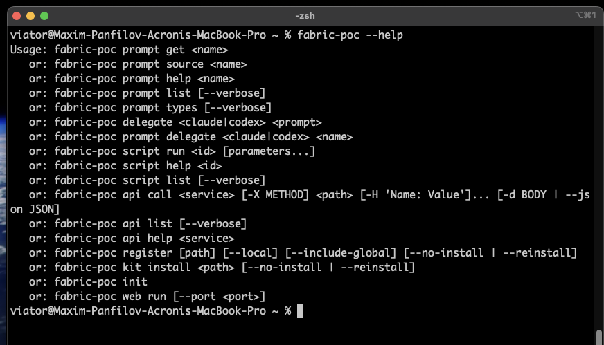
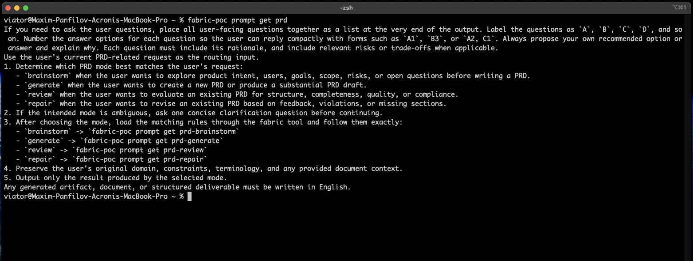
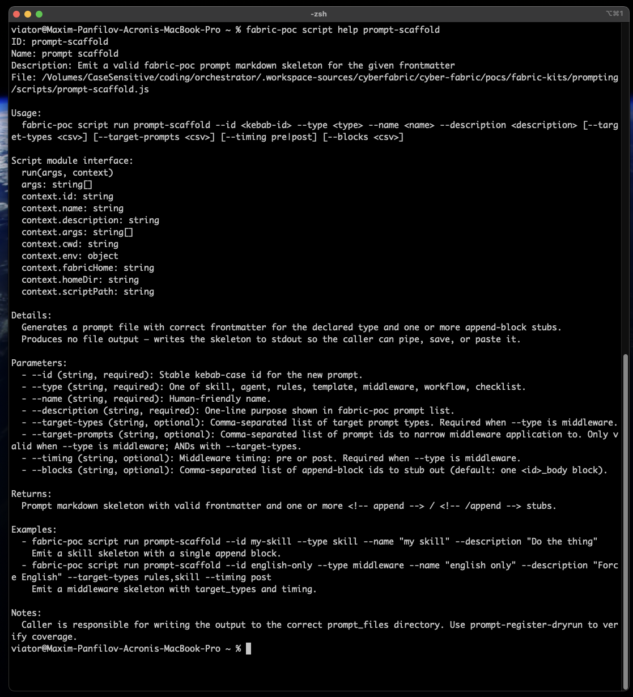
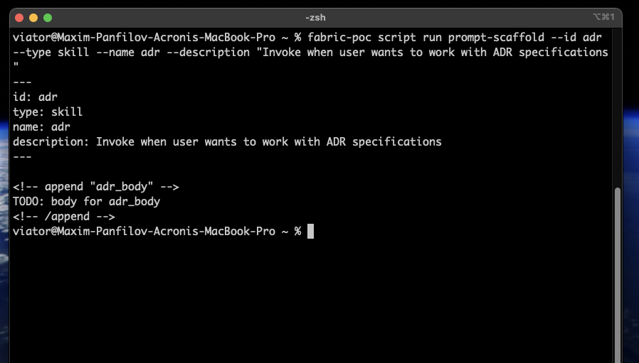
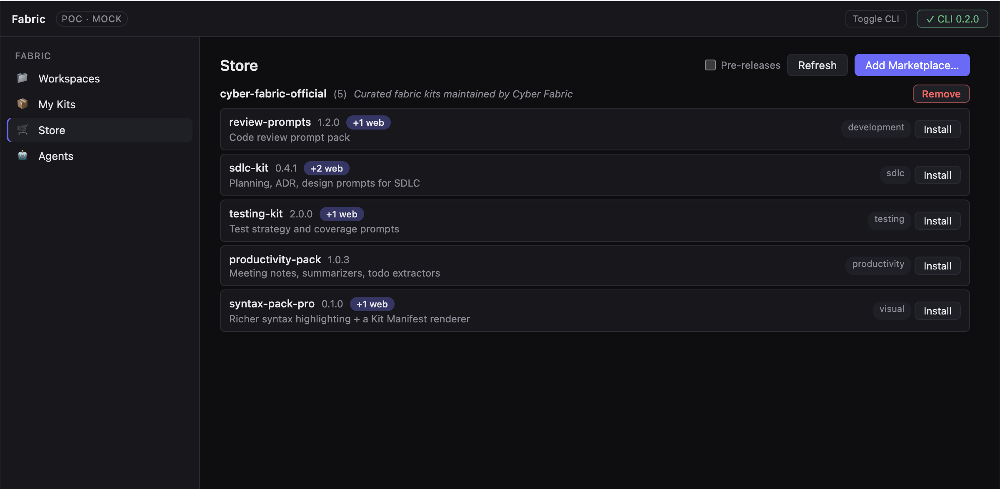
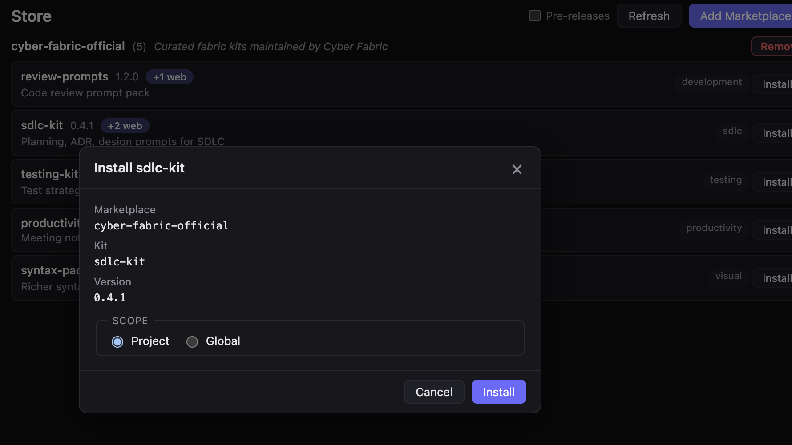
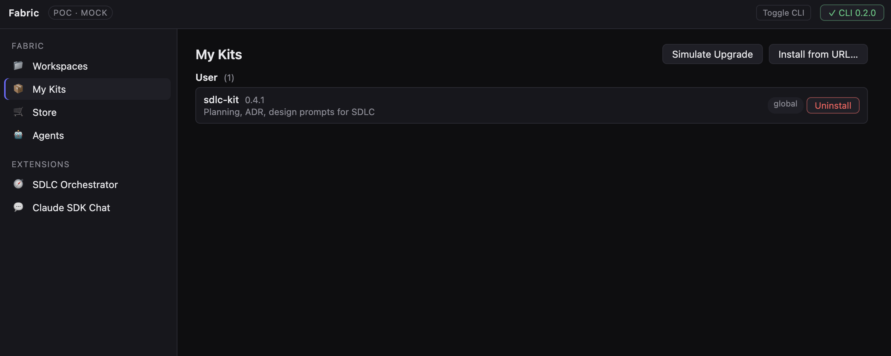
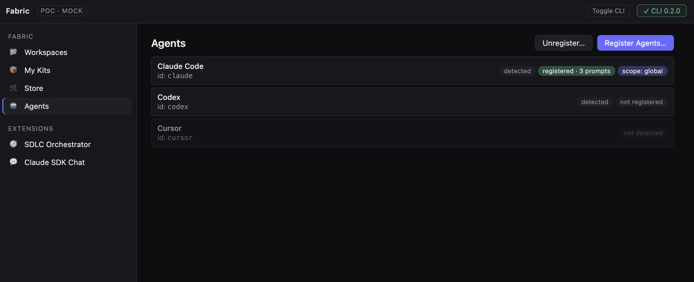
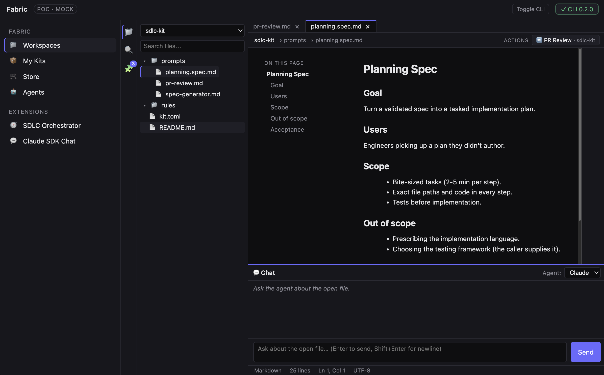

---
cpt:
  id: cpt-cyber-fabric-prd
  kind: PRD
  system: cyber-fabric
  version: 2.0
  status: draft
  date: 2026-04-29
---

# PRD — Cyber Fabric

<!-- toc -->

- [1. Overview](#1-overview)
  - [1.1 Purpose](#11-purpose)
  - [1.2 Background / Problem Statement](#12-background--problem-statement)
  - [1.3 Goals (Business Outcomes)](#13-goals-business-outcomes)
  - [1.4 Glossary](#14-glossary)
- [2. Actors](#2-actors)
  - [2.1 Human Actors](#21-human-actors)
  - [2.2 System Actors](#22-system-actors)
- [3. Operational Concept & Environment](#3-operational-concept--environment)
  - [3.1 Module-Specific Environment Constraints](#31-module-specific-environment-constraints)
- [4. Scope](#4-scope)
  - [4.1 In Scope](#41-in-scope)
  - [4.2 Out of Scope](#42-out-of-scope)
- [5. Functional Requirements](#5-functional-requirements)
  - [5.1 Workspaces](#51-workspaces)
  - [5.2 Kits & Marketplace](#52-kits--marketplace)
  - [5.3 Prompts, Skills & Sub-Agents](#53-prompts-skills--sub-agents)
  - [5.4 Surfaces](#54-surfaces)
  - [5.5 Git Domain](#55-git-domain)
  - [5.6 Pull Requests & Markdown-Aware Review](#56-pull-requests--markdown-aware-review)
  - [5.7 Authentication & Secrets](#57-authentication--secrets)
  - [5.8 Distribution & Installation](#58-distribution--installation)
  - [5.9 Mockup Visualization](#59-mockup-visualization)
- [6. Non-Functional Requirements](#6-non-functional-requirements)
  - [6.1 NFR Inclusions](#61-nfr-inclusions)
  - [6.2 NFR Exclusions](#62-nfr-exclusions)
- [7. Public Library Interfaces](#7-public-library-interfaces)
  - [7.1 Public API Surface](#71-public-api-surface)
  - [7.2 External Integration Contracts](#72-external-integration-contracts)
- [8. Use Cases](#8-use-cases)
  - [Developer use cases](#developer-use-cases)
  - [Architect use cases](#architect-use-cases)
  - [Product Manager use cases](#product-manager-use-cases)
  - [Prompt Engineer use cases](#prompt-engineer-use-cases)
  - [UX Designer use cases](#ux-designer-use-cases)
  - [Cross-cutting use cases](#cross-cutting-use-cases)
- [9. Acceptance Criteria](#9-acceptance-criteria)
- [10. Dependencies](#10-dependencies)
- [11. Assumptions](#11-assumptions)
- [12. Risks](#12-risks)

<!-- /toc -->

---

## 1. Overview

### 1.1 Purpose

Cyber Fabric is a delivery platform that unifies developers, architects, product managers, prompt engineers, and UX designers around the artifacts they already work with — repositories, specs, ADRs, PRDs, designs, mockups, code, and pull requests. Fabric ships one canonical content model (Prompts, Scripts, Assets, Web Extensions, dev-tool plugins) and one extension mechanism (Kits) that materialize identically across every user surface: a Web App, a VS Code plugin, a REST API, a CLI, and any agentic tool the user already lives in.

The Cyber Fabric ADR set ([docs/ADR/README.md](ADR/README.md)) is the architectural authority behind this PRD. This document captures the *what* — user-visible capabilities, scenarios, and acceptance — and points at ADRs for the *how*.

### 1.2 Background / Problem Statement

Modern product organizations operate with a fragmented SDLC tool stack. PRDs live in one tool, design lives in another, code and tests live in repositories, review discussions live in pull-request threads, and AI-assisted workflows are scattered across multiple agentic tools (Claude Code, Cursor, Windsurf, Codex, Copilot) — each with its own prompt format, skill registration mechanism, and context model. This makes end-to-end traceability expensive: teams cannot reliably link a requirement to the code that implements it, the tests that validate it, or the review that approved it. Every new agentic-tool integration multiplies the maintenance surface; every new persona surface (CLI for engineers, Web App for PMs, IDE plugin for either) re-implements prompt resolution, kit discovery, and registration.

**Target users**:

- Developers (build features, fix bugs, review PRs across many repos)
- Architects (author specs and ADRs, run design reviews, brainstorm decisions)
- Product Managers (author PRDs, coordinate delivery, review documentation)
- Prompt Engineers (author and distribute prompts, skills, sub-agents)
- UX Designers (produce mockups, hand off designs, run visual reviews)

**Key problems solved**:

- Per-tool skill stub maintenance — same prompt re-formatted for every agentic tool
- Cross-repo coordination — branches, worktrees, commits, PRs scattered across `git`, `gh`, IDE windows
- Spec / ADR review fragmentation — markdown rendering, comments, suggestions split across multiple surfaces
- Kit-style distribution gap — no versioning, no dependency model, no install verb for prompt collections
- PM ↔ engineer surface gap — PMs locked out of git-native flows

### 1.3 Goals (Business Outcomes)

- **G1 — OSS adoption.** Ship Fabric under Apache-2.0 (no CLA, BDFL governance) and reach **1,000 GitHub stars and at least one external (non-sponsor) adopter** within **18 months of release** (Baseline: 0 stars, 0 adopters at draft date; Target: v1.0 GA + 18mo).
- **G2 — Sponsor production adoption.** Reach **≥ `{N-production-sponsors}` sponsor companies** actively using Fabric on at least one production delivery flow within **18 months of v1.0 GA** (Baseline: 0 production sponsors at draft date; Target: v1.0 GA + 18mo; `{N-production-sponsors}` populated when design-partner outreach completes).
- **G3 — Use-case throughput.** For each headline scenario in §8, **establish a baseline before MVP** and **set a scenario-specific target before approved-for-execution** (one global percentage across every scenario is too blunt to be meaningful; thresholds are scenario-specific and populated when design-partner data lands).
- **G4 — Surface parity.** Every persona MUST drive every headline scenario in §8 to a reviewable artifact from at least one user surface without escalating to another persona's tooling — verified by a tracked equivalence checklist at release (Baseline: not measured; Target: v1.0 GA, 100% pass).
- **G5 — One author, every surface, every tool.** A prompt of type `skill` packaged in a kit MUST register identically across the v1 supported agentic tools (**Claude Code + Codex** at v1.0 GA; Cursor / Windsurf / Copilot land in v2) — the kit author writes it once (Baseline: 0 tools at draft date; Target: v1.0 GA = 2 tools, v2 = ≥ 4 of 5 tools).

### 1.4 Glossary

| Term | Definition |
|------|------------|
| **Fabric Workspace** | A named, multi-repo delivery context. Groups one or more git repositories plus their Fabric kits and operational state into a single working surface. A workspace is not a folder — it's a logical set of repositories that may live anywhere on disk. |
| **Fabric Kit** | A versioned, installable bundle of Fabric content (prompts, scripts, assets, web extensions, optional dev-tool plugins). The unit of distribution. Kits can be personal, workspace-scoped, organization-wide, or community-published, and may depend on other kits. |
| **Fabric Marketplace** | Discovery and distribution registry for kits. Users register one or more marketplaces (the official one is bundled; private and per-project marketplaces are supported) and browse / install kits resolved by name. |
| **Fabric Prompt** | A typed, addressable unit of authored agent instruction. Types include `template`, `rules`, `skill`, `agent`, `delegate`, `checklist`, `example`, `workflow`, and `middleware`. |
| **Fabric Skill** | A directly-invokable agent capability registered into an agentic tool from a Fabric Prompt of type `skill`. |
| **Fabric Sub-Agent** | A delegated, scoped persona invoked from inside an agent session, registered from a Fabric Prompt of type `agent`. |
| **Fabric Script** | An executable helper bundled in a kit that prompts and skills can call to drive deterministic behavior. |
| **Fabric Asset** | Static data files bundled in a kit (text, JSON, images, fixtures, model files) addressable from prompts and scripts. |
| **Fabric Web App** | The first-party Web UI for browsing workspaces, managing kits, reviewing pull requests with markdown-aware affordances, hosting agentic chat, and running kit-supplied web extensions. |
| **Fabric Web Extension** | A kit-contributed UI affordance for the Web App and the VS Code plugin (additional views, renderers, toolbar actions, custom screens). |
| **Fabric CLI** | The command-line surface (`fabric ...`). Available to every persona; primary surface for power users, scripters, and CI. |
| **Fabric VS Code Plugin** | The first-party VS Code extension that brings Fabric capabilities into VS Code through native patterns (Tree Views, Side Panel, Command Palette, webviews). |
| **Fabric REST API** | A canonical HTTP surface to Fabric capabilities. Available locally by default; the Web App and VS Code plugin both use it; external tools can build typed clients from its OpenAPI specification. |
| **Fabric API (resource)** | A declarative description of an external HTTP service shipped inside a kit (`*.api.toml`). Invokable from CLI, scripts, and prompts. |
| **Fabric Login** | The user-facing authentication verb for any provider (`fabric login git github`, `fabric login claude`, `fabric login npm`, …). |
| **Branch / Worktree / Commit** | First-class entities Fabric models structurally across all repos in a workspace, with workspace-aware filters and queries. |
| **Pull Request (PR)** | A first-class entity provided by a git provider (GitHub by default, others via kits). Fabric supports listing, creating, reviewing, and visualizing PRs across surfaces, with markdown-aware review for spec / ADR / documentation files. |
| **Agentic Tool** | A third-party AI coding environment (Claude Code, Codex, Cursor, Windsurf, Copilot, Pi). Fabric registers skills and sub-agents into it via host-native plugins. |
| **Agent Provider** | The runtime that actually executes a delegated prompt (Claude, Codex, Devin, Copilot CLI, …). Selectable through Fabric's delegate model. |

---

## 2. Actors

> **Note**: Stakeholder needs are managed at project / task level by the steering committee. This section documents actors (users, systems) that interact with Fabric directly.

### 2.1 Human Actors

#### Developer

**ID**: `cpt-cyber-fabric-actor-developer`

**Role**: Software engineer building features, fixing bugs, reviewing PRs, working day-to-day in a preferred IDE and agentic tool.

**Needs**: Workspaces that span many repos with first-class branches / worktrees / commits / PRs; kits that work identically across every supported agentic tool; share parameterized prompts with the team without copy-pasting; customize upstream kits without forking.

#### Architect

**ID**: `cpt-cyber-fabric-actor-architect`

**Role**: Software architect authoring specs, ADRs, design notes, and system diagrams; running design reviews; brainstorming with stakeholders.

**Needs**: Markdown-aware spec / ADR review with rendered preview, line comments, suggestion blocks; diagram rendering for popular formats; architecture-focused kits from the marketplace; a VS Code plugin with first-class spec / ADR editing.

#### Product Manager

**ID**: `cpt-cyber-fabric-actor-product-manager`

**Role**: Authors PRDs, requirements, user stories, and review feedback; coordinates delivery across engineering, design, and QA. May not work natively in git.

**Needs**: A Web App that surfaces workspaces, repositories, branches, commits, open PRs, and kit-managed content in one place; markdown-aware PRD / spec rendering with review affordances; agentic chat surface in the Web App; one-click kit installation; collaboration through PR comments without learning git mechanics.

#### Prompt Engineer

**ID**: `cpt-cyber-fabric-actor-prompt-engineer`

**Role**: Authors and maintains prompts, skills, and sub-agents; integrates scripts and external services into prompt-driven workflows; ships prompt libraries to teams.

**Needs**: One canonical kit format and one publish verb across surfaces; typed prompt taxonomy that captures different intents; bundled scripts and assets with per-kit dependency isolation; ability to ship a custom screen as a Web Extension; ability to extend / override other kits without forking.

#### UX Designer

**ID**: `cpt-cyber-fabric-actor-ux-designer`

**Role**: UX / product designer producing mockups, wireframes, interaction flows, and visual specs.

**Needs**: A mockup-visualization surface inside the Web App with chat alongside; design-focused kits in the marketplace (UI scaffolding, design systems, accessibility review, mockup generation); design hand-off through PRs with markdown-aware review; design-system kit distribution across an organization.

#### Downstream Beneficiary

**ID**: `cpt-cyber-fabric-actor-downstream-beneficiary`

**Role**: QA engineers and other roles who consume Fabric-generated artifacts (test plans, ADRs, design notes, review summaries) but don't author inside Fabric in MVP.

**Needs**: Read Fabric-generated artifacts as plain git-tracked files (markdown, TOML, JSON, images) without any Fabric tooling installed; provide review feedback through existing tools (PR comments, design tools).

### 2.2 System Actors

#### Agentic Tool

**ID**: `cpt-cyber-fabric-actor-agentic-tool`

**Role**: Third-party AI coding environment (Claude Code, Codex, Cursor, Windsurf, Copilot, Pi) into which Fabric registers skills and sub-agents through host-native plugins.

#### Agent Provider

**ID**: `cpt-cyber-fabric-actor-agent-provider`

**Role**: Runtime that executes a delegated prompt — Claude, Codex, Devin, Copilot CLI, and other future targets — selectable through Fabric's delegate model.

#### Git Provider

**ID**: `cpt-cyber-fabric-actor-git-provider`

**Role**: Hosting service for repositories and pull requests / merge requests. GitHub is the default, bundled provider; GitLab, Bitbucket, Gerrit, Gitea, Forgejo, and others plug in as kits implementing the same provider contract.

#### Marketplace

**ID**: `cpt-cyber-fabric-actor-marketplace`

**Role**: Git-repo-backed (or local-path) discovery and distribution registry for kits. The official marketplace is bundled; users register additional marketplaces (organization-private, per-project, community).

#### OS Keychain

**ID**: `cpt-cyber-fabric-actor-os-keychain`

**Role**: OS-native secret store (macOS Keychain, Windows Credential Manager, Linux Secret Service / libsecret) that holds provider credentials; encrypted-file fallback exists for headless environments.

---

## 3. Operational Concept & Environment

### 3.1 Module-Specific Environment Constraints

- **Cross-platform local-first.** Fabric runs locally on macOS, Windows, and Linux; cloud / multi-tenant deployment is post-MVP.
- **Node 16+ runtime.** Required on the user's host across every distribution channel.
- **Git toolchain on PATH.** Standard git plumbing must be available; no Fabric-specific git extension is required.
- **OS-native keychain reachable.** macOS Keychain / Windows Credential Manager / Linux Secret Service expected; encrypted-file fallback gated behind explicit opt-in for environments without keychain access (headless CI, locked-down hosts).
- **Git-native concurrency.** Fabric does not arbitrate concurrent edits across repos in a workspace; per-repo branches are the merge point.
- **No long-running daemon in MVP.** Operations are user-initiated; proactive workflows ship as host-hook recipe documentation.

---

## 4. Scope

> **Release phasing**. Items in this PRD carry a priority marker (`p1`–`p9`) that indicates release scope. **`p1` = v1 first release.** **`p2` = next-release candidates.** **`p3+` = backlog.** §4.1 below lists the *eventual* Fabric scope. The v1 cut — personas, surfaces, capabilities, and use cases tagged `p1` — is documented per-item in §5 (Functional Requirements), §7 (Public Library Interfaces), and §8 (Use Cases). The v1 personas are **Developer** and **Prompt Engineer**; **Architect**, **Product Manager**, and **UX Designer** are first-class v2 personas with their primary surfaces (VS Code plugin, Web App, mockup visualization) targeted for v2.

### 4.1 In Scope

- Multi-repo Fabric Workspaces with first-class branches, worktrees, commits, and pull requests
- Kits as the only extension mechanism (personal, workspace-scoped, core-bundled), with dependencies and auto-update policy
- Marketplace browsing and PR-gated kit publication; multi-marketplace support (official, organization-private, per-project, local-path)
- Typed prompt taxonomy (template, rules, skill, agent, delegate, checklist, example, workflow, middleware) with layered overrides
- Cross-tool skill registration: write once, register identically across supported agentic tools
- User surfaces: CLI, Web App, VS Code plugin, REST API, kit-supplied Web Extensions
- Pull request listing, creation, review, and markdown-aware review affordances (rendered preview, line comments on rendered output, suggestion blocks)
- Provider-agnostic git operations with GitHub bundled as the default provider
- `fabric login` for any provider (git providers, agent providers, package registries) backed by OS-native keychain
- Multi-channel distribution (npm / pnpm, Homebrew, Scoop, VS Code Marketplace, agentic-tool marketplaces, container images) with cross-channel install equivalence
- A core kit shipped with Fabric containing platform-internal prompts, the canonical Fabric VS Code extension, and the GitHub provider implementation
- Mockup visualization with chat in the Web App, plus a Web Extension contract that lets design kits add custom mockup-related screens
- Open-source release under Apache-2.0 with no CLA and BDFL governance

### 4.2 Out of Scope

- Fabric-managed multi-tenant cloud service (post-MVP)
- Background daemon, file-watcher, or proactive watcher process (post-MVP)
- Standalone desktop shell hosting the Web App outside `fabric web run` (post-MVP)
- PRD authoring through the CLI (PMs use the Web App)
- First-class authoring surfaces for QA in MVP (consumes artifacts as git-tracked files)
- CLA-based contribution model and foundation-style governance (post-MVP if sponsors require)
- Fabric-side merge arbitration across repos in a workspace
- Built-in product telemetry that phones home (no instrumentation Fabric collects centrally)

---

## 5. Functional Requirements

> **Testing strategy**: All requirements are verified via automated tests (unit, integration, e2e) targeting 90%+ code coverage unless otherwise specified. Verification Method is documented only for non-test approaches (analysis, inspection, demonstration).

### 5.1 Workspaces

#### Named multi-repo workspace

- [ ] `p1` - **ID**: `cpt-cyber-fabric-fr-workspace-named-multi-repo`

The system **MUST** allow a user to create a named workspace that pins one or more git repositories living anywhere on disk, and **MUST** make that workspace addressable by name from any directory and any surface.

**Rationale**: Workspaces are the unit of multi-repo delivery; without a named, surface-agnostic addressing model, cross-repo work and surface parity (G4) cannot be achieved.

**Actors**: `cpt-cyber-fabric-actor-developer`, `cpt-cyber-fabric-actor-architect`, `cpt-cyber-fabric-actor-product-manager`, `cpt-cyber-fabric-actor-ux-designer`

#### Workspace lifecycle and membership

- [ ] `p1` - **ID**: `cpt-cyber-fabric-fr-workspace-lifecycle`

The system **MUST** support creating, listing, inspecting, and removing workspaces, and adding or removing repositories from a workspace at any time.

**Rationale**: Workspaces evolve over time; teams add repos, retire repos, and change scope — the workspace concept must accommodate that without re-creation.

**Actors**: `cpt-cyber-fabric-actor-developer`, `cpt-cyber-fabric-actor-architect`

#### VS Code workspace interop

- [ ] `p2` - **ID**: `cpt-cyber-fabric-fr-workspace-vscode-interop`

The system **MUST** support bidirectional interop with VS Code workspaces: importing a `.code-workspace` file into a Fabric workspace, and exporting a Fabric workspace to a `.code-workspace` file.

**Rationale**: VS Code-only collaborators must remain part of the workflow; bidirectional interop prevents the two views from drifting.

**Actors**: `cpt-cyber-fabric-actor-developer`, `cpt-cyber-fabric-actor-architect`

#### Workspace context resolution per surface

- [ ] `p1` - **ID**: `cpt-cyber-fabric-fr-workspace-context-resolution`

The system **MUST** resolve the target workspace in a surface-appropriate way, **MUST** make the active workspace visible to the user, and **MUST** allow explicit override when needed.

**Rationale**: Surface-natural context resolution avoids both the "always-explicit" extreme (destroys ergonomics) and the "global sticky" extreme (hides state); per-surface specifics are an architecture concern handled in ADRs.

**Actors**: `cpt-cyber-fabric-actor-developer`, `cpt-cyber-fabric-actor-architect`, `cpt-cyber-fabric-actor-product-manager`, `cpt-cyber-fabric-actor-prompt-engineer`, `cpt-cyber-fabric-actor-ux-designer`

#### Workspace-aware prompt rendering

- [ ] `p1` - **ID**: `cpt-cyber-fabric-fr-workspace-aware-prompt-rendering`

The system **MUST** auto-inject workspace context (member repositories, branches, worktrees, scoped kits) into every rendered prompt when a workspace is active, and **MUST** return a deterministic, recoverable error when a prompt requires a workspace and none is selected.

**Rationale**: Agents that receive a rendered prompt must always see workspace context up front; missing workspace must be a recoverable, agent-readable state, not an empty response.

**Actors**: `cpt-cyber-fabric-actor-developer`, `cpt-cyber-fabric-actor-prompt-engineer`

### 5.2 Kits & Marketplace

#### Kits as the only extension mechanism

- [ ] `p1` - **ID**: `cpt-cyber-fabric-fr-kits-only-extension-mechanism`

The system **MUST** deliver every prompt, every script, every web extension, and every dev-tool plugin through kits; there **MUST NOT** be a parallel extension mechanism.

**Rationale**: One extension story is a structural simplification — every persona learns one shape; tooling, distribution, validation, and lifecycle apply uniformly.

**Actors**: `cpt-cyber-fabric-actor-prompt-engineer`, `cpt-cyber-fabric-actor-developer`, `cpt-cyber-fabric-actor-architect`, `cpt-cyber-fabric-actor-ux-designer`

#### Three kit scopes

- [ ] `p1` - **ID**: `cpt-cyber-fabric-fr-kits-three-scopes`

The system **MUST** support three kit scopes: personal / global, workspace-scoped, and core-bundled (shipped with Fabric itself).

**Rationale**: Personal experimentation, project-local sharing, and platform-shipped content all need first-class homes; one scope cannot serve all three.

**Actors**: `cpt-cyber-fabric-actor-prompt-engineer`, `cpt-cyber-fabric-actor-developer`

#### Kit dependencies and auto-update policy

- [ ] `p1` - **ID**: `cpt-cyber-fabric-fr-kits-dependencies-and-auto-update`

The system **MUST** allow a kit to declare dependencies on other kits, including version compatibility constraints and an update policy.

**Rationale**: Kits compose; teams need reproducibility *and* a path for unattended security / patch updates without per-team manual intervention. The exact compatibility model and update-policy mechanism are an architecture concern.

**Actors**: `cpt-cyber-fabric-actor-prompt-engineer`, `cpt-cyber-fabric-actor-developer`

#### Marketplace operations across surfaces

- [ ] `p1` - **ID**: `cpt-cyber-fabric-fr-marketplace-cross-surface`

The system **MUST** support marketplace browsing, name-resolved kit installation, removal, and listing from every surface (CLI, Web App, VS Code plugin, REST API, agentic tool).

**Rationale**: PMs install through the Web App; developers install through the CLI or the agentic tool; surface parity (G4) requires every surface to reach the marketplace.

**Actors**: `cpt-cyber-fabric-actor-product-manager`, `cpt-cyber-fabric-actor-developer`, `cpt-cyber-fabric-actor-architect`, `cpt-cyber-fabric-actor-ux-designer`

#### Multiple registered marketplaces

- [ ] `p2` - **ID**: `cpt-cyber-fabric-fr-multiple-marketplaces`

The system **MUST** support multiple registered marketplaces simultaneously: the official one (bundled), per-organization private ones, per-project ones, and local-path ones.

**Rationale**: Distribution audiences differ — public, organization-private, per-project, and personal all need first-class channels with the same authoring workflow.

**Actors**: `cpt-cyber-fabric-actor-prompt-engineer`, `cpt-cyber-fabric-actor-developer`

#### PR-gated kit publication

- [ ] `p1` - **ID**: `cpt-cyber-fabric-fr-kit-publication-pr-gated`

The system **MUST** publish kit versions through a reviewable marketplace contribution flow and **MUST** make installed versions verifiable.

**Rationale**: A reviewable contribution flow plus client-side verifiability is what protects every consumer even when individual trust-chain links are compromised. The exact verification mechanism is an architecture concern.

**Actors**: `cpt-cyber-fabric-actor-prompt-engineer`

#### Per-kit dependency isolation

- [ ] `p1` - **ID**: `cpt-cyber-fabric-fr-per-kit-dependency-isolation`

The system **MUST** isolate each kit's runtime dependencies so two kits can pin different versions of the same library and both work, and one kit **MUST NOT** be able to read another kit's secrets or interfere with its execution.

**Rationale**: Kits ship from many authors; isolation is the price of trust at scale and a precondition for the marketplace to grow safely.

**Actors**: `cpt-cyber-fabric-actor-prompt-engineer`, `cpt-cyber-fabric-actor-developer`

### 5.3 Prompts, Skills & Sub-Agents

#### Typed markdown prompts

- [ ] `p1` - **ID**: `cpt-cyber-fabric-fr-prompts-typed-markdown`

The system **MUST** model prompts as markdown files with frontmatter, where each prompt declares one type drawn from a closed taxonomy: `template`, `rules`, `skill`, `agent`, `delegate`, `checklist`, `example`, `workflow`, `middleware`.

**Rationale**: Different consumer intents need different machinery; one shape forced on all of them either over-constrains or under-specifies.

**Actors**: `cpt-cyber-fabric-actor-prompt-engineer`

#### Layered prompt overrides

- [ ] `p1` - **ID**: `cpt-cyber-fabric-fr-prompts-layered-overrides`

The system **MUST** allow a kit to extend, replace, append, prepend, remove, or reorder another kit's instruction blocks by stable identifier, without forking the upstream kit.

**Rationale**: Customization without forking is what makes kit composition viable at organization scale; stable instruction ids let overrides survive upstream upgrades.

**Actors**: `cpt-cyber-fabric-actor-prompt-engineer`, `cpt-cyber-fabric-actor-developer`

#### Variable resolution with override precedence

- [ ] `p1` - **ID**: `cpt-cyber-fabric-fr-prompts-variable-resolution`

The system **MUST** resolve prompt template variables by merging global and workspace configuration, with explicit per-invocation overrides taking precedence over both.

**Rationale**: Predictable variable resolution is a prerequisite for prompts that work the same way in every surface and every environment.

**Actors**: `cpt-cyber-fabric-actor-prompt-engineer`, `cpt-cyber-fabric-actor-developer`

#### Cross-tool skill registration

- [ ] `p1` - **ID**: `cpt-cyber-fabric-fr-skills-cross-tool-registration`

The system **MUST** register a kit-shipped prompt of type `skill` identically across every supported agentic tool from one kit-side declaration; the kit author **MUST** write it once.

**Rationale**: G5 — same skill everywhere — is the platform's headline value to prompt engineers and developers.

**Actors**: `cpt-cyber-fabric-actor-prompt-engineer`, `cpt-cyber-fabric-actor-developer`, `cpt-cyber-fabric-actor-agentic-tool`

#### Middleware composition

- [ ] `p1` - **ID**: `cpt-cyber-fabric-fr-prompts-middleware-composition`

The system **MUST** support `middleware`-typed prompts that compose cross-cutting injections (prepend / append) into target prompts selected by id or glob.

**Rationale**: Tone customization, organizational standards, and platform-level context (e.g. workspace summary) need a clean way to layer in without modifying every target prompt.

**Actors**: `cpt-cyber-fabric-actor-prompt-engineer`

#### Delegate prompts to external agents

- [ ] `p2` - **ID**: `cpt-cyber-fabric-fr-prompts-delegate-external-agents`

The system **MUST** support `delegate`-typed prompts that, when invoked, run against an explicit external agent (Claude, Codex, Devin, Copilot CLI, …) chosen by the prompt author.

**Rationale**: Some prompts are designed to drive a specific agent's strengths; delegate captures that intent without forcing the user's current agentic tool.

**Actors**: `cpt-cyber-fabric-actor-prompt-engineer`, `cpt-cyber-fabric-actor-agent-provider`

### 5.4 Surfaces

#### CLI surface

- [ ] `p1` - **ID**: `cpt-cyber-fabric-fr-surface-cli`

The system **MUST** expose every Fabric capability through a command-line surface (`fabric ...`) available to every persona, suitable for power users, scripters, and CI.

**Rationale**: CLI is the universal denominator across operating systems and CI environments; it is the only surface guaranteed to work without a window manager.

**Actors**: `cpt-cyber-fabric-actor-developer`, `cpt-cyber-fabric-actor-prompt-engineer`, `cpt-cyber-fabric-actor-architect`

#### Web App surface

- [ ] `p2` - **ID**: `cpt-cyber-fabric-fr-surface-web-app`

The system **MUST** ship a first-party Web App that surfaces workspaces, kits, pull requests, agentic chat, mockup visualization, and kit-supplied Web Extensions, launched locally with one verb.

**Rationale**: PMs, architects, and UX designers need a non-CLI primary surface; the Web App is also the richest visualization surface for markdown-aware review and mockups.

**Actors**: `cpt-cyber-fabric-actor-product-manager`, `cpt-cyber-fabric-actor-architect`, `cpt-cyber-fabric-actor-ux-designer`, `cpt-cyber-fabric-actor-developer`

#### VS Code plugin surface

- [ ] `p2` - **ID**: `cpt-cyber-fabric-fr-surface-vscode-plugin`

The system **MUST** ship a first-party VS Code extension that brings Fabric capabilities into VS Code through native extension affordances and supports kit-supplied Web Extensions.

**Rationale**: Developers and architects who live in VS Code need every Fabric capability without leaving the editor; using native extension affordances is what makes the experience feel at home in the IDE.

**Actors**: `cpt-cyber-fabric-actor-developer`, `cpt-cyber-fabric-actor-architect`

#### REST API surface

- [ ] `p2` - **ID**: `cpt-cyber-fabric-fr-surface-rest-api`

The system **MUST** expose Fabric capabilities through a REST API, available locally by default and suitable for first-party and third-party clients.

**Rationale**: A REST surface is what lets cloud Fabric and local Fabric work identically and lets external integrators build typed clients; transport-and-canonical-client rules belong in §7 and ADRs.

**Actors**: `cpt-cyber-fabric-actor-developer`, `cpt-cyber-fabric-actor-prompt-engineer`

#### Web Extensions

- [ ] `p2` - **ID**: `cpt-cyber-fabric-fr-surface-web-extensions`

The system **MUST** allow a kit to ship a Web Extension that works in both the Web App and the VS Code plugin from a single extension definition.

**Rationale**: Kit authors should not have to maintain two UIs; one extension definition for two surfaces is the leverage point.

**Actors**: `cpt-cyber-fabric-actor-prompt-engineer`, `cpt-cyber-fabric-actor-ux-designer`

#### Surface parity guarantee

- [ ] `p1` - **ID**: `cpt-cyber-fabric-fr-surface-parity`

The system **MUST** make every operation a user can perform on one surface reachable from the others; no surface is feature-privileged.

**Rationale**: G4 — surface parity — is the only way every persona can drive every scenario without escalating to another persona's tooling.

**Actors**: `cpt-cyber-fabric-actor-developer`, `cpt-cyber-fabric-actor-product-manager`, `cpt-cyber-fabric-actor-architect`, `cpt-cyber-fabric-actor-ux-designer`, `cpt-cyber-fabric-actor-prompt-engineer`

**Verification Method**: Demonstration — every MVP surface drives a representative scenario for every persona end-to-end; equivalence checklist tracked at release.

---

#### CLI visual references *(v1 — POC captures)*

The screenshots below are real terminal output from the Fabric CLI POC (`fabric-poc`), the v1 surface per `cpt-cyber-fabric-fr-surface-cli` and `cpt-cyber-fabric-interface-cli-surface`. They illustrate the four canonical CLI workflows: discovery (`--help`), prompt rendering (`prompt get`), script discovery (`script help`), and script execution (`script run`).

> *`fabric-poc --help` — top-level CLI surface.* Lists every verb the v1 CLI exposes: `prompt get / source / help / list / types`, `delegate <claude|codex>`, `prompt delegate`, `script run / help / list`, `api call / list / help`, `register`, `kit install`, `init`, `web run`. This is the canonical entry point for every v1 user — Developer and Prompt Engineer alike. Cross-references: `cpt-cyber-fabric-fr-surface-cli`, `cpt-cyber-fabric-interface-cli-surface`, `cpt-cyber-fabric-fr-skills-cross-tool-registration`, `cpt-cyber-fabric-fr-marketplace-cross-surface`, `cpt-cyber-fabric-usecase-install-fabric`.

---

> *`fabric-poc prompt get prd` — rendered prompt output.* Resolves the `prd` prompt from the active kit set, applies layered overrides and variable resolution, and prints the rendered instruction body (here: a router that selects between `prd-brainstorm` / `prd-generate` / `prd-review` / `prd-repair` modes). The downstream commands the prompt suggests (`fabric-poc prompt get prd-brainstorm`, etc.) demonstrate the typed-prompt taxonomy in action. Cross-references: `cpt-cyber-fabric-fr-prompts-typed-markdown`, `cpt-cyber-fabric-fr-prompts-layered-overrides`, `cpt-cyber-fabric-fr-prompts-variable-resolution`, `cpt-cyber-fabric-fr-workspace-aware-prompt-rendering`, `cpt-cyber-fabric-usecase-dev-share-parameterized-prompt`.

---

> *`fabric-poc script help prompt-scaffold` — script discovery + metadata.* Returns the script's declared frontmatter (id, type, name, description, content), the runtime arguments it accepts, examples, and authoring notes. Backed by the kit manifest declaration per ADR-0017. Cross-references: `cpt-cyber-fabric-fr-kits-only-extension-mechanism`, `cpt-cyber-fabric-usecase-pe-bundle-scripts-with-prompts`, `cpt-cyber-fabric-usecase-pe-author-kit`.

---

> *`fabric-poc script run prompt-scaffold --id adr --type skill --name adr --description "..."` — deterministic script execution.* Output is a scaffolded prompt: frontmatter (`id`, `type: skill`, `name`, `description`) followed by an `<!-- append "adr_body" -->` block-helper region for the prompt body. Demonstrates how a kit-shipped script (`prompt-scaffold` from `kit-dev`) generates new typed prompts on demand — the exact PE workflow that turns "I have an idea" into "kit-ready prompt". Cross-references: `cpt-cyber-fabric-fr-kits-only-extension-mechanism`, `cpt-cyber-fabric-fr-prompts-typed-markdown`, `cpt-cyber-fabric-usecase-pe-bundle-scripts-with-prompts`, `cpt-cyber-fabric-usecase-pe-author-kit`.

---

#### Web App visual references *(v2 — POC mockups)*

The screenshots below illustrate the eventual Fabric Web App per `cpt-cyber-fabric-fr-surface-web-app` and adjacent v2 FRs (`cpt-cyber-fabric-fr-surface-web-extensions`, `cpt-cyber-fabric-interface-web-extension-contract`). The "POC · MOCK" badge is visible in every screenshot — these are not v1.0 GA artifacts; the first-party Web App lands in **v2**.

> *Marketplace store.* Browse the curated `cyber-fabric-official` marketplace; per-kit `+N web` badges flag bundled Web Extensions; tags (`development`, `sdlc`, `testing`, `productivity`, `visual`) drive role-based discovery. Cross-references: `cpt-cyber-fabric-fr-marketplace-cross-surface`, `cpt-cyber-fabric-usecase-dev-install-from-marketplace`.

---

> *Kit install dialog.* User picks the install **scope** (Project / Global) and confirms. The same dialog backs name-resolved install regardless of marketplace origin. Cross-references: `cpt-cyber-fabric-fr-kits-three-scopes`, `cpt-cyber-fabric-usecase-dev-install-from-marketplace`.

---

> *My Kits.* Lifecycle management for installed kits, with scope provenance (`global`, `User`). Side panel splits **FABRIC** core sections (Workspaces, My Kits, Store, Agents) from kit-contributed **EXTENSIONS** (here: SDLC Orchestrator, Claude SDK Chat) — extensions register as Fabric Web Extensions per `cpt-cyber-fabric-fr-surface-web-extensions`. Cross-references: `cpt-cyber-fabric-fr-kits-only-extension-mechanism`, `cpt-cyber-fabric-fr-kits-three-scopes`.

---

> *Agents.* Cross-tool skill registration status. Each supported agentic tool (Claude Code, Codex, Cursor, …) reports `detected` / `not detected` and `registered · N prompts` / `not registered`, with scope. The `Register Agents…` action drives the cross-tool registration flow. Cross-references: `cpt-cyber-fabric-fr-skills-cross-tool-registration`, `cpt-cyber-fabric-contract-agentic-tool-host-plugin`, `cpt-cyber-fabric-usecase-dev-use-skill-in-agentic-tool`.

---

> *Workspace browser with spec editor and inline chat.* Multi-pane layout: workspace tree (`sdlc-kit > prompts/rules/kit.toml/README.md`) on the left, tabbed file editor (`pr-review.md`, `planning.spec.md`) in the middle, table-of-contents navigator on the right, and an inline agentic chat panel anchored to the open file with selectable agent provider. PR Review badge indicates an open PR context. Cross-references: `cpt-cyber-fabric-fr-workspace-named-multi-repo`, `cpt-cyber-fabric-fr-pr-markdown-aware-review`, `cpt-cyber-fabric-usecase-pm-review-from-web-app`, `cpt-cyber-fabric-usecase-pm-author-prd`, `cpt-cyber-fabric-usecase-ux-mockup-and-chat` *(all v2)*.

---

### 5.5 Git Domain

#### Branches as first-class entities

- [ ] `p1` - **ID**: `cpt-cyber-fabric-fr-git-branches-first-class`

The system **MUST** model branches as first-class structured data with workspace-aware filters (orphan, gone, stale) and operations (list, info, create, delete, rename, track, untrack), aggregated across all repos in the active workspace.

**Rationale**: Cross-repo branch questions cannot be answered by plain `git` in one command; first-class modelling is what lets multi-repo workflows scale.

**Actors**: `cpt-cyber-fabric-actor-developer`, `cpt-cyber-fabric-actor-architect`

#### Worktrees as first-class entities with hybrid ownership

- [ ] `p1` - **ID**: `cpt-cyber-fabric-fr-git-worktrees-first-class`

The system **MUST** model worktrees as first-class structured data, distinguishing Fabric-created (aggressively cleanable) from externally created (protected by explicit confirmation), with cross-repo aggregation across the workspace.

**Rationale**: Worktrees accumulate; intelligent cleanup needs ownership metadata; external worktrees (created by `git`, `gh`, Claude Code's Agent tool, …) must remain safe.

**Actors**: `cpt-cyber-fabric-actor-developer`

#### Commits as first-class entities

- [ ] `p1` - **ID**: `cpt-cyber-fabric-fr-git-commits-first-class`

The system **MUST** model commits as first-class structured data (sha, message, author, date, parents, files-changed) queryable across the workspace by repo, branch, author, and date range.

**Rationale**: "Who landed what across all repos this week" is a real cross-repo question; first-class commit modelling is what makes it answerable in one query.

**Actors**: `cpt-cyber-fabric-actor-developer`, `cpt-cyber-fabric-actor-architect`

#### Workspace-default aggregation with per-repo filtering

- [ ] `p1` - **ID**: `cpt-cyber-fabric-fr-git-workspace-aggregation`

The system **MUST** aggregate git domain operations across the full workspace by default, while allowing per-repo filtering on demand.

**Rationale**: The workspace is the unit of work; per-repo views are a refinement, not the default.

**Actors**: `cpt-cyber-fabric-actor-developer`, `cpt-cyber-fabric-actor-architect`, `cpt-cyber-fabric-actor-product-manager`

### 5.6 Pull Requests & Markdown-Aware Review

#### Pull requests as first-class entities

- [ ] `p2` - **ID**: `cpt-cyber-fabric-fr-pr-first-class`

The system **MUST** model pull requests (and provider-specific equivalents — GitLab MRs, Bitbucket PRs, …) as first-class structured entities accessible from every surface.

**Rationale**: Review and approval are core workflows; PRs must be queryable, viewable, and actionable without leaving Fabric for the git host.

**Actors**: `cpt-cyber-fabric-actor-developer`, `cpt-cyber-fabric-actor-product-manager`, `cpt-cyber-fabric-actor-architect`, `cpt-cyber-fabric-actor-ux-designer`, `cpt-cyber-fabric-actor-git-provider`

#### Cross-surface PR operations

- [ ] `p2` - **ID**: `cpt-cyber-fabric-fr-pr-cross-surface-operations`

The system **MUST** support listing, inspecting, creating, approving / requesting changes / commenting, and visualizing PRs from every user surface.

**Rationale**: PR work happens wherever the user is — IDE, Web App, agentic tool — and surface parity (G4) requires uniform PR operations.

**Actors**: `cpt-cyber-fabric-actor-developer`, `cpt-cyber-fabric-actor-product-manager`, `cpt-cyber-fabric-actor-architect`, `cpt-cyber-fabric-actor-ux-designer`

#### Markdown-aware review

- [ ] `p2` - **ID**: `cpt-cyber-fabric-fr-pr-markdown-aware-review`

The system **MUST** provide markdown-aware review affordances on PRs: side-by-side rendered preview of changed markdown files, line comments on the rendered output (mapped back to source line), and suggestion blocks. The Web App **MUST** be the richest visualization surface for these affordances.

**Rationale**: Cyber Fabric is built around markdown artifacts (specs, ADRs, PRDs, design briefs); reviewing them as raw diff loses 80% of the signal.

**Actors**: `cpt-cyber-fabric-actor-product-manager`, `cpt-cyber-fabric-actor-architect`, `cpt-cyber-fabric-actor-ux-designer`, `cpt-cyber-fabric-actor-developer`

#### Provider-agnostic git operations

- [ ] `p2` - **ID**: `cpt-cyber-fabric-fr-pr-provider-agnostic`

The system **MUST** define a provider-agnostic interface for git provider operations (PRs / MRs, reviews, comments, releases) and **MUST** ship GitHub support as the default provider; other providers (GitLab, Bitbucket, Gerrit, Gitea, Forgejo, …) **MUST** be addable through the same kit-as-extension mechanism.

**Rationale**: Locking Fabric to one provider would split the addressable market; a provider-agnostic interface preserves choice without splitting the codebase.

**Actors**: `cpt-cyber-fabric-actor-developer`, `cpt-cyber-fabric-actor-prompt-engineer`, `cpt-cyber-fabric-actor-git-provider`

### 5.7 Authentication & Secrets

#### Unified `fabric login` verb

- [ ] `p1` - **ID**: `cpt-cyber-fabric-fr-auth-fabric-login`

The system **MUST** expose a unified authentication verb (`fabric login <subject>`) that dispatches to the relevant provider's auth flow (OAuth device flow, browser-based OAuth, personal access token entry, …) for git providers, agent providers, and package registries.

**Rationale**: One verb across providers reduces user surface; provider authors choose the flow that suits their service.

**Actors**: `cpt-cyber-fabric-actor-developer`, `cpt-cyber-fabric-actor-product-manager`, `cpt-cyber-fabric-actor-architect`, `cpt-cyber-fabric-actor-ux-designer`, `cpt-cyber-fabric-actor-prompt-engineer`

#### OS-keychain-backed secret storage

- [ ] `p1` - **ID**: `cpt-cyber-fabric-fr-auth-secret-storage`

The system **MUST** store provider credentials in the OS-native keychain (macOS Keychain, Windows Credential Manager, Linux Secret Service) by default, with an explicit-opt-in encrypted-file fallback for headless environments.

**Rationale**: Plaintext secrets in shared user files do not clear sponsor-grade hygiene bars; OS-native keychains are the lowest-friction durable answer.

**Actors**: `cpt-cyber-fabric-actor-developer`, `cpt-cyber-fabric-actor-os-keychain`

#### Cross-surface auth and secret management

- [ ] `p2` - **ID**: `cpt-cyber-fabric-fr-auth-cross-surface`

The system **MUST** make `fabric login` and secret-management operations available from every user surface (CLI, Web App, VS Code plugin, REST API).

**Rationale**: Auth is a precondition for almost every other user flow; locking it to one surface breaks the flow for the persona working elsewhere.

**Actors**: `cpt-cyber-fabric-actor-developer`, `cpt-cyber-fabric-actor-product-manager`, `cpt-cyber-fabric-actor-architect`, `cpt-cyber-fabric-actor-ux-designer`, `cpt-cyber-fabric-actor-prompt-engineer`

#### Secret confidentiality across REST connections

- [ ] `p2` - **ID**: `cpt-cyber-fabric-fr-auth-secret-protection`

The system **MUST NOT** return secret values over an unencrypted REST connection that is not bound to localhost.

**Rationale**: Secrets must not leak across an untrusted network just because the client uses the REST API; localhost is the safe default and TLS is the gate for remote.

**Actors**: `cpt-cyber-fabric-actor-developer`

### 5.8 Distribution & Installation

#### Multi-channel distribution

- [ ] `p1` - **ID**: `cpt-cyber-fabric-fr-distribution-multi-channel`

The system **MUST** be installable through multiple channels — npm / pnpm, Homebrew, Scoop, the VS Code Marketplace, agentic-tool marketplaces, and container images — so users can pick the channel they already use.

**Rationale**: Forcing one install channel would exclude entire user populations; meeting users where they already are is the lowest-friction adoption path.

**Actors**: `cpt-cyber-fabric-actor-developer`, `cpt-cyber-fabric-actor-product-manager`, `cpt-cyber-fabric-actor-architect`, `cpt-cyber-fabric-actor-ux-designer`, `cpt-cyber-fabric-actor-prompt-engineer`

#### Cross-channel install equivalence

- [ ] `p1` - **ID**: `cpt-cyber-fabric-fr-distribution-channel-equivalence`

The system **MUST** produce an equivalent install across every channel — same version, same bundled core kit (including the canonical Fabric VS Code extension and the GitHub provider), same surfaces and capabilities.

**Rationale**: Channel choice must not change what Fabric can do; equivalence is a precondition for users to swap channels freely.

**Actors**: `cpt-cyber-fabric-actor-developer`, `cpt-cyber-fabric-actor-product-manager`

**Verification Method**: Demonstration — install via each MVP channel; run an equivalence checklist that exercises every persona's headline scenario; results recorded at release.

#### Channel-native updates

- [ ] `p2` - **ID**: `cpt-cyber-fabric-fr-distribution-channel-native-update`

The system **SHOULD** rely on each channel's native update mechanism (`brew upgrade`, `pnpm update -g`, VS Code auto-update, …) and **MUST** report the install channel in a `--version` query.

**Rationale**: Native update mechanisms are what users already trust; reporting the channel makes cross-channel duplicate-install scenarios diagnosable.

**Actors**: `cpt-cyber-fabric-actor-developer`

#### Core kit shipped with Fabric

- [ ] `p1` - **ID**: `cpt-cyber-fabric-fr-distribution-core-kit`

The system **MUST** ship with a core-bundled kit that provides the minimum platform content required for a useful fresh install.

**Rationale**: Core content must travel with Fabric so that a fresh install is immediately useful; the exact contents and packaging / versioning relationship are an architecture concern.

**Actors**: `cpt-cyber-fabric-actor-developer`, `cpt-cyber-fabric-actor-marketplace`

### 5.9 Mockup Visualization

#### Render mockups in the Web App

- [ ] `p2` - **ID**: `cpt-cyber-fabric-fr-mockup-visualization`

The system **MUST** render mockup files committed to a workspace repository directly in the Web App, in a documented set of supported formats.

**Rationale**: Designers must see their work without leaving the workspace; mockup rendering is what makes the Web App a first-class design surface.

**Actors**: `cpt-cyber-fabric-actor-ux-designer`, `cpt-cyber-fabric-actor-product-manager`, `cpt-cyber-fabric-actor-developer`

#### Mockup iteration with chat alongside

- [ ] `p2` - **ID**: `cpt-cyber-fabric-fr-mockup-chat-iteration`

The system **MUST** allow a designer to iterate on a rendered mockup with the agentic chat surface alongside, and **MUST** save assistant-generated outputs from mockup iteration back into the workspace as reviewable version-controlled artifacts.

**Rationale**: Visual + chat together is the unique value the Web App brings to designers; round-tripping through a separate AI design tool defeats the purpose, and durable version-controlled outputs are what make iterations reviewable.

**Actors**: `cpt-cyber-fabric-actor-ux-designer`

#### Design kit category as first-class

- [ ] `p2` - **ID**: `cpt-cyber-fabric-fr-design-kits`

The system **SHOULD** support a discoverable category of design-focused kits in the marketplace (UI scaffolding, design systems, accessibility review, mockup generation), tagged so designers can filter for them.

**Rationale**: A discoverability story for design kits is what turns the Web App from "render markdown" to "produce designs through prompts"; without surfacing them, the design persona has nothing to install.

**Actors**: `cpt-cyber-fabric-actor-ux-designer`, `cpt-cyber-fabric-actor-marketplace`

---

## 6. Non-Functional Requirements

### 6.1 NFR Inclusions

#### Secret storage via OS-native keychain

- [ ] `p1` - **ID**: `cpt-cyber-fabric-nfr-security-secret-storage`

The system **MUST** persist provider credentials only through the OS-native keychain by default, with an explicit-opt-in encrypted-file fallback.

**Threshold**: Zero plaintext secrets persisted on disk by default. Flat-file storage in shared user files is disallowed for production.

**Rationale**: Sponsor-grade artifact hygiene (G2) is incompatible with plaintext token storage.

**Verification Method**: Inspection — release-binary code review confirms no plaintext token write paths reachable without the explicit opt-in flag.

#### Kit-install secret scanning

- [ ] `p1` - **ID**: `cpt-cyber-fabric-nfr-security-kit-secret-scan`

The system **MUST** scan installed kits for inadvertently checked-in secrets at install time using existing tooling (e.g. `gitleaks`, `trufflehog`).

**Threshold**: Every kit install invokes the configured scanner before activating the kit; non-clean scan aborts the install with a non-zero exit.

**Rationale**: Marketplace trust depends on every install being scanned at the consumer side, not just at the publisher's CI.

#### SBOM at every release

- [ ] `p1` - **ID**: `cpt-cyber-fabric-nfr-security-sbom`

The system **MUST** ship a Software Bill of Materials (SBOM) generated at build time alongside every published release artifact.

**Threshold**: Every release artifact (npm packages, Homebrew bottle, VS Code Marketplace VSIX, Scoop manifest, container image) carries an SBOM file in CycloneDX or SPDX format.

**Rationale**: Sponsor procurement increasingly requires SBOMs (G2 enabler).

#### Apache-2.0 / no CLA / BDFL governance

- [ ] `p1` - **ID**: `cpt-cyber-fabric-nfr-license-apache-no-cla`

The project **MUST** be released under the Apache 2.0 license with no Contributor License Agreement, governed by the Benevolent Dictator For Life (BDFL) model.

**Threshold**: Repository carries an Apache-2.0 `LICENSE` file and an SPDX header in source files; no CLA bot is configured; a governance document names the BDFL.

**Rationale**: G1 — minimal legal posture compatible with enterprise sponsor consumption — and the lightest-weight contribution barrier compatible with sponsor adoption.

#### Surface parity

- [ ] `p1` - **ID**: `cpt-cyber-fabric-nfr-surface-parity`

The system **MUST** maintain functional parity across CLI, Web App, VS Code plugin, REST API, and agentic-tool surfaces — same data, same operations, same outcomes regardless of surface.

**Threshold**: At every release, an equivalence checklist is run that exercises representative scenarios for every persona on every surface; release blocks on a parity gap.

**Rationale**: G4 — every persona drives every scenario without escalating to another persona's tooling.

**Verification Method**: Demonstration — equivalence checklist tracked per release.

#### Cross-channel install equivalence

- [ ] `p1` - **ID**: `cpt-cyber-fabric-nfr-cross-channel-equivalence`

The system **MUST** produce equivalent installs across every distribution channel — same version, same bundled core kit, same surfaces and capabilities.

**Threshold**: At every release, install through each MVP channel (npm / pnpm, Homebrew, VS Code Marketplace) and run the equivalence checklist; release blocks on channel divergence.

**Rationale**: Picking a different install channel must not change what Fabric can do.

#### Reviewable artifacts

- [ ] `p1` - **ID**: `cpt-cyber-fabric-nfr-reviewable-artifacts`

The system **MUST** produce all user-facing artifacts as plain git-tracked files (markdown, TOML, JSON, images) readable without any Fabric tooling.

**Threshold**: 100% of artifact types Fabric writes are inspectable with a generic file reader; zero binary-only or proprietary-format artifacts in the artifact lifecycle.

**Rationale**: Downstream beneficiaries (QA, designers, external reviewers) must be able to consume artifacts without installing Fabric; reviewability defends against vendor lock-in concerns.

#### Minimal repository footprint

- [ ] `p1` - **ID**: `cpt-cyber-fabric-nfr-minimal-footprint`

The system **MUST** keep project-local Fabric state small and diff-able; only essential workspace registration and kit configuration are committed by default.

**Threshold**: A fresh workspace adds only the workspace registration file plus committed kit configuration; no caches, runtime indexes, or per-host artifacts in the committed footprint.

**Rationale**: Sponsors check Fabric into shared repos; large generated state would damage PR reviewability and upgrade cost.

#### Git-native concurrency

- [ ] `p1` - **ID**: `cpt-cyber-fabric-nfr-concurrency-git-native`

The system **MUST NOT** arbitrate concurrent edits across repos in a workspace; per-repo branches **MUST** remain the merge point.

**Threshold**: No Fabric API exposes a cross-repo lock, queue, or transactional commit. Cross-repo coordination, when needed, is handled by host-hook recipes shipped as documentation.

**Rationale**: Without a long-running daemon, git is the only realistic merge point; arbitration would require state Fabric does not have.

### 6.2 NFR Exclusions

The following project-default expectations are explicit non-goals for MVP:

- **NX-1 — Plaintext secret storage in production**. Disallowed per NFR-security-secret-storage; the development-only opt-in fallback is not a default and not a production path.
- **NX-2 — No long-running daemon / service**. Fabric is on-demand only; no background watcher, no IPC service, no auto-start agent.
- **NX-3 — No separate database**. All artifacts live in git-tracked repositories.
- **NX-4 — No hosted / centralized Fabric backend in MVP**. Cloud / multi-tenant deployment of Fabric is post-MVP; the MVP runs single-user on the user's host.
- **NX-5 — No `fabric watch` proactive watcher in MVP**. Reactive invocation through user surfaces is the only entry point.
- **NX-6 — No built-in Fabric telemetry**. Fabric does not collect usage data centrally; observability is the user's responsibility.

---

## 7. Public Library Interfaces

This section defines the user-visible interface surfaces Fabric exposes and the contracts it has with external systems. All technical specifics (OpenAPI signatures, schemas, internal module shapes) live in ADRs and downstream design artifacts, not in this PRD.

### 7.1 Public API Surface

#### Fabric CLI surface

- [ ] `p1` - **ID**: `cpt-cyber-fabric-interface-cli-surface`

**Type**: Command-line interface (`fabric ...`).

**Stability**: stable — major-version semver.

**Description**: User-facing command-line surface for every Fabric capability — workspaces, kits, marketplace, prompts, scripts, surfaces, git domain, PRs, auth, distribution. Available to every persona; primary surface for power users, scripters, and CI.

**Breaking Change Policy**: Breaking changes require a major version bump.

#### Fabric REST API surface

- [ ] `p2` - **ID**: `cpt-cyber-fabric-interface-rest-api-surface`

**Type**: REST/HTTP API with auto-generated OpenAPI specification.

**Stability**: stable — major-versioned REST contract; breaking changes require a new major version.

**Description**: Canonical HTTP surface to Fabric capabilities, used by first-party surfaces (Web App, VS Code plugin) and available to third-party clients. Localhost by default; remote enablement is explicit opt-in. External tools can build typed clients from the published OpenAPI specification.

**Breaking Change Policy**: Breaking changes increment the major version; the previous major continues to be served until the deprecation window closes.

#### Web Extension contract

- [ ] `p2` - **ID**: `cpt-cyber-fabric-interface-web-extension-contract`

**Type**: Frontend module contract for kit-shipped UI extensions.

**Stability**: stable — major-version semver aligned with Web App and VS Code plugin majors.

**Description**: Contract that lets a kit ship a single Web Extension definition consumable in both the Fabric Web App and the Fabric VS Code plugin. Web Extensions consume Fabric through documented extension / runtime contracts, including access to the kit's storage and assets.

**Breaking Change Policy**: Breaking changes are major-version events on the Web Extension contract; minor versions remain backward-compatible.

### 7.2 External Integration Contracts

#### Git provider contract

- [ ] `p2` - **ID**: `cpt-cyber-fabric-contract-git-provider`

**Direction**: provided by library — Fabric defines the provider contract; concrete providers (GitHub bundled; GitLab, Bitbucket, Gerrit, Gitea, Forgejo as kits) implement it.

**Protocol/Format**: Provider-agnostic interface covering pull-requests / merge-requests, reviews, comments, and releases. GitHub is the default bundled provider.

**Compatibility**: Adding a new provider is a minor-version event on the kit ecosystem; the contract itself follows major-version semver.

#### Agent provider contract

- [ ] `p1` - **ID**: `cpt-cyber-fabric-contract-agent-provider`

**Direction**: provided by library — Fabric's delegate model defines a provider contract; concrete providers (Claude, Codex, Devin, Copilot CLI) plug in.

**Protocol/Format**: Provider-agnostic delegate dispatch with provider-specific auth flows reachable through `fabric login`.

**Compatibility**: Adding a new provider is a minor-version event; changing an existing provider's contract is breaking.

#### OS keychain contract

- [ ] `p1` - **ID**: `cpt-cyber-fabric-contract-os-keychain`

**Direction**: required from client — Fabric expects an OS-native keychain (macOS Keychain, Windows Credential Manager, Linux Secret Service / libsecret) to be present; an explicit-opt-in encrypted-file fallback exists for environments where the keychain is unavailable.

**Protocol/Format**: OS-native keychain APIs.

**Compatibility**: Forward-compatible with each OS's standard keychain interfaces; the encrypted-file fallback uses a documented, audit-ready format.

#### Agentic tool host-plugin contract

- [ ] `p1` - **ID**: `cpt-cyber-fabric-contract-agentic-tool-host-plugin`

**Direction**: provided by library — Fabric writes host-native registrations for skills and sub-agents into each supported agentic tool, and ships first-party plugins where the host supports them.

**Protocol/Format**: Host-native registration details are defined per supported agentic tool (examples: Claude Code, Codex, Cursor, Copilot); the contract guarantees one kit-defined registration model across supported hosts.

**Compatibility**: Adding a new agentic tool is a minor-version event on the host-adapter set; changing an existing host's contract is breaking.

---

## 8. Use Cases

### Developer use cases

#### UC-DEV-1: Set up a multi-repo workspace

- [ ] `p1` - **ID**: `cpt-cyber-fabric-usecase-dev-multi-repo-workspace`

**Actor**: `cpt-cyber-fabric-actor-developer`

**Preconditions**:
- Multiple git repositories exist on the user's host (paths anywhere).

**Main Flow**:
1. Developer creates a Fabric Workspace by name and adds the relevant repository paths to it.
2. Workspace is registered globally — addressable by name from any surface, any directory.
3. Developer opens the workspace in the Web App, in VS Code (one window ↔ one workspace), or queries it from an agentic tool. All surfaces show the same repos, branches, worktrees, commits, and PRs.
4. From any surface, the developer adds or removes a repo and the change is visible everywhere.

**Postconditions**:
- The workspace exists in the global registry; a small registration file may live in one of the repos to make joining one step for teammates.

**Alternative Flows**:
- **VS Code interop**: developer imports an existing `.code-workspace` and Fabric generates a workspace from it; or exports a Fabric workspace back to a `.code-workspace`.

#### UC-DEV-2: Discover and install kits from the marketplace

- [ ] `p1` - **ID**: `cpt-cyber-fabric-usecase-dev-install-from-marketplace`

**Actor**: `cpt-cyber-fabric-actor-developer`

**Preconditions**:
- Fabric is installed; at least one marketplace is registered (the official one is bundled).

**Main Flow**:
1. Developer browses the marketplace from the Web App, the VS Code plugin, the agentic tool, or the CLI.
2. Marketplace surfaces kits curated for every persona.
3. Developer installs a kit by name; the kit and its declared dependencies are resolved and installed; skills become available, prompts become listable, scripts become runnable.
4. Developer chooses scope at install: personal (global), this workspace only, or organization-shared (via a private marketplace).

**Postconditions**:
- Kit is installed at the chosen scope; auto-update policy determines future patch / minor / major rollout.

**Alternative Flows**:
- **Private marketplace**: developer adds an organization-private marketplace and installs from it.
- **Per-project marketplace**: developer pins a marketplace to the workspace.

#### UC-DEV-3: Use a Fabric skill from a favorite agentic tool

- [ ] `p1` - **ID**: `cpt-cyber-fabric-usecase-dev-use-skill-in-agentic-tool`

**Actor**: `cpt-cyber-fabric-actor-developer`, `cpt-cyber-fabric-actor-agentic-tool`

**Preconditions**:
- A kit shipping a skill is installed; the agentic tool is configured.

**Main Flow**:
1. Developer invokes the skill through the agentic tool's native skill mechanism (slash command, palette, …).
2. Skill body resolves through Fabric, sees the active workspace context, runs any associated scripts or external API calls, and dispatches the assembled prompt through the configured agent provider.
3. Result streams back into the agentic tool's UI.

**Postconditions**:
- Same skill works identically in every supported agentic tool with no per-tool boilerplate written by the developer.

**Alternative Flows**:
- **Web App invocation**: developer triggers the same skill from the Web App's agentic chat surface.
- **VS Code invocation**: developer triggers the same skill from the VS Code plugin command palette.

#### UC-DEV-4: Author and share a parameterized prompt with the team

- [ ] `p1` - **ID**: `cpt-cyber-fabric-usecase-dev-share-parameterized-prompt`

**Actor**: `cpt-cyber-fabric-actor-developer`

**Preconditions**:
- Workspace exists; developer has write access to the workspace's primary repo.

**Main Flow**:
1. Developer authors a markdown prompt with frontmatter and instruction-block helpers; declares variables at template scope.
2. Developer drops the prompt into a workspace-scoped kit and commits it to the workspace's primary repo.
3. Teammates install the kit (auto-installed if listed in the workspace's pinned marketplace, or by registering the local folder); the prompt becomes available everywhere.
4. When invoked, Fabric resolves variables from global config and workspace config, then applies per-invocation overrides; the effective values are visible to the user before execution.
5. The prompt receives the workspace summary auto-injected at the top.
6. Teammates customize the prompt without forking by shipping a kit that overrides specific instruction blocks.

**Postconditions**:
- Prompt is shareable, parameterized, and auto-aware of workspace context; effective variable values are inspectable per invocation.

**Alternative Flows**:
- **Public publication**: developer publishes the kit to a community marketplace via the reviewable contribution flow.

#### UC-DEV-5: Drive a multi-repo change

- [ ] `p1` - **ID**: `cpt-cyber-fabric-usecase-dev-multi-repo-change`

**Actor**: `cpt-cyber-fabric-actor-developer`, `cpt-cyber-fabric-actor-git-provider`

**Preconditions**:
- Workspace contains ≥ 2 repos; agent provider credentials present in the OS keychain.

**Main Flow**:
1. From an agentic-tool skill or the CLI, developer asks Fabric to apply a change spec across the workspace's repos.
2. Fabric enumerates the repos and dispatches per-repo change application; each repo gets its own branch and commit.
3. Developer reviews per-repo diffs through their normal git workflow (`git diff`, IDE diff view, …).
4. Per-repo branches are pushed; developer opens a PR per repo through their normal git provider workflow (`gh`, the provider's web UI). Fabric-side PR orchestration is a v2 capability.

**Postconditions**:
- Per-repo branches exist and are pushed; cross-repo coordination handled by standard git workflow (Fabric does not arbitrate).

**Alternative Flows**:
- **Per-repo failure**: failed repos can be retried individually without re-running the successful ones.
- **Subset scope**: developer scopes the change to a subset of repos.

#### UC-DEV-6: Browse the git domain across the workspace

- [ ] `p1` - **ID**: `cpt-cyber-fabric-usecase-dev-browse-git-domain`

**Actor**: `cpt-cyber-fabric-actor-developer`

**Preconditions**:
- Workspace exists with ≥ 1 repo.

**Main Flow**:
1. Developer asks Fabric for a workspace-wide branch listing with filters (orphan, gone, stale); a worktree listing distinguishing Fabric-owned from externally created; a commit log filtered by repo / branch / author / date.
2. Fabric aggregates across all workspace repos in one view.
3. Developer cleans up stale Fabric-owned worktrees in one step; externally created worktrees prompt explicit confirmation.

**Postconditions**:
- Cross-repo git questions answered without scripting; one surface, one query.

#### UC-DEV-7: Customize an upstream kit without forking

- [ ] `p1` - **ID**: `cpt-cyber-fabric-usecase-dev-customize-upstream-kit`

**Actor**: `cpt-cyber-fabric-actor-developer`, `cpt-cyber-fabric-actor-prompt-engineer`

**Preconditions**:
- Upstream kit is installed; user has write access to a workspace-scoped or organization-scoped marketplace.

**Main Flow**:
1. Developer creates an override kit that depends on the upstream kit and declares overrides on specific instruction blocks by id.
2. Override kit is published to the chosen marketplace.
3. Workspace members get the upstream kit + the override automatically.

**Postconditions**:
- Upstream kit upgrades along its declared auto-update policy; override survives because it targets stable instruction ids.

#### UC-DEV-8: Switch context across multiple workspaces in one day

- [ ] `p2` - **ID**: `cpt-cyber-fabric-usecase-dev-switch-workspace-context`

**Actor**: `cpt-cyber-fabric-actor-developer`

**Preconditions**:
- ≥ 2 workspaces exist.

**Main Flow**:
1. CLI auto-detects the active workspace from CWD; explicit override available for one-off invocations.
2. VS Code plugin maps one window to one workspace; developer keeps multiple windows open.
3. Web App has a workspace selector; switching reloads workspace-scoped views.

**Postconditions**:
- Active workspace is always visible per-surface; no risk of running a command against the wrong workspace.

### Architect use cases

#### UC-ARC-1: Edit a spec or ADR with rendered diagrams

- [ ] `p2` - **ID**: `cpt-cyber-fabric-usecase-arc-edit-spec-with-diagrams`

**Actor**: `cpt-cyber-fabric-actor-architect`

**Preconditions**:
- Spec or ADR file exists in a workspace repo.

**Main Flow**:
1. Architect opens the spec in the Fabric VS Code plugin with side-by-side rendered preview.
2. Diagrams in supported popular formats render inline.
3. Architect commits the spec; the same rendering shows up in the Web App and in PR review.

**Postconditions**:
- Spec is committed; rendering equivalent across surfaces.

**Alternative Flows**:
- **Web App editing**: architect edits the spec in the Web App's spec view.

#### UC-ARC-2: Run an architectural design review

- [ ] `p2` - **ID**: `cpt-cyber-fabric-usecase-arc-design-review`

**Actor**: `cpt-cyber-fabric-actor-architect`

**Preconditions**:
- PR is open with spec / ADR / multi-file design changes; design-review kit is installed.

**Main Flow**:
1. Architect opens the PR in the Web App; markdown files render with diagrams; line comments are placed on the rendered preview.
2. Architect uses the design-review kit's structured-review skills and specialized review screen (Web Extension).
3. Comments and suggestions sync to the underlying PR.

**Postconditions**:
- Structured review feedback recorded on the PR; reviewable from any surface.

#### UC-ARC-3: Brainstorm an architectural decision

- [ ] `p2` - **ID**: `cpt-cyber-fabric-usecase-arc-brainstorm-decision`

**Actor**: `cpt-cyber-fabric-actor-architect`

**Preconditions**:
- Brainstorm-facilitation kit is installed; agent provider credentials present.

**Main Flow**:
1. Architect installs the brainstorm-facilitation kit from the marketplace.
2. Architect invokes the kit's skill from the Web App's agentic chat, the VS Code plugin's palette, or an agentic tool.
3. Skill drives a structured exploration and lands on a draft ADR file in the target repo.

**Postconditions**:
- Draft ADR ready for spec review (UC-ARC-2).

**Alternative Flows**:
- **Marketplace discovery for architecture work**: architect browses the marketplace for architecture-focused kits, filters by role, installs one (design-review, brainstorm-facilitation, dependency-mapping, …), then invokes it from the preferred surface.

#### UC-ARC-4: Visualize architectural state across the workspace

- [ ] `p2` - **ID**: `cpt-cyber-fabric-usecase-arc-visualize-architecture`

**Actor**: `cpt-cyber-fabric-actor-architect`

**Preconditions**:
- Workspace exists with ≥ 1 repo.

**Main Flow**:
1. Architect opens the Web App workspace viewer.
2. Workspace state and git domain are visualized — repos, branches, worktrees, commits, PRs — with kit-supplied web extensions adding architecture-specific overlays (dependency map, ADR status board, …).

**Postconditions**:
- Architecture state is visible at a glance; overlays are kit-extensible.

#### UC-ARC-5: Cross-functional design review across roles

- [ ] `p2` - **ID**: `cpt-cyber-fabric-usecase-arc-cross-functional-review`

**Actor**: `cpt-cyber-fabric-actor-architect`, `cpt-cyber-fabric-actor-developer`, `cpt-cyber-fabric-actor-product-manager`

**Preconditions**:
- Draft design exists as markdown in a workspace repo on a feature branch.

**Main Flow**:
1. Each participant uses their preferred surface — Web App, VS Code plugin, or an agentic-tool skill — to open the draft.
2. Each participant comments, suggests, and edits through the same PR object.
3. Diagrams render the same way on every surface.

**Postconditions**:
- Single PR carries multi-role feedback; no drift across surfaces.

### Product Manager use cases

#### UC-PM-1: Author a PRD with embedded diagrams

- [ ] `p2` - **ID**: `cpt-cyber-fabric-usecase-pm-author-prd`

**Actor**: `cpt-cyber-fabric-actor-product-manager`

**Preconditions**:
- Workspace exists; a PRD-authoring kit is available (or the user authors plain markdown).

**Main Flow**:
1. PM opens the Web App and edits the PRD markdown with rendered preview alongside.
2. Diagrams render inline; templates from installed kits provide structure.
3. PM commits the PRD via the Web App; the change opens a branch and a PR through the configured git provider.

**Postconditions**:
- PRD is committed; PR opened for review (UC-PM-2 follows).

**Alternative Flows**:
- **Skill-driven scaffold**: PM uses a kit-supplied skill to scaffold the PRD's structure from a brief description.

#### UC-PM-2: Review specs and PRs from the Web App

- [ ] `p2` - **ID**: `cpt-cyber-fabric-usecase-pm-review-from-web-app`

**Actor**: `cpt-cyber-fabric-actor-product-manager`

**Preconditions**:
- PR is open with documentation, spec, or PRD content changes.

**Main Flow**:
1. PM opens the PR in the Web App; markdown files render with diagrams.
2. PM places line comments on the rendered preview; comments map back to source lines.
3. PM uses suggestion blocks to propose concrete edits; suggestions can be accepted by the PR author with one click.
4. PM approves, requests changes, or comments — all through the same surface.

**Postconditions**:
- PR carries structured PM feedback without leaving the Web App for the git host.

#### UC-PM-3: Drive an AI-assisted workflow from agentic chat

- [ ] `p2` - **ID**: `cpt-cyber-fabric-usecase-pm-agentic-chat-workflow`

**Actor**: `cpt-cyber-fabric-actor-product-manager`

**Preconditions**:
- Kit with the desired skill is installed; agent provider credentials present.

**Main Flow**:
1. PM opens the Web App's agentic chat surface.
2. PM invokes a skill from an installed kit.
3. Skill runs and streams output back into chat; resulting artifacts land in the workspace's repos as PRs.

**Postconditions**:
- AI-driven artifacts captured as PRs the PM can review.

#### UC-PM-4: Browse the marketplace and install kits

- [ ] `p2` - **ID**: `cpt-cyber-fabric-usecase-pm-browse-and-install-kits`

**Actor**: `cpt-cyber-fabric-actor-product-manager`

**Preconditions**:
- Fabric is installed.

**Main Flow**:
1. PM opens the marketplace browser in the Web App.
2. PM filters by role-relevant tags, reads kit descriptions, and installs a kit at workspace or personal scope.
3. New skills, screens, and content are immediately available in the Web App.

**Postconditions**:
- Kit available; PM never touched the CLI.

#### UC-PM-5: Collaborate on a workspace with engineers and architects

- [ ] `p2` - **ID**: `cpt-cyber-fabric-usecase-pm-cross-role-collaboration`

**Actor**: `cpt-cyber-fabric-actor-product-manager`, `cpt-cyber-fabric-actor-developer`, `cpt-cyber-fabric-actor-architect`

**Preconditions**:
- Workspace exists with active PRs.

**Main Flow**:
1. All roles see the same workspace state through their preferred surface.
2. Comments, suggestions, and reviews flow through the same PR objects regardless of which surface authored them.
3. PM uses kit-supplied collaboration screens (custom dashboards, status boards) shipped as Fabric Web Extensions.

**Postconditions**:
- Single workspace + PR set carries multi-role collaboration.

#### UC-PM-6: Track delivery status across a multi-repo product

- [ ] `p2` - **ID**: `cpt-cyber-fabric-usecase-pm-track-delivery-status`

**Actor**: `cpt-cyber-fabric-actor-product-manager`

**Preconditions**:
- Workspace contains ≥ 2 repos; PRs are open.

**Main Flow**:
1. PM opens the workspace overview in the Web App and sees repositories, branches, recent commits, and open PRs across all member repos in one place.
2. Web extensions installed in the workspace add status overlays (review state, blocking comments, age, …).
3. PM drills into a PR for markdown-aware review (UC-PM-2) or pings the engineer through PR comments.

**Postconditions**:
- Delivery state — repos, branches, commits, PRs — is visible in one surface across the multi-repo product.

### Prompt Engineer use cases

#### UC-PE-1: Author a kit (prompts + scripts + assets)

- [ ] `p1` - **ID**: `cpt-cyber-fabric-usecase-pe-author-kit`

**Actor**: `cpt-cyber-fabric-actor-prompt-engineer`

**Preconditions**:
- Fabric is installed; workspace exists for testing.

**Main Flow**:
1. Prompt engineer scaffolds a new kit (skeleton manifest + folders).
2. Adds prompts as markdown files declaring each prompt's `type`.
3. Adds scripts as runnable code declared in the kit manifest.
4. Adds assets addressable by stable identifiers from prompts and scripts.
5. Tests the kit locally inside a workspace; iterates without marketplace round-trips.

**Postconditions**:
- Kit is locally registered, testable, and ready for publication.

#### UC-PE-2: Publish a kit to the marketplace

- [ ] `p1` - **ID**: `cpt-cyber-fabric-usecase-pe-publish-kit`

**Actor**: `cpt-cyber-fabric-actor-prompt-engineer`, `cpt-cyber-fabric-actor-marketplace`

**Preconditions**:
- Kit is locally validated; auth to the target marketplace is configured.

**Main Flow**:
1. Prompt engineer chooses a target marketplace (official, organization-private, per-project).
2. Runs the publish verb against a git URL; Fabric opens a PR (or fork + PR) on the marketplace's git repository, registering a new version pinned to a commit hash and content hash.
3. Marketplace CI validates the entry; once merged, the kit is installable by name.

**Postconditions**:
- Kit is discoverable and one-click installable from the chosen marketplace.

**Alternative Flows**:
- **Local-path marketplace**: prompt engineer uses `--local` to register the entry directly with an explicit no-review-chain warning.

#### UC-PE-3: Bundle deterministic scripts with prompts

- [ ] `p1` - **ID**: `cpt-cyber-fabric-usecase-pe-bundle-scripts-with-prompts`

**Actor**: `cpt-cyber-fabric-actor-prompt-engineer`

**Preconditions**:
- Kit author has a deterministic side effect that should not be done by the LLM.

**Main Flow**:
1. Prompt engineer adds the script to the kit; declares it in the kit manifest with description and arguments.
2. From any prompt in the kit (or another kit that depends on it), the script is callable through Fabric.
3. Scripts get isolated dependencies — different kits coexist with different library versions.

**Postconditions**:
- Deterministic helpers are reachable from prompt-driven workflows; no dependency cross-contamination.

#### UC-PE-4: Ship a custom Web Extension screen

- [ ] `p2` - **ID**: `cpt-cyber-fabric-usecase-pe-ship-web-extension`

**Actor**: `cpt-cyber-fabric-actor-prompt-engineer`

**Preconditions**:
- Kit author has a custom UI need (dashboard, review screen, configuration panel).

**Main Flow**:
1. Prompt engineer adds a Web Extension to the kit, written as a frontend module.
2. Web Extension loads inside the Web App as a microfrontend and inside the VS Code plugin as a webview panel from the same source.

**Postconditions**:
- Kit installation makes the new screen appear in every consuming user's Web App and VS Code plugin.

#### UC-PE-5: Customize and extend other kits without forking

- [ ] `p1` - **ID**: `cpt-cyber-fabric-usecase-pe-extend-other-kits`

**Actor**: `cpt-cyber-fabric-actor-prompt-engineer`

**Preconditions**:
- Upstream kit identified; kit author wants to layer customizations.

**Main Flow**:
1. Kit declares dependency on the upstream kit (strict pin or minimum range).
2. Kit ships `middleware`-typed prompts targeting the upstream's instruction blocks by id (and / or by glob), declaring position (prepend / append).
3. When users install the dependent kit, they get the upstream + customizations layered.

**Postconditions**:
- Customizations survive upstream upgrades because they target stable instruction ids.

#### UC-PE-6: Author a delegate prompt that drives an external agent

- [ ] `p2` - **ID**: `cpt-cyber-fabric-usecase-pe-delegate-prompt`

**Actor**: `cpt-cyber-fabric-actor-prompt-engineer`, `cpt-cyber-fabric-actor-agent-provider`

**Preconditions**:
- Target agent's auth is configured (`fabric login <agent>`).

**Main Flow**:
1. Prompt engineer authors a `delegate`-typed prompt declaring the target agent.
2. From any surface, the user runs the delegate prompt; Fabric assembles the rendered content and invokes the chosen agent through Fabric's delegate model.

**Postconditions**:
- Prompt drives the explicit external agent regardless of the user's current agentic tool.

#### UC-PE-7: Distribute a kit to one project, one organization, or the public

- [ ] `p1` - **ID**: `cpt-cyber-fabric-usecase-pe-distribute-kit`

**Actor**: `cpt-cyber-fabric-actor-prompt-engineer`

**Preconditions**:
- Kit is locally validated.

**Main Flow**:
1. **Project-only**: drop the kit into the workspace's repo and pin a per-project marketplace; teammates pick it up automatically when they join the workspace.
2. **Organization-private**: publish the kit to a private git-repo-backed marketplace the organization runs; member workspaces register that marketplace once.
3. **Public**: publish to the official marketplace through the PR-gated publish flow (UC-PE-2).

**Postconditions**:
- Same authoring workflow flows through three different distribution channels with no source change.

### UX Designer use cases

#### UC-UX-1: Visualize and iterate on a mockup with AI chat in one surface

- [ ] `p2` - **ID**: `cpt-cyber-fabric-usecase-ux-mockup-and-chat`

**Actor**: `cpt-cyber-fabric-actor-ux-designer`

**Preconditions**:
- Mockup file is committed to a workspace repo; agent provider credentials present.

**Main Flow**:
1. Designer opens the mockup file in the Web App; the mockup renders directly in the workspace viewer.
2. Designer opens the agentic chat surface alongside the mockup view.
3. Designer iterates by prompt; assistant outputs (updated mockup file, alternative variants, rationale notes) land as a new commit on a feature branch.
4. Designer reviews the updated mockup rendered in the same surface; iterates again or opens a PR.

**Postconditions**:
- Mockup, the prompt that produced it, and review feedback all live in the same workspace.

#### UC-UX-2: Generate UI scaffolds from a design kit

- [ ] `p2` - **ID**: `cpt-cyber-fabric-usecase-ux-generate-ui-scaffolds`

**Actor**: `cpt-cyber-fabric-actor-ux-designer`

**Preconditions**:
- UI-scaffolding or design-system kit is installed.

**Main Flow**:
1. Designer installs a UI-scaffolding or design-system kit from the marketplace.
2. Designer invokes the kit's skill from the Web App agentic chat surface.
3. Skill produces mockup artifacts (images, design files, or markdown design briefs) committed on a feature branch.
4. Designer opens each variant in the Web App's mockup viewer.

**Postconditions**:
- Design exploration moves into the same Fabric workspace where engineers and PMs already work.

#### UC-UX-3: Hand off a design to engineering with full rationale

- [ ] `p2` - **ID**: `cpt-cyber-fabric-usecase-ux-design-handoff`

**Actor**: `cpt-cyber-fabric-actor-ux-designer`, `cpt-cyber-fabric-actor-developer`

**Preconditions**:
- Final mockup and design brief are ready.

**Main Flow**:
1. Designer commits the final mockup, the design brief, and the rationale notes on a feature branch.
2. Designer opens a PR through the Web App.
3. Engineers and PMs review through markdown-aware review (UC-PM-2): line comments on the brief, comments on the rendered mockup, suggestion blocks on the rationale.
4. Once approved, the design lives durably in the repo.

**Postconditions**:
- Design + rationale survive the hand-off; nothing depends on a third-party design-tool URL.

#### UC-UX-4: Run a cross-functional design review

- [ ] `p2` - **ID**: `cpt-cyber-fabric-usecase-ux-cross-functional-design-review`

**Actor**: `cpt-cyber-fabric-actor-ux-designer`, `cpt-cyber-fabric-actor-product-manager`, `cpt-cyber-fabric-actor-developer`, `cpt-cyber-fabric-actor-architect`

**Preconditions**:
- Design PR is open; design-review kit is optionally installed.

**Main Flow**:
1. Reviewers open the PR in their preferred surface (Web App for PMs and designers, VS Code plugin for engineers, agentic-tool skill for an architect).
2. Reviewers comment on the rendered mockup, the design brief, and embedded diagrams.
3. A design-review web extension overlays accessibility checklists, design-system compliance flags, and brand-token coverage.
4. Designer addresses feedback and pushes a new commit; review continues on the same PR.

**Postconditions**:
- Design feedback is durable, structured, and surfaces uniformly.

#### UC-UX-5: Maintain and evolve a design-system kit

- [ ] `p2` - **ID**: `cpt-cyber-fabric-usecase-ux-design-system-kit`

**Actor**: `cpt-cyber-fabric-actor-ux-designer`, `cpt-cyber-fabric-actor-prompt-engineer`

**Preconditions**:
- Organization runs a private marketplace.

**Main Flow**:
1. Author packages tokens, component specs, accessibility rules, and example mockups as a kit.
2. Author publishes to the organization's private marketplace.
3. Product teams install the kit at workspace scope.
4. Updates roll out via the kit's auto-update policy; teams override specific tokens or components by shipping a workspace-scoped kit that depends on the design system.

**Postconditions**:
- Design system propagates organization-wide with override discipline preserved.

### Cross-cutting use cases

#### UC-INSTALL: Install Fabric

- [ ] `p1` - **ID**: `cpt-cyber-fabric-usecase-install-fabric`

**Actor**: `cpt-cyber-fabric-actor-developer`, `cpt-cyber-fabric-actor-architect`, `cpt-cyber-fabric-actor-product-manager`, `cpt-cyber-fabric-actor-prompt-engineer`, `cpt-cyber-fabric-actor-ux-designer`

**Preconditions**:
- Node 16+ available; user has access to at least one supported install channel.

**Main Flow**:
1. User picks an install channel they already use: npm / pnpm, Homebrew, Scoop, the VS Code Marketplace, or an agentic-tool marketplace entry.
2. Every channel installs the same version with the same bundled core kit.
3. `fabric --version` reports the install channel.

**Postconditions**:
- Every surface (CLI, Web App, VS Code plugin, REST API) is available with the same capabilities regardless of how Fabric was installed.

**Alternative Flows**:
- **Channel-native update**: user updates Fabric through the channel's native mechanism (`brew upgrade`, `pnpm update -g`, VS Code auto-update, …); `fabric --version` continues to report the install channel after the update.

#### UC-AUTH: Authenticate with a provider

- [ ] `p1` - **ID**: `cpt-cyber-fabric-usecase-auth-with-provider`

**Actor**: `cpt-cyber-fabric-actor-developer`, `cpt-cyber-fabric-actor-product-manager`, `cpt-cyber-fabric-actor-architect`, `cpt-cyber-fabric-actor-ux-designer`, `cpt-cyber-fabric-actor-prompt-engineer`, `cpt-cyber-fabric-actor-os-keychain`

**Preconditions**:
- User wants to authenticate with a git provider, agent provider, or other service.

**Main Flow**:
1. User runs `fabric login <subject>` (e.g. `fabric login git github`, `fabric login claude`).
2. Fabric dispatches to the provider's auth flow (OAuth device flow, browser-based OAuth, personal access token entry).
3. Resulting credential is stored in the OS-native secret store; user never sees a plaintext token in a config file.

**Postconditions**:
- Credential is stored securely; same login flow is available from every surface.

#### UC-API-1: Invoke Fabric from an external client

- [ ] `p2` - **ID**: `cpt-cyber-fabric-usecase-invoke-from-external-client`

**Actor**: `cpt-cyber-fabric-actor-developer`, `cpt-cyber-fabric-actor-prompt-engineer`

**Preconditions**:
- Fabric is installed and running locally; user has built or configured an external client (CI job, internal tool, third-party integration).

**Main Flow**:
1. External client targets the local Fabric REST API.
2. Client invokes Fabric capabilities — workspace queries, kit operations, prompt rendering, PR listings — and consumes structured responses.
3. Same operations work against a future remote Fabric deployment with no client-code change.

**Postconditions**:
- External integration drives Fabric capabilities the same way first-party surfaces do.

**Alternative Flows**:
- **Secret confidentiality on remote connections**: a request that would return a secret value over an unencrypted non-localhost connection is rejected with a non-secret error explaining the confidentiality requirement.

#### UC-PR: Manage a pull request end-to-end

- [ ] `p2` - **ID**: `cpt-cyber-fabric-usecase-manage-pull-request`

**Actor**: `cpt-cyber-fabric-actor-developer`, `cpt-cyber-fabric-actor-product-manager`, `cpt-cyber-fabric-actor-architect`, `cpt-cyber-fabric-actor-ux-designer`, `cpt-cyber-fabric-actor-git-provider`

**Preconditions**:
- Workspace exists; git provider is configured and authenticated.

**Main Flow**:
1. User lists PRs across the workspace from any surface.
2. User opens a PR and sees title, description, source / target branches, file changes, reviews and comments, last commit.
3. For markdown files in the diff, user gets side-by-side rendered preview, line comments on rendered output, and suggestion blocks.
4. User approves, requests changes, comments, or creates a new PR — all from the same surface.

**Postconditions**:
- PR state is consistent across surfaces; review feedback is durable on the underlying PR object.

**Alternative Flows**:
- **Provider variation**: PRs and merge requests work the same way through the provider-agnostic interface (GitHub default, others as kits).

#### UC-OFFLINE-ARTIFACT: Read Fabric-generated artifacts without Fabric

- [ ] `p1` - **ID**: `cpt-cyber-fabric-usecase-read-artifact-without-fabric`

**Actor**: `cpt-cyber-fabric-actor-downstream-beneficiary`

**Preconditions**:
- Fabric-generated artifacts (specs, ADRs, design briefs, …) are committed to a git-tracked repo accessible to the reader.

**Main Flow**:
1. Reader uses any text or markdown renderer to read the artifacts; no Fabric tooling required.
2. Reader leaves feedback through the git provider's standard PR / comment mechanisms.
3. Feedback becomes visible inside Fabric to authoring personas.

**Postconditions**:
- Downstream consumption works without installing Fabric; feedback round-trips back to authors.

---

## 9. Acceptance Criteria

Business-level, user-observable acceptance criteria for the PRD as a whole. Numeric thresholds dependent on design-partner data are explicitly marked `{TBD}` with a populating condition.

- [ ] **AC-1 — Sponsor production adoption (primary 18-month signal)**: ≥ `{N-production-sponsors}` sponsor companies actively using Fabric on production work within 18 months of MVP GA.
  - Rationale: G2 — sponsor production adoption is the primary 18-month success signal.
  - Unblocks when: ≥ 3 design partners are committed and Q1 baseline data is available.
- [ ] **AC-2 — External (non-sponsor) marketplace contribution**: ≥ `{N-external-contributions}` kit publications by authors outside the sponsor population to the official marketplace within 18 months of MVP GA.
  - Rationale: G1 — public OSS signal of external adoption, measurable from the marketplace's PR history alone (does not depend on user-side telemetry).
  - Unblocks when: PRD is approved-for-execution; AC is measurable from public signal alone.
- [ ] **AC-3 — GitHub stars (secondary signal)**: ≥ 1000 GitHub stars on the public Fabric repository within 18 months of MVP GA.
  - Rationale: G1 — public OSS signal.
  - Unblocks when: PRD is approved-for-execution; AC is measurable from public signal alone.
- [ ] **AC-4 — Per-persona drivability**: Every persona drives every headline scenario in §8 to a reviewable artifact from at least one user surface; verified by an equivalence checklist at release.
  - Rationale: G4 — surface parity is a non-negotiable MVP property.
- [ ] **AC-5 — Same-skill-everywhere**: A kit-shipped skill registers identically into both v1 supported agentic tools (Claude Code + Codex) at v1.0 GA, with a documented integration recipe per tool. v2 raises this to ≥ 4 of 5 supported tools.
  - Rationale: G5 — one author, every tool.
- [ ] **AC-6 — Markdown-aware review** *(v2)*: Side-by-side rendering, line comments on rendered markdown, and suggestion blocks are demonstrable on a real spec / ADR PR in both the Web App and the VS Code plugin at v2 release. *Not gating for v1.0 GA — Web App is v2.*
  - Rationale: Markdown-aware review is a defining persona feature for architects, PMs, and UX designers; it depends on v2 surfaces.
- [ ] **AC-7 — Multi-channel distribution**: Fabric is installable via at least npm / pnpm and Homebrew at v1.0 GA; each install passes the cross-channel equivalence check. VS Code Marketplace, Scoop, agentic-tool marketplaces, and container images join in v2.
  - Rationale: NFR-cross-channel-equivalence.
- [ ] **AC-8 — Security posture honored**: No plaintext secrets persisted by default; kit-install secret-scan in place; SBOM ships with every release artifact.
  - Rationale: NFR-security-secret-storage, NFR-security-kit-secret-scan, NFR-security-sbom.
- [ ] **AC-9 — Design-partner commitment**: ≥ `{N-design-partners}` named design partners committed by `{partner-commitment-milestone}`. PRD is approved-for-execution at that point.
  - Rationale: Without committed partners, AC-1 numerics and G3 scenario-specific thresholds cannot be validated.
  - Unblocks when: design-partner outreach milestone closes with ≥ 1 named partner.

---

## 10. Dependencies

| Dependency | Description | Criticality |
|------------|-------------|-------------|
| Git (local) | Local git toolchain on the user's host. Required by every Fabric workflow. | p1 |
| Git provider (host) | Hosting service providing repositories and PRs. GitHub is the default bundled provider; others through kits. | p1 |
| Agentic tool runtime | Claude Code, Codex, Cursor, Windsurf, or Copilot — when the user wants in-tool skill invocation. | p1 |
| Node runtime | Node 16+ on the user's host. | p1 |
| OS-native keychain | macOS Keychain, Windows Credential Manager, Linux Secret Service. Encrypted-file fallback exists for headless environments. | p1 |
| VS Code | When the user chooses the IDE-embedded surface. | p2 |
| Marketplace registry | Git-repo-backed (or local-path) discovery and distribution registry for kits. The official marketplace is bundled; others may be registered. | p1 |
| Secret-scanning tool | `gitleaks` / `trufflehog` or equivalent for kit-install scanning. | p1 |
| SBOM tool | `syft` / `cyclonedx-cli` or equivalent for SBOM generation. | p1 |

---

## 11. Assumptions

- Developer, Architect, Product Manager, Prompt Engineer, and UX Designer are the five authoring personas; QA and other downstream beneficiaries consume artifacts but do not author inside Fabric in MVP.
- Artifacts live in git-tracked repositories; Fabric does not introduce a separate persistence tier.
- Concurrency is git-native — Fabric does not arbitrate concurrent edits across repos in a workspace.
- Apache-2.0 + no CLA + BDFL governance is acceptable to enterprise sponsors at MVP launch; CLA introduction is a tracked future risk.
- OS keychain is reachable on the user's host; an explicit encrypted-file escape hatch exists for environments where it isn't.
- Provisional acceptance baselines (AC-1 / AC-9 numerics, plus G3 scenario-specific targets) will be populated before "approved-for-execution".
- Design-partner commitments populate the `{N-production-sponsors}`, `{N-design-partners}`, `{partner-commitment-milestone}`, and G3 per-scenario targets; without partners, the PRD ships as "draft, partner-blocked".
- AC-2 (`{N-external-contributions}`) is independent of design-partner data — it is measured from the official marketplace's public PR history.

---

## 12. Risks

| Risk | Impact | Mitigation |
|------|--------|------------|
| **R-PM-GIT** — PMs may not work natively in git → friction on raw git workflows. | Med | PMs use the Web App as their primary surface; engineer-mediated CLI flow is the documented fallback. |
| **R-MULTIREPO** — Multi-repo coordination without a long-running Fabric process is the hardest user bet. | High | Ship host-hook recipes as docs; scope multi-repo narrowly at design time; measure UC-DEV-5 against real partner data before declaring success. |
| **R-DIFFERENTIATION** — Other agent-orchestration tools share part of Fabric's packaging mechanism → confusion in differentiation. | Med | Articulate workflow-scope differentiation in §1.1 — Fabric is multi-repo, multi-persona, review-aware, and kit-based; positioning is workflow-based, not packaging-based. |
| **R-DOWNSTREAM** — Downstream beneficiaries (QA, …) must accept Fabric-generated artifacts → procurement and adoption risk. | High | Invest in markdown-aware review (UC-PM-2, UC-ARC-2); make every artifact reviewable diff-by-diff; track via AC-1. |
| **R-MOCKUP-FORMATS** — The mockup-visualization surface (UC-UX-1) covers a finite set of mockup file formats; designs created in unsupported tooling have to be exported. | Med | Ship a clearly-documented format set at GA; treat new format support as additive minor-version features; encourage design-tool kits to bring their own renderer as a Web Extension. |
| **R-LICENSE** — License retrofit risk; if enterprise sponsors later request a CLA, retrofitting is harder than starting with one. | Med | Document a CLA-introduction path; monitor sponsor governance asks; keep the option open without committing now. |
| **R-SECRETS** — OS keychain unavailable in some environments (headless CI, locked-down hosts) → user friction. | Med | Encrypted-file fallback gated behind explicit opt-in; document the fallback for sponsor build hosts. |
| **R-BASELINES** — Provisional acceptance baselines (AC-1 / AC-2 / AC-9) `{TBD}` until design partners report. | High | Secure design-partner commitments; gather Q1 baseline data before MVP GA. |
| **R-PARTNERS** — Pending design partners — none committed at PRD draft date. | High | Dedicated outreach milestone owned by sponsor; PRD is "approved-for-execution" only after ≥ 1 partner is named. |
