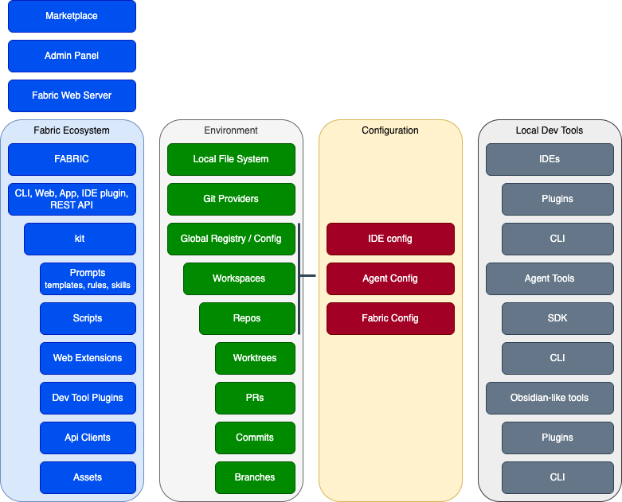
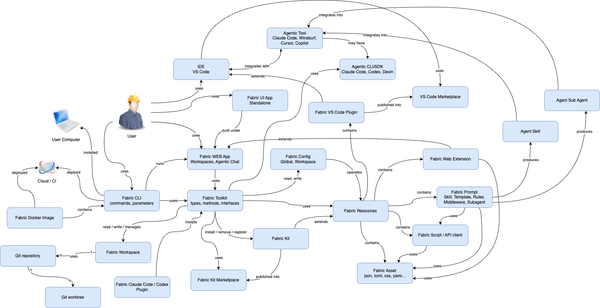

# Cyber Fabric — Domain Model

## Overview

This document is the canonical glossary of Fabric's domain entities and their relationships, matched to what exists in the current PoC (`pocs/fabric`, `pocs/fabric-vscode`, `pocs/fabric-kits`). It is a map, not a specification — each row states what the entity is **for**, which other entities it connects to, and where (if anywhere) it already lives in code.

Fabric's product direction is summarized in [`VISION.md`](../VISION.md). The short version: Fabric is a deterministic collaborative delivery system that spans the IDE, a standalone UI, and a CLI, unified around **workspaces**, **kits**, and **resources**.

## Entity glossary

Entities are grouped by layer. Relation direction is expressed as `entity → target` (follow arrows on the diagram). PoC state references are anchored to `pocs/fabric` unless stated otherwise.

### 1. People

| Entity | Purpose / goal | Key relations | PoC state |
|---|---|---|---|
| **User** | The human operator of Fabric — a developer, architect, PM, or reviewer. Entry point of every workflow. | Uses: `IDE VS Code`, `Agentic Tool`, `Fabric UI App Standalone`, `Fabric WEB App`, `Fabric CLI`. Owns: `User Computer`. | Implicit everywhere; no code entity. |

### 2. Infrastructure & distribution

| Entity | Purpose / goal | Key relations | PoC state |
|---|---|---|---|
| **User Computer** | The local host where Fabric runs in single-user mode. Anchors workspace state, git checkouts, and the CLI install. | Hosts: `Fabric CLI`, `IDE VS Code`, `Agentic Tool`, `Git repository` clones. `Fabric Docker Image` is `installed` here. | Implicit. |
| **Cloud / CI** | Centralized deployment target for shared Fabric instances (team-wide web UI, CI automation, server-side artifact generation). | `Fabric Docker Image` is `deployed` here. | Not yet implemented. Vision only. |
| **Fabric Docker Image** | Packaged distribution artifact containing the CLI and its runtime, for reproducible install both on developer machines and in CI. | `contains` `Fabric CLI`; `deployed` to `Cloud / CI`; `installed` on `User Computer`. | Not yet implemented. |

### 3. Fabric core

| Entity | Purpose / goal | Key relations | PoC state |
|---|---|---|---|
| **Fabric CLI** | Primary command-line entry point. Exposes commands and parameters for every Fabric operation: kit install, prompt register, resource listing, launching the web UI, etc. | `uses` `Fabric Toolkit`; `runs` `Fabric WEB App`; packaged inside `Fabric Docker Image`. | `pocs/fabric/bin/` and `pocs/fabric/src/*.js` (commands: `kits`, `prompts`, `resources`, `delegates`, `register`, `web-server`). |
| **Fabric Toolkit** | The shared library of types, methods, and interfaces behind every Fabric surface. A single source of truth for kit/resource/workspace operations so CLI, web, and VS Code plugin behave identically. | Reads/writes `Fabric Config`; `read/write/manages` `Fabric Workspace`; `install/remove/register` `Fabric Kit`; `uses` `Fabric Resources`. Consumed by `Fabric CLI`, `Fabric WEB App`, `Fabric VS Code Plugin`. | `pocs/fabric/src/public.js` exposes the public surface; types mirrored in `pocs/fabric/web/src/types.ts`. |
| **Fabric Config** | Declarative configuration for Fabric behavior, scoped to **global** (`~/.fabric/`) or **workspace** (`.fabric/` in the project root). Controls which kits, resources, agents, and preferences apply in a given context. Also holds API credentials (global-only, `~/.fabric/auth.toml`) consumed by `Fabric API`. | `Fabric Toolkit` reads and writes it; it `operates` on `Fabric Resources`; supplies credentials to `Fabric API`. | `~/.fabric/resources.toml` and `.fabric/resources.toml` (global vs. local), handled by `pocs/fabric/src/resources.js`. `auth.toml` not yet implemented. |

### 4. Domain objects (content model)

| Entity | Purpose / goal | Key relations | PoC state |
|---|---|---|---|
| **Fabric Workspace** | A multi-repo delivery context. Groups one or more git repositories plus their Fabric config, resources, and review state into a single working surface. | Managed by `Fabric Toolkit`; `uses` N `Git repository` (1:N). | Partially scaffolded in `pocs/fabric/web/src/mock/fixtures/workspaces.ts` (UI-side fixture); CLI-side workspace model pending. |
| **Fabric Kit** | A versioned, installable bundle of Fabric Resources (prompts + scripts + assets + optional web extensions) published by an author for reuse. The unit of distribution. | `extends` `Fabric Resources`; `published into` `Fabric Kit Marketplace`; `install/remove/register` by `Fabric Toolkit`. | `pocs/fabric-kits/*` (PRD kit example); manifest at `pocs/fabric-kits/<kit>/resources.toml`; installer logic in `pocs/fabric/src/kits.js`. |
| **Fabric Kit Marketplace** | Discovery and distribution registry for kits. Resolves a kit name or git URL to a downloadable, versioned artifact. | `Fabric Kit` is `published into` it. | Mocked in `pocs/fabric/web/src/mock/fixtures/marketplaces.ts`; real backend not yet implemented. |
| **Fabric Resources** | The content model Fabric manages. A container of four primary content types — **Fabric Prompt**, **Fabric Script**, **Fabric API**, **Fabric Asset** — plus optional **Fabric Web Extension** contributions. | `contains`: `Fabric Prompt`, `Fabric Script`, `Fabric API`, `Fabric Asset`, `Fabric Web Extension`. `Fabric Kit` `extends` Resources; `Fabric Config` `operates` on Resources. | Declared in `resources.toml` (`prompt_files`, `script_files`; `api_files` pending); schema handled by `pocs/fabric/src/resources.js`. |
| **Fabric Prompt** | A typed, addressable unit of authored agent instruction. Subtypes: **Skill** (directly invokable), **Template** (static layout), **Rules** (mode-specific body), **Middleware** (pre/post cross-cutting), **Subagent** (delegated persona). | `uses` `Fabric Script`; `uses` `Fabric API`; `uses` `Fabric Asset`; `produces` `Agent Skill` and `Agent Sub Agent` via registration. | `pocs/fabric/prompts/*.md` + typed registry in `pocs/fabric/src/prompts.js` (`allowedPromptTypes` = `skill | agent | rules | template | middleware | workflow | checklist`). |
| **Fabric Script** | An executable helper (small program, usually node/bash) that a prompt can call during a workflow. Bridges deterministic computation into prompt flows. | `uses` `Fabric Asset`; `uses` `Fabric API` (via SDK). Referenced by `Fabric Prompt`. | Hooked through `script_files` in `resources.toml`; execution plumbed via `pocs/fabric/src/scripts.js`. |
| **Fabric API** | A declarative description of an external HTTP service (`*.api.toml`: `base_url`, `default_headers`, optional `auth_ref`). Invokable from the CLI (`fabric api call <service> …`), from scripts via the `fabric.api` SDK, or referenced in prompt bodies as shell text that the hosting agent executes. Lets Fabric call third-party APIs (GitHub, OpenAI, internal services) without re-implementing auth and base URLs in every prompt or script. | Part of `Fabric Resources`; `uses` credentials from `Fabric Config` (`~/.fabric/auth.toml`, global-only); consumed by `Fabric Prompt` (as shell snippet) and `Fabric Script` (via SDK); registered through `api_files` globs in `resources.toml`. | Not yet implemented. Design + plan captured in the orchestrator repo under `docs/superpowers/specs/2026-04-24-fabric-api-command-design.md` and `docs/superpowers/plans/2026-04-24-fabric-api-command.md`. v1 scope: `bearer` / `basic` / `header` / `none` auth types; CLI surface `fabric api call|list|help`. |
| **Fabric Asset** | Static data file consumed by prompts or scripts: `.json`, `.toml`, `.css`, `.yaml`, etc. Examples: schema files, templates, reference datasets. | Consumed by `Fabric Prompt` and `Fabric Script`. | Ships inside a kit or resource directory; no distinct module — served directly from disk. |
| **Fabric Web Extension** | A kit-contributed UI affordance for `Fabric WEB App` / `Fabric VS Code Plugin`: additional views, renderers, toolbar actions, highlight packs. Delivered through kit resources. | Part of `Fabric Resources`; consumed by `Fabric WEB App` and `Fabric VS Code Plugin`. | `WebExtension` type + `workspaceContributions` in `pocs/fabric/web/src/types.ts`; demo renderers in `pocs/fabric/web/src/ui/views/workspace/renderers/`. |

### 5. User-facing surfaces

| Entity | Purpose / goal | Key relations | PoC state |
|---|---|---|---|
| **IDE VS Code** | Primary code-editing host. The "native" surface for most developers using Fabric. | User `uses` it; `Fabric VS Code Plugin` `extends` it; `integrates with` `Agentic Tool`. | External product; Fabric integrates, does not ship it. |
| **Agentic Tool** (Claude Code, Windsurf, Cursor, Copilot) | Third-party AI coding environments. Fabric expects to coexist with and feed prompts into them. | `integrates into` `IDE VS Code`; `may have` / `uses` `Agentic CLI/SDK`; `uses` `Fabric Prompt` (after `Fabric register`). | External. Registration scaffolding exists in `pocs/fabric/src/register.js` (installs prompts into `.claude/`, `.agents/`, etc.). |
| **Agentic CLI/SDK** (Claude Code, Codex, Devin) | Agent runtime layer beneath the IDE-facing agentic tool. Fabric shells out to these for agent execution. | `Agentic Tool` `may have` and `uses` it; `Fabric Prompt` flows into it. | Provider invocation in `pocs/fabric/src/delegates.js` (`invokeClaude`, `invokeCodex`). |
| **VS Code Marketplace** | Public registry for VS Code extensions. Distribution channel for the Fabric VS Code Plugin. | `Fabric VS Code Plugin` is `published into` it. | Extension package exists at `pocs/fabric-vscode/fabric-vscode-0.0.3.vsix`; not yet published. |
| **Fabric UI App Standalone** | A cross-platform desktop/web shell that hosts `Fabric WEB App` outside any IDE, so the same Fabric experience works for non-VS Code users. | `Fabric WEB App` is `built under` it; User `uses` it. | Not yet implemented — today `Fabric WEB App` only runs via `fabric web run` from the CLI (see `pocs/fabric/src/web-server.js`). |
| **Fabric WEB App** | The unified web UI. Provides **Workspaces** (multi-repo project viewer) and **Agentic Chat** — the user-facing surface where workspace browsing, kit management, and agent conversations converge. | `built under` `Fabric UI App Standalone`; `run` by `Fabric CLI`; `uses` `Fabric Toolkit`. | React + Vite app at `pocs/fabric/web/`; Workspaces viewer landed in Tasks 1–14 of the `2026-04-24-fabric-workspaces-viewer.md` plan. |
| **Fabric VS Code Plugin** | VS Code extension embedding Fabric inside the IDE: tree views for kits/store/agents, commands for kit install/register, and the Web Extension surface. | `extends` `IDE VS Code`; `contains` `Fabric Web Extension`; `published into` `VS Code Marketplace`; `integrates into` `Agentic Tool`; `uses` `Fabric Toolkit`. | `pocs/fabric-vscode/src/extension.ts` activates tree providers and registers commands. |
| **Fabric Claude Code / Codex Plugin** | Per-agent-provider plugin distributed **into** the agentic runtime (Claude Code / Codex plugin surface). Installs the Fabric Toolkit and registers Fabric prompts as native skills/sub-agents inside the agent. | `installs` `Fabric Toolkit`. | Not yet implemented as a first-class plugin; prompt registration is done ad-hoc via `fabric register`. |

### 6. Agent integration

| Entity | Purpose / goal | Key relations | PoC state |
|---|---|---|---|
| **Agent Skill** | A top-level, directly-invokable capability exposed to an agentic tool (e.g. `fabric-<id>` slash command in Claude Code). Produced from a Fabric Prompt of type `skill`. | `Fabric Prompt` `produces` it. | `fabric register` writes skill entries into `.claude/skills/` and `.agents/skills/` (see `pocs/fabric/src/register.js`). |
| **Agent Sub Agent** | A delegated, scoped persona invoked from within another agent's session. Produced from a Fabric Prompt of type `agent` (or `subagent`). Enables multi-agent workflows inside a single Agentic Tool. | `Fabric Prompt` `produces` it. | Also materialized by `fabric register` (agents subdirectory). |

### 7. Version control

| Entity | Purpose / goal | Key relations | PoC state |
|---|---|---|---|
| **Git repository** | The durable, versioned source of project content. A workspace pins one or more repositories as its source of truth. | `Fabric Workspace` `uses` N of these (1:N). Contains N `Git worktree` (1:N). | Standard git; no Fabric-specific extension. Workspace integration is aspirational. |
| **Git worktree** | A lightweight checkout of a repository at a specific ref. Fabric can operate multiple worktrees of the same repo (e.g. main + feature branch + experimental branch) as parallel sub-contexts. | `Git repository` has N worktrees (1:N). | Not yet directly managed by Fabric; relevant to Fabric Workspace once multi-repo support lands. |

## Relations index

A flat list of the edges in the diagram, grouped by source. Useful when chasing a specific connection.

**User → ...**
- `uses` `IDE VS Code`
- `uses` `Agentic Tool`
- `uses` `Fabric UI App Standalone`
- `uses` `Fabric WEB App`
- `uses` `Fabric CLI`

**Fabric Docker Image → ...**
- `contains` `Fabric CLI`
- `installed` on `User Computer`
- `deployed` to `Cloud / CI`

**IDE VS Code → ...**
- `integrates with` `Agentic Tool`

**Agentic Tool → ...**
- `integrates into` `IDE VS Code`
- `may have` `Agentic CLI/SDK`
- `uses` `Agentic CLI/SDK`
- `uses` `Fabric Prompt`

**Agentic CLI/SDK → ...**
- `uses` `Fabric Prompt`

**Fabric VS Code Plugin → ...**
- `extends` `IDE VS Code`
- `contains` `Fabric Web Extension`
- `published into` `VS Code Marketplace`
- `integrates into` `Agentic Tool`
- `uses` `Fabric Toolkit`

**Fabric UI App Standalone → ...**
- Hosts `Fabric WEB App` (`Fabric WEB App` is `built under` it)

**Fabric WEB App → ...**
- `uses` `Fabric Toolkit`
- `built under` `Fabric UI App Standalone`
- `run` by `Fabric CLI`

**Fabric CLI → ...**
- `uses` `Fabric Toolkit`
- `runs` `Fabric WEB App`
- `contained` in `Fabric Docker Image`

**Fabric Claude Code / Codex Plugin → ...**
- `installs` `Fabric Toolkit`

**Fabric Toolkit → ...**
- `reads, writes` `Fabric Config`
- `read/write/manages` `Fabric Workspace`
- `install/remove/register` `Fabric Kit`
- `uses` `Fabric Resources`

**Fabric Config → ...**
- `operates` `Fabric Resources`

**Fabric Workspace → ...**
- `uses` N `Git repository`

**Git repository → ...**
- `has` N `Git worktree`

**Fabric Kit → ...**
- `extends` `Fabric Resources`
- `published into` `Fabric Kit Marketplace`

**Fabric Resources → ...**
- `contains` `Fabric Prompt`
- `contains` `Fabric Script`
- `contains` `Fabric API`
- `contains` `Fabric Asset`
- `contains` `Fabric Web Extension`

**Fabric Prompt → ...**
- `contains` subtypes: Skill, Template, Rules, Middleware, Subagent
- `uses` `Fabric Script`
- `uses` `Fabric API`
- `uses` `Fabric Asset`
- `produces` `Agent Skill`
- `produces` `Agent Sub Agent`

**Fabric Script → ...**
- `uses` `Fabric Asset`
- `uses` `Fabric API` (via SDK)

**Fabric API → ...**
- `uses` `Fabric Config` (credentials from `~/.fabric/auth.toml`)
- consumed by `Fabric Prompt` (shell snippet) and `Fabric Script` (SDK)

## PoC coverage summary

The diagram is aspirational; the current PoC covers a subset.

| Area | PoC status |
|---|---|
| Fabric CLI | ✅ `pocs/fabric/bin/`, `pocs/fabric/src/` |
| Fabric Toolkit (public API) | ✅ `pocs/fabric/src/public.js` + web-side mirror in `pocs/fabric/web/src/fabricLib.ts` |
| Fabric Config (local + global) | ✅ `.fabric/resources.toml` + `~/.fabric/resources.toml` |
| Fabric Resources (prompts + scripts + assets) | ✅ Prompt + script manifests; Asset is file-level only. |
| Fabric Prompt subtypes | ✅ `skill`, `rules`, `template`, `middleware`, `agent`, `workflow`, `checklist` (in `prompts.js`) |
| Fabric API | ❌ Spec + plan only (`docs/superpowers/specs/2026-04-24-fabric-api-command-design.md`); `src/apis.js`, `src/auth.js`, `api_files` manifest field, and `fabric api call|list|help` CLI pending |
| Fabric Kit | ✅ `pocs/fabric-kits/` + `src/kits.js` |
| Fabric Kit Marketplace | 🟡 Mocked in `fabric-web`; no real backend |
| Fabric WEB App | 🟡 React + Vite app at `pocs/fabric/web/`; Workspaces viewer in progress |
| Fabric UI App Standalone | ❌ Not yet implemented |
| Fabric VS Code Plugin | ✅ `pocs/fabric-vscode/` |
| Fabric Claude Code / Codex Plugin | ❌ Not yet implemented (prompts registered ad-hoc) |
| Fabric Web Extension | 🟡 Type + demo contributions in `fabric-web` |
| Fabric Workspace | 🟡 UI-side fixtures; CLI-side model pending |
| Fabric Docker Image | ❌ Not yet implemented |
| Cloud / CI deployment | ❌ Not yet implemented |
| Agent Skill / Sub Agent generation | ✅ `fabric register` writes to `.claude/` and `.agents/` |

Legend: ✅ implemented · 🟡 partial · ❌ not started.

## Full domain diagram

